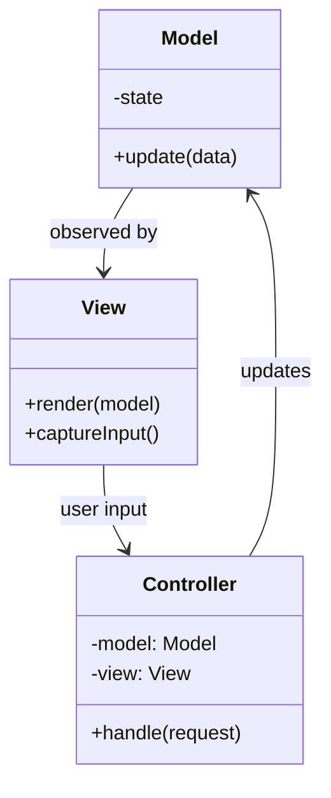
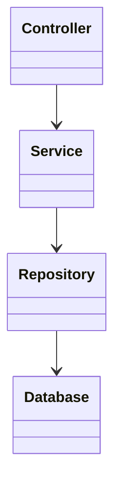
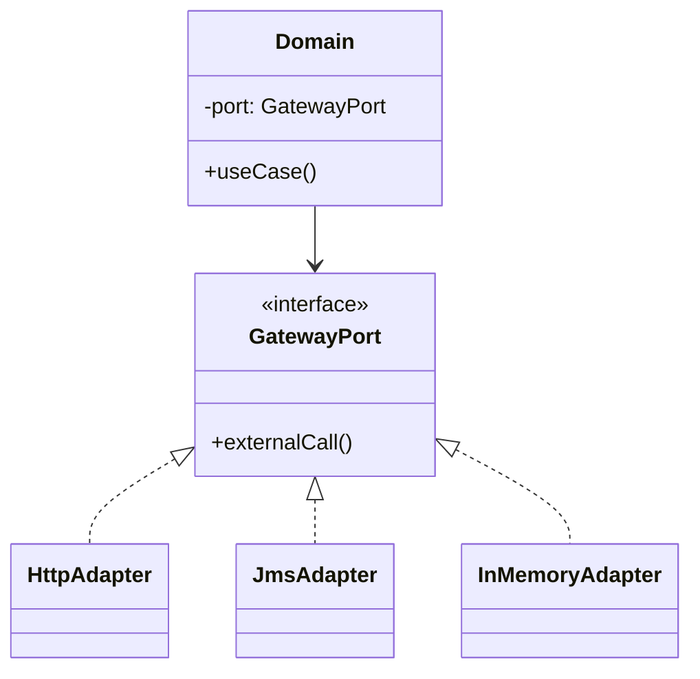
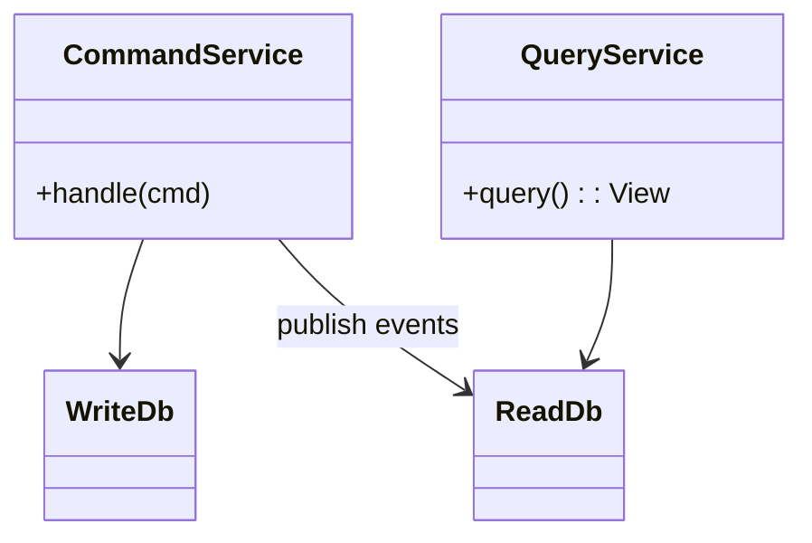
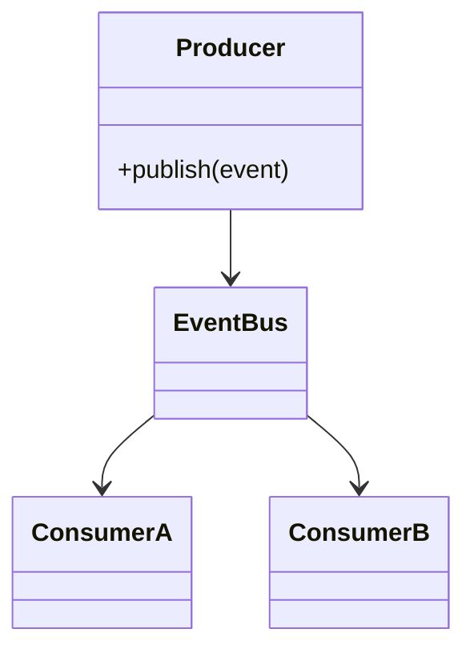
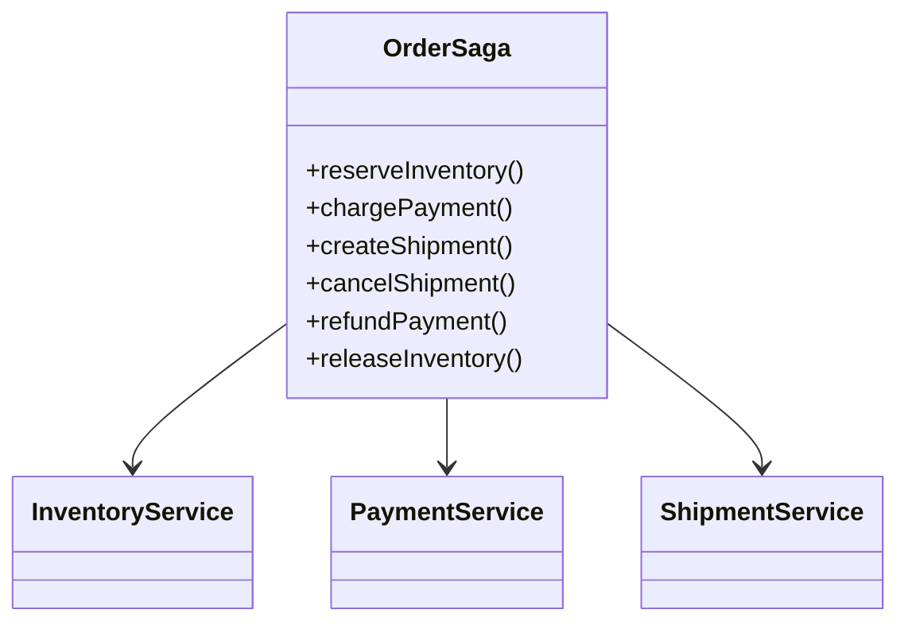

import QuickNav from '@site/src/components/QuickNav';
import CodeTabs from '@site/src/components/CodeTabs';
import Pillbar from '@site/src/components/Pillbar';

# Architectural Patterns

<Pillbar pills={[
  { label: 'family', value: 'architectural' },
  { label: 'patterns', value: 6 },
  { label: 'theme', value: 'whole-system organization' },
]} />

Architectural patterns describe how an **entire application** is organized — not classes in a method, but modules / services / processes in a system.

<QuickNav items={[
  { label: 'MVC / MVP / MVVM', href: '#mvc--mvp--mvvm' },
  { label: 'LAYERED', href: '#layered' },
  { label: 'HEXAGONAL (PORTS & ADAPTERS)', href: '#hexagonal-ports--adapters' },
  { label: 'CQRS', href: '#cqrs' },
  { label: 'EVENT-DRIVEN', href: '#event-driven' },
  { label: 'SAGA', href: '#saga' },
]} />

---

## MVC / MVP / MVVM

> **Separate model, view, and controller / presenter / view-model.**

### Intent

Decouple **data** (Model), **presentation** (View), and **input + logic** (Controller / Presenter / View-Model). The variants differ in how View and Controller communicate.

| Variant | View knows | Controller / Presenter / VM knows |
| --- | --- | --- |
| **MVC** | The model directly (observes it) | View + Model |
| **MVP** | The presenter via a view interface | View interface + Model |
| **MVVM** | The view-model via data bindings | Model |

### Spring MVC code shape

<CodeTabs
  title="Spring MVC"
  java={`// Model
public record User(long id, String name, String email) { }

@Service
public class UserService {
  public User findById(long id) { /* ... */ }
}

// Controller
@RestController
@RequestMapping("/users")
public class UserController {
  private final UserService users;
  public UserController(UserService u) { this.users = u; }

  @GetMapping("/{id}")
  public ResponseEntity<UserDto> get(@PathVariable long id) {
    User u = users.findById(id);
    if (u == null) return ResponseEntity.notFound().build();
    return ResponseEntity.ok(UserDto.from(u));
  }
}

// View — for a REST API, the "view" is the JSON serialization.
// For an HTML app, it's a Thymeleaf / JSP template.`}
  kotlin={`// Model
data class User(val id: Long, val name: String, val email: String)

@Service
class UserService {
  fun findById(id: Long): User? = TODO()
}

// Controller
@RestController
@RequestMapping("/users")
class UserController(private val users: UserService) {
  @GetMapping("/{id}")
  fun get(@PathVariable id: Long): ResponseEntity<UserDto> {
    val u = users.findById(id) ?: return ResponseEntity.notFound().build()
    return ResponseEntity.ok(UserDto.from(u))
  }
}

// View — JSON for an API, Thymeleaf / Compose for HTML.`}
/>

### When to use

- Any UI or HTTP application — MVC is the default for a reason.
- MVP for testable UI (the view interface mocks easily).
- MVVM for data-binding UI frameworks (WPF, Vue, Angular).

### Gotchas

- "**Fat controllers**" leak business logic out of the model and service layer.
- "**Anaemic models**" carry no behaviour — usually a smell.

---

## Layered

> **Strict layering — UI → service → repository → DB.**

### Intent

The simplest architecture: each layer depends only on the layer immediately below. Easy to teach, easy to violate.

<CodeTabs
  title="Layered · folder structure"
  bash={`src/main/java/com/example/orders/
├── controller/          # HTTP boundary
│   └── OrderController.java
├── service/             # business logic
│   └── OrderService.java
├── repository/          # persistence
│   └── OrderRepository.java
├── domain/              # entities / value objects
│   └── Order.java
└── config/`}
/>

### When to use

- New apps, small teams, well-known domains.
- When the team needs a default shape — and one good enough is better than a perfect one nobody understands.

### Gotchas

- **Skipping layers** ("controller calls repository") accumulates fast unless reviewed.
- **Anaemic domain**: all behaviour ends up in services. Common in Java; not always wrong, but worth a discussion.

---

## Hexagonal (Ports & Adapters)

> **The domain depends only on interfaces (ports). Adapters implement them.**

### Intent

The domain (use cases + entities) sits in the middle and depends only on **ports** (interfaces). Adapters — HTTP controllers, DB repositories, message consumers — implement the ports.

Switching from REST to gRPC requires changing only adapters; the domain doesn't move.

<CodeTabs
  title="Hexagonal · ports + adapters"
  java={`// === Domain (the hex centre) =================================================
public class PlaceOrder {
  private final OrderRepository orders;     // outbound port (interface)
  private final PaymentGateway gateway;     // outbound port (interface)
  private final Notifier notifier;          // outbound port (interface)

  public PlaceOrder(OrderRepository o, PaymentGateway p, Notifier n) {
    this.orders = o; this.gateway = p; this.notifier = n;
  }

  public OrderId handle(PlaceOrderCommand cmd) {
    Order o = Order.from(cmd);
    gateway.charge(o.amount());
    orders.save(o);
    notifier.confirm(o.customerEmail());
    return o.id();
  }
}

// === Outbound ports (interfaces in the domain module) ========================
public interface OrderRepository { void save(Order o); Optional<Order> byId(OrderId id); }
public interface PaymentGateway  { void charge(Money amount); }
public interface Notifier        { void confirm(String email); }

// === Adapters (in infrastructure modules) ====================================
@Repository
public class JpaOrderRepository implements OrderRepository { /* JPA */ }

public class StripeGateway implements PaymentGateway { /* Stripe SDK */ }

public class EmailNotifier implements Notifier { /* SMTP */ }

// === Inbound adapter (HTTP) — calls into the use case ========================
@RestController
@RequestMapping("/orders")
public class OrderController {
  private final PlaceOrder placeOrder;
  public OrderController(PlaceOrder p) { this.placeOrder = p; }

  @PostMapping
  public ResponseEntity<OrderId> create(@RequestBody PlaceOrderCommand cmd) {
    return ResponseEntity.ok(placeOrder.handle(cmd));
  }
}`}
  kotlin={`// === Domain (the hex centre) ================================================
class PlaceOrder(
  private val orders: OrderRepository,    // outbound port
  private val gateway: PaymentGateway,    // outbound port
  private val notifier: Notifier,         // outbound port
) {
  fun handle(cmd: PlaceOrderCommand): OrderId {
    val o = Order.from(cmd)
    gateway.charge(o.amount)
    orders.save(o)
    notifier.confirm(o.customerEmail)
    return o.id
  }
}

// === Outbound ports =========================================================
interface OrderRepository { fun save(o: Order); fun byId(id: OrderId): Order? }
interface PaymentGateway  { fun charge(amount: Money) }
interface Notifier        { fun confirm(email: String) }

// === Adapters (infrastructure modules) ======================================
@Repository class JpaOrderRepository : OrderRepository { /* JPA */ }
class StripeGateway : PaymentGateway { /* Stripe SDK */ }
class EmailNotifier : Notifier { /* SMTP */ }

// === Inbound adapter (HTTP) =================================================
@RestController
@RequestMapping("/orders")
class OrderController(private val placeOrder: PlaceOrder) {
  @PostMapping
  fun create(@RequestBody cmd: PlaceOrderCommand): ResponseEntity<OrderId> =
    ResponseEntity.ok(placeOrder.handle(cmd))
}`}
/>

### When to use

- Long-lived systems where the **infrastructure** (DB, framework, message bus) is expected to change but the **domain** is not.
- Test-friendly designs (each adapter swappable for an in-memory fake).

### Gotchas

- Adds layers, files, and discipline. Overkill for small apps.
- Easy to slip and let JPA annotations leak into domain entities — keep them out.

---

## CQRS

> **Command Query Responsibility Segregation — separate models for writes (commands) and reads (queries).**

### Intent

Reads and writes have different shapes, different access patterns, and different scaling needs. CQRS separates them — often paired with event sourcing for the write side.

<CodeTabs
  title="CQRS · sketch"
  java={`// === Write side ==============================================================
public class TransferMoneyCommand {
  public final String fromAccount, toAccount;
  public final long amountCents;
  // constructor omitted
}

@Service
public class TransferMoneyHandler {
  private final AccountRepository accounts;
  private final EventBus events;

  public void handle(TransferMoneyCommand cmd) {
    Account from = accounts.byId(cmd.fromAccount);
    Account to   = accounts.byId(cmd.toAccount);
    from.debit(cmd.amountCents);
    to.credit(cmd.amountCents);
    accounts.save(from);
    accounts.save(to);
    events.publish(new MoneyTransferred(from.id(), to.id(), cmd.amountCents));
  }
}

// === Read side ===============================================================
// Pre-computed view, denormalized. Updated by listening to events.
public record AccountBalanceView(String accountId, long balanceCents, Instant asOf) { }

@Service
public class AccountBalanceQueryService {
  private final BalanceViewRepository views;
  public AccountBalanceView byId(String id) { return views.findById(id); }
}`}
  kotlin={`// === Write side ============================================================
data class TransferMoneyCommand(
  val fromAccount: String,
  val toAccount: String,
  val amountCents: Long,
)

@Service
class TransferMoneyHandler(
  private val accounts: AccountRepository,
  private val events: EventBus,
) {
  fun handle(cmd: TransferMoneyCommand) {
    val from = accounts.byId(cmd.fromAccount)
    val to   = accounts.byId(cmd.toAccount)
    from.debit(cmd.amountCents)
    to.credit(cmd.amountCents)
    accounts.save(from); accounts.save(to)
    events.publish(MoneyTransferred(from.id, to.id, cmd.amountCents))
  }
}

// === Read side =============================================================
data class AccountBalanceView(
  val accountId: String, val balanceCents: Long, val asOf: Instant,
)

@Service
class AccountBalanceQueryService(private val views: BalanceViewRepository) {
  fun byId(id: String): AccountBalanceView = views.findById(id)
}`}
/>

### When to use

- Reads dominate writes by 10× or more.
- Reads need different shapes than the canonical write model.
- Event-sourced systems (writes append events; reads project them).

### Gotchas

- Two models → two consistency models. **Eventual** between write and read views is normal.
- Adds operational complexity. Don't reach for it on day one.

---

## Event-Driven

> **Components communicate via events; producer and consumer are decoupled.**

### Intent

Decouple producers and consumers in time, in deployment, and in scale. A `OrderPlaced` event is published once; many consumers (email, analytics, fraud-check) react independently.

<CodeTabs
  title="Event-driven · Spring + Kafka"
  java={`// Producer
@Service
public class OrderService {
  private final KafkaTemplate<String, OrderPlaced> kafka;

  public void place(OrderRequest req) {
    Order o = persist(req);
    kafka.send("orders.placed", o.id(), new OrderPlaced(o));
  }
}

// Consumer A — emails
@Component
public class WelcomeEmailListener {
  @KafkaListener(topics = "orders.placed", groupId = "email")
  public void onPlaced(OrderPlaced e) {
    mailer.send(e.customerEmail(), "Order confirmed");
  }
}

// Consumer B — analytics (independent of A)
@Component
public class AnalyticsListener {
  @KafkaListener(topics = "orders.placed", groupId = "analytics")
  public void onPlaced(OrderPlaced e) {
    metrics.record("orders.placed", e);
  }
}`}
  kotlin={`// Producer
@Service
class OrderService(private val kafka: KafkaTemplate<String, OrderPlaced>) {
  fun place(req: OrderRequest) {
    val o = persist(req)
    kafka.send("orders.placed", o.id, OrderPlaced(o))
  }
}

// Consumer A — emails
@Component
class WelcomeEmailListener(private val mailer: Mailer) {
  @KafkaListener(topics = ["orders.placed"], groupId = "email")
  fun onPlaced(e: OrderPlaced) {
    mailer.send(e.customerEmail, "Order confirmed")
  }
}

// Consumer B — analytics (independent of A)
@Component
class AnalyticsListener(private val metrics: MetricsRegistry) {
  @KafkaListener(topics = ["orders.placed"], groupId = "analytics")
  fun onPlaced(e: OrderPlaced) {
    metrics.record("orders.placed", e)
  }
}`}
/>

### When to use

- Multiple subsystems care about the same business event.
- You need to add consumers later without touching the producer.
- The producer and consumer have different scaling needs.

### Gotchas

- **At-least-once** delivery means duplicates → consumers must be **idempotent**.
- Debugging an event flow across many services needs tracing.

---

## Saga

> **Distributed transaction split into a sequence of local transactions with compensating actions.**

### Intent

Atomic transactions across services don't exist (or 2PC blocks). A **saga** runs a sequence of **local transactions**, each with a **compensating action** to undo it if a later step fails.

### Two flavours

- **Orchestrated** — one coordinator service drives the saga (visible flow, easier to debug).
- **Choreographed** — each service listens for events and reacts (decoupled, harder to trace).

<CodeTabs
  title="Saga · orchestrated"
  java={`@Service
public class PlaceOrderSaga {
  private final InventoryService inventory;
  private final PaymentService   payments;
  private final ShipmentService  shipments;

  public OrderResult place(Order o) {
    InventoryReservation reservation = null;
    PaymentReceipt receipt = null;
    try {
      reservation = inventory.reserve(o.items());     // step 1
      receipt     = payments.charge(o.userId(), o.amount());  // step 2
      Shipment s  = shipments.create(o, reservation);  // step 3
      return OrderResult.ok(s.trackingId());
    } catch (Exception failure) {
      if (receipt != null)     payments.refund(receipt);     // compensate step 2
      if (reservation != null) inventory.release(reservation); // compensate step 1
      return OrderResult.failed(failure.getMessage());
    }
  }
}`}
  kotlin={`@Service
class PlaceOrderSaga(
  private val inventory: InventoryService,
  private val payments: PaymentService,
  private val shipments: ShipmentService,
) {
  fun place(o: Order): OrderResult {
    var reservation: InventoryReservation? = null
    var receipt: PaymentReceipt? = null
    return try {
      reservation = inventory.reserve(o.items)                  // step 1
      receipt     = payments.charge(o.userId, o.amount)         // step 2
      val s       = shipments.create(o, reservation)            // step 3
      OrderResult.ok(s.trackingId)
    } catch (failure: Exception) {
      receipt?.let     { payments.refund(it) }                  // compensate step 2
      reservation?.let { inventory.release(it) }                // compensate step 1
      OrderResult.failed(failure.message ?: "unknown")
    }
  }
}`}
/>

### When to use

- Multi-service business transactions (checkout, signup, hotel booking with flight + car).
- Anywhere 2PC would be tempting but unavailable.

### Gotchas

- Compensating actions are **business operations**, not deletes. `RefundPayment`, not `DELETE FROM payments`.
- Some operations **can't** be compensated (sent emails, real-world side effects). Design around that.

---

## Pattern selection cheat-sheet for Architectural

| Problem | Pattern |
| --- | --- |
| Web app with structured UI / API | MVC / MVP / MVVM |
| New service, simple shape | Layered |
| Long-lived domain, swappable infra | Hexagonal |
| Reads ≫ writes, divergent shapes | CQRS |
| Multiple subsystems react to one event | Event-Driven |
| Multi-service business transaction | Saga |

---

## Practice Problems

Architectural patterns are about how a whole system is shaped. Each problem here is a 30–45-minute design exercise — sketch the components, the data flow, and the failure modes before any code.

### 1. Cinema booking platform

Design a movie-ticket booking service that supports browsing showings, reserving seats, and paying. The catalog (browse) sees 100× more traffic than reservations.

- **Patterns**: Layered for the service shell; **CQRS** so the read-side seat-availability view scales independently from the write-side reservation engine.
- **Stretch**: Discuss the saga needed when payment, seat reservation, and ticket issuance must all succeed (or all be undone).

### 2. Multi-vendor checkout

Implement the checkout flow for an e-commerce site where a single cart can contain items from three vendors, each with its own inventory and fulfillment service. The customer pays once; all vendors must be reserved and shipped, or all rolled back.

- **Pattern**: **Saga** (orchestrated). Compensations: cancel reservation, refund payment slice, cancel shipment.
- **Stretch**: Switch to a choreographed version using events — what's harder to debug?

### 3. Banking core that must run for 20 years

Build a transaction-processing service that will outlive its current database (currently Oracle, may move to Postgres) and current framework (currently Spring, may move to Quarkus). The domain logic must be untouched by any of those migrations.

- **Pattern**: **Hexagonal**. Domain depends only on ports; the adapters change.
- **Trap**: JPA annotations leaking into the `Account` entity. Discuss strategies to keep it pure.

### 4. Pinterest-style activity feed

Users see a real-time feed of pins from people they follow. Pins are created 1× per second by users; feeds are read 10,000× per second.

- **Pattern**: **CQRS** (write model = pin; read model = per-user pre-computed feed). Update via events on pin creation.
- **Stretch**: How does the design change with celebrity users (a single creator with 100M followers)?

### 5. Cross-team event bus

You're at a 200-engineer company. Teams want to integrate without direct API calls — order events, user events, billing events. Design the contract, evolution rules, and the bus topology.

- **Pattern**: **Event-Driven**.
- **Discussion**: Schema registry, backward compatibility, dead-letter queues, replay.

### 6. Real-time collaborative whiteboard

Multiple users edit shapes on a shared canvas. All clients see updates within 100 ms.

- **Patterns**: **MVVM** on the client (View ← bindings → ViewModel ← WebSocket → server). **Event-Driven** server-side for fan-out.

### 7. ML-feature-store service

A feature store serves features at low latency to online inference and bulk to offline training. Online sees milliseconds; offline reads gigabytes.

- **Pattern**: **CQRS** (separate read paths) backed by a single source of truth in event-sourced form.

### 8. Migration of a 10-year-old monolith

The monolith has 30 controllers, 80 services, and 200 repositories — all in one Spring app. The team wants to extract three bounded contexts into separate services over 18 months without freezing feature work.

- **Pattern**: Strangler-fig + Hexagonal at the boundary of each context, eventing for cross-context communication.

### 9. Configurable form-rendering app

A SaaS lets customers design forms (drag-and-drop). Each form is rendered server-side as HTML for SEO and client-side via React for interactivity.

- **Pattern**: **MVC** server-side for the rendered HTML view; **MVVM** client-side for the editor; shared model schema between them.
