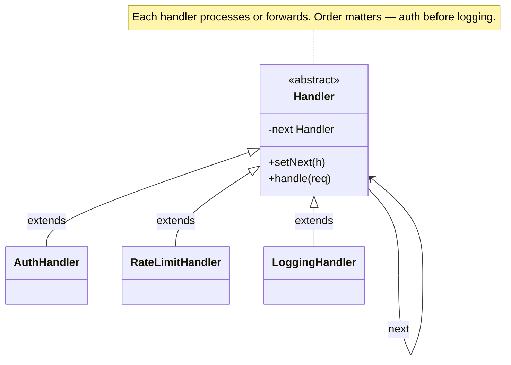

import QuickNav from '@site/src/components/QuickNav';
import CodeTabs from '@site/src/components/CodeTabs';
import Pillbar from '@site/src/components/Pillbar';

# Chain of Responsibility

<Pillbar pills={[
  { label: 'family', value: 'behavioral' },
  { label: 'aka', value: 'CoR · Pipeline' },
  { label: 'complexity', value: '★★☆' },
  { label: 'popularity', value: '★★★' },
]} />

<QuickNav items={[
  { label: 'INTENT',     href: '#intent' },
  { label: 'PROBLEM',    href: '#problem' },
  { label: 'SOLUTION',   href: '#solution' },
  { label: 'ANALOGY',    href: '#real-world-analogy' },
  { label: 'STRUCTURE',  href: '#structure' },
  { label: 'CODE',       href: '#code' },
  { label: 'PROS & CONS',href: '#pros--cons' },
  { label: 'RELATIONS',  href: '#relations-with-other-patterns' },
]} />

## Intent

> **Pass a request along a chain of handlers; each handler decides whether to process the request or forward it to the next one.**

## Problem

An HTTP request must pass through several concerns before it reaches a controller: authentication, rate-limiting, request validation, logging. Cramming all of them into one function buries the logic; subclassing per combination explodes; calling a static utility per concern hard-codes the order.

What you actually want is a *sequence of small handlers*, each independent, each able to short-circuit (e.g. reject with 401) or fall through.

## Solution

Define a `Handler` interface (or abstract class) with a `handle(request)` method and a reference to the next handler. Each concrete handler does its job and then either calls `next.handle(request)` or stops the chain. Building the pipeline is just linking handlers in order: `auth → rateLimit → logging → dispatcher`.

## Real-World Analogy

A help desk. You call support; a level-1 agent fields the call. If they can't solve it, they escalate to level-2; if level-2 can't, to engineering; if engineering can't, to a vendor. Each step decides whether to resolve or pass the ticket along. From your perspective you just made one call.

## Structure

## Code

<CodeTabs
  groupId="im-lang"
  title="Chain of Responsibility"
  java={`public abstract class Handler {
  protected Handler next;
  public Handler setNext(Handler h) { this.next = h; return h; }
  public abstract void handle(Request r);
  protected void forward(Request r) { if (next != null) next.handle(r); }
}

public class AuthHandler extends Handler {
  public void handle(Request r) {
    if (r.token() == null) throw new SecurityException("401");
    forward(r);
  }
}

public class RateLimitHandler extends Handler {
  private final RateLimiter limiter;
  public RateLimitHandler(RateLimiter l) { this.limiter = l; }
  public void handle(Request r) {
    if (!limiter.tryAcquire(r.userId())) throw new RuntimeException("429");
    forward(r);
  }
}

public class LoggingHandler extends Handler {
  public void handle(Request r) {
    System.out.println("req " + r);
    forward(r);
  }
}

public class FinalDispatcher extends Handler {
  public void handle(Request r) { /* route to controller */ }
}

// Build the chain
Handler chain = new AuthHandler();
chain.setNext(new RateLimitHandler(limiter))
     .setNext(new LoggingHandler())
     .setNext(new FinalDispatcher());

chain.handle(request);`}
  kotlin={`abstract class Handler {
  var next: Handler? = null
    private set
  fun setNext(h: Handler): Handler { next = h; return h }
  abstract fun handle(r: Request)
  protected fun forward(r: Request) = next?.handle(r)
}

class AuthHandler : Handler() {
  override fun handle(r: Request) {
    if (r.token == null) throw SecurityException("401")
    forward(r)
  }
}

class RateLimitHandler(private val limiter: RateLimiter) : Handler() {
  override fun handle(r: Request) {
    if (!limiter.tryAcquire(r.userId)) throw RuntimeException("429")
    forward(r)
  }
}

class LoggingHandler : Handler() {
  override fun handle(r: Request) {
    println("req \$r")
    forward(r)
  }
}

class FinalDispatcher : Handler() {
  override fun handle(r: Request) { /* route to controller */ }
}

val chain = AuthHandler().apply {
  setNext(RateLimitHandler(limiter))
    .setNext(LoggingHandler())
    .setNext(FinalDispatcher())
}
chain.handle(request)`}
/>

## Pros & Cons

| Pros | Cons |
| --- | --- |
| Each concern in its own focused class | Order matters — easy to put logging after auth and miss rejected requests |
| Add, remove, or reorder handlers without editing the others | A request can fall off the end unhandled if no one stops the chain |
| Open/Closed — new handlers slot in | Debugging is harder — the call stack hides which handler did what |

## Relations with Other Patterns

- **Decorator** also stacks wrappers but every layer forwards; in CoR a handler may *short-circuit*.
- **Composite** trees are commonly traversed using CoR (a parent forwards to a child).
- **Command** is often the *payload* a CoR pipeline processes.
- **Servlet filters**, **Spring `HandlerInterceptor`**, **OkHttp interceptors**, **AWS Lambda middleware** — all CoR.
