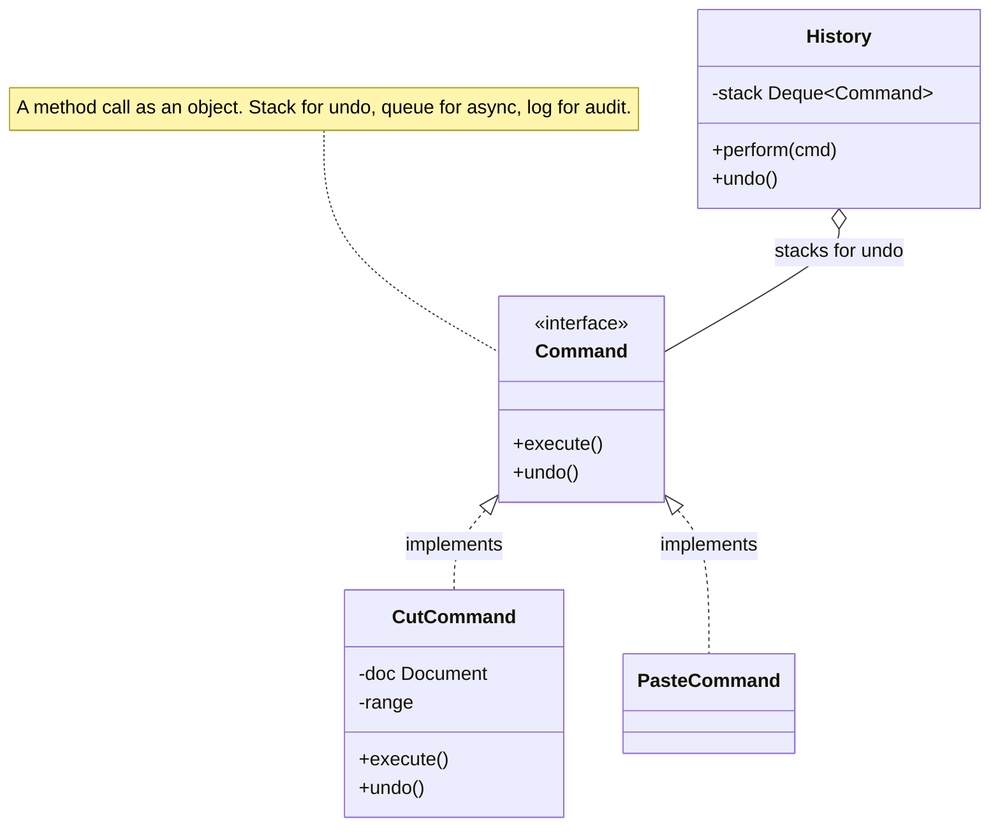

import QuickNav from '@site/src/components/QuickNav';
import CodeTabs from '@site/src/components/CodeTabs';
import Pillbar from '@site/src/components/Pillbar';

# Command

<Pillbar pills={[
  { label: 'family', value: 'behavioral' },
  { label: 'aka', value: 'Action · Transaction' },
  { label: 'complexity', value: '★★☆' },
  { label: 'popularity', value: '★★★' },
]} />

<QuickNav items={[
  { label: 'INTENT',     href: '#intent' },
  { label: 'PROBLEM',    href: '#problem' },
  { label: 'SOLUTION',   href: '#solution' },
  { label: 'ANALOGY',    href: '#real-world-analogy' },
  { label: 'STRUCTURE',  href: '#structure' },
  { label: 'CODE',       href: '#code' },
  { label: 'PROS & CONS',href: '#pros--cons' },
  { label: 'RELATIONS',  href: '#relations-with-other-patterns' },
]} />

## Intent

> **Encapsulate a request as a stand-alone object containing all information about the request, so it can be queued, logged, undone, or replayed.**

## Problem

A text editor exposes "insert text", "delete range", "paste". You want undo / redo, macros, a job queue, and audit logging. If each user action is implemented as a direct method call, you have nothing to push on a stack, nothing to record on disk, nothing to replay later.

## Solution

Wrap each action as a `Command` object that carries its parameters and exposes `execute()` and `undo()`. The caller invokes commands through a single dispatcher (`History.perform(cmd)`); the dispatcher does the bookkeeping — push to an undo stack, log the event, queue for retry — without knowing the specifics of any one command.

## Real-World Analogy

A restaurant order ticket. When you order, the waiter doesn't shout the dish into the kitchen — they write it on a ticket and pin it to the rail. The ticket is a *Command* object: it carries the request, can be re-fired if the cook drops it, queued behind other tickets, and stored as a record of the meal.

## Structure

## Code

<CodeTabs
  groupId="im-lang"
  title="Command · undo / redo"
  java={`public interface Command {
  void execute();
  void undo();
}

public class History {
  private final Deque<Command> undoStack = new ArrayDeque<>();
  private final Deque<Command> redoStack = new ArrayDeque<>();

  public void perform(Command c) {
    c.execute();
    undoStack.push(c);
    redoStack.clear();
  }

  public void undo() {
    if (undoStack.isEmpty()) return;
    Command c = undoStack.pop();
    c.undo();
    redoStack.push(c);
  }

  public void redo() {
    if (redoStack.isEmpty()) return;
    Command c = redoStack.pop();
    c.execute();
    undoStack.push(c);
  }
}

public class InsertTextCommand implements Command {
  private final Document doc; private final int pos; private final String text;
  public InsertTextCommand(Document doc, int pos, String text) {
    this.doc = doc; this.pos = pos; this.text = text;
  }
  public void execute() { doc.insert(pos, text); }
  public void undo()    { doc.delete(pos, text.length()); }
}`}
  kotlin={`interface Command {
  fun execute()
  fun undo()
}

class History {
  private val undoStack = ArrayDeque<Command>()
  private val redoStack = ArrayDeque<Command>()

  fun perform(c: Command) {
    c.execute()
    undoStack.addFirst(c)
    redoStack.clear()
  }

  fun undo() {
    val c = undoStack.removeFirstOrNull() ?: return
    c.undo()
    redoStack.addFirst(c)
  }

  fun redo() {
    val c = redoStack.removeFirstOrNull() ?: return
    c.execute()
    undoStack.addFirst(c)
  }
}

class InsertTextCommand(
  private val doc: Document,
  private val pos: Int,
  private val text: String,
) : Command {
  override fun execute() = doc.insert(pos, text)
  override fun undo()    = doc.delete(pos, text.length)
}`}
/>

## Pros & Cons

| Pros | Cons |
| --- | --- |
| Undo, redo, queueing, logging fall out for free | One class per action — boilerplate-heavy for trivial cases |
| Decouples invoker (UI button) from receiver (document) | Correct `undo()` requires careful state capture (often pair with **Memento**) |
| Commands are queueable, serialisable, replayable | Long command histories eat memory |

## Relations with Other Patterns

- **Memento** is the usual partner — `Command.undo()` restores a snapshot captured in `execute()`.
- **Composite** lets you build *macro* commands (a command made of sub-commands).
- **Chain of Responsibility** processes commands one after another (e.g. middleware pipelines).
- **Prototype** copies command instances before queueing.
- **Strategy** swaps the *body* of an algorithm; Command captures the *call* itself.
