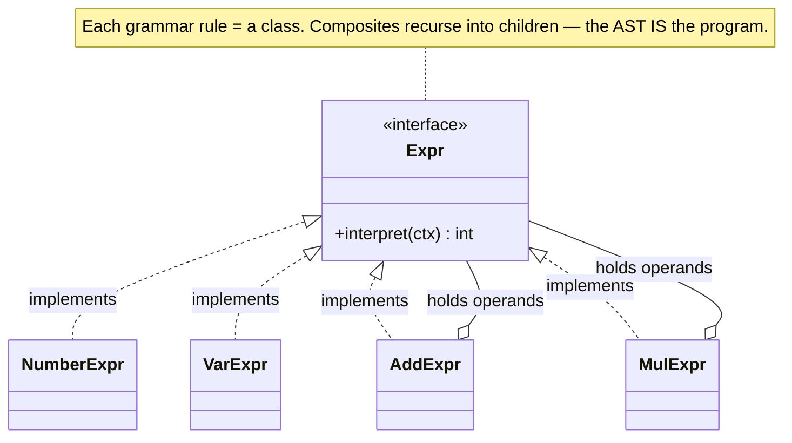

import QuickNav from '@site/src/components/QuickNav';
import CodeTabs from '@site/src/components/CodeTabs';
import Pillbar from '@site/src/components/Pillbar';

# Behavioral Patterns

<Pillbar pills={[
  { label: 'family', value: 'behavioral' },
  { label: 'patterns', value: 10 },
  { label: 'plus', value: 'Interpreter (below)' },
]} />

Behavioral patterns describe **how objects collaborate at runtime** — who knows about whom, who calls what, how responsibilities flow. They answer questions like: *which algorithm runs now?* *who needs to know that state changed?* *where do I draw the line between "decide" and "do"?*

The shared trick: introduce a *role* — Strategy, Observer, Command, State, Handler, Visitor — and let callers and callees collaborate through the role instead of by direct reference.

<QuickNav items={[
  { label: 'CHAIN OF RESPONSIBILITY', href: '/learn/java/design-patterns/behavioral/chain-of-responsibility' },
  { label: 'COMMAND',         href: '/learn/java/design-patterns/behavioral/command' },
  { label: 'ITERATOR',        href: '/learn/java/design-patterns/behavioral/iterator' },
  { label: 'MEDIATOR',        href: '/learn/java/design-patterns/behavioral/mediator' },
  { label: 'MEMENTO',         href: '/learn/java/design-patterns/behavioral/memento' },
  { label: 'OBSERVER',        href: '/learn/java/design-patterns/behavioral/observer' },
  { label: 'STATE',           href: '/learn/java/design-patterns/behavioral/state' },
  { label: 'STRATEGY',        href: '/learn/java/design-patterns/behavioral/strategy' },
  { label: 'TEMPLATE METHOD', href: '/learn/java/design-patterns/behavioral/template-method' },
  { label: 'VISITOR',         href: '/learn/java/design-patterns/behavioral/visitor' },
  { label: 'INTERPRETER',     href: '#interpreter' },
]} />

## At a glance

| Pattern | Intent | Reach for it when | Key collaborator |
| --- | --- | --- | --- |
| [Chain of Responsibility](./chain-of-responsibility.mdx) | Pipeline of handlers; each decides whether to process or pass | Request-processing or middleware pipelines | `Handler.next` |
| [Command](./command.mdx) | Turn an action into an object | Undo/redo, queues, macros, logging | `History` stack |
| [Iterator](./iterator.mdx) | Encapsulate traversal of a collection | Custom collections or lazy sequences | `Iterable` interface |
| [Mediator](./mediator.mdx) | Centralise many-to-many communication | N×N coupling between components | a central hub class |
| [Memento](./memento.mdx) | Capture and restore an object's state | Undo, checkpoints, save-games | `Originator` + `Caretaker` |
| [Observer](./observer.mdx) | One-to-many notification on change | Pub/sub, UI events, domain events | `Subscriber` interface |
| [State](./state.mdx) | Behaviour changes when an internal state changes | Many `if (status == ...)` branches | `Context` holds active state |
| [Strategy](./strategy.mdx) | Pluggable algorithm chosen at runtime | A/B-tested or config-driven algorithms | `Strategy` interface |
| [Template Method](./template-method.mdx) | Algorithm skeleton with subclass hooks | Steps are common; some vary | abstract base class |
| [Visitor](./visitor.mdx) | Add operations to a stable hierarchy | Many ops, few node types | `Element.accept(v)` |

## Smell → pattern lookup

| Symptom in code | Pattern to consider |
| --- | --- |
| `switch` on an algorithm-selector flag | **Strategy** |
| Many listeners want to know when something happens | **Observer** |
| You'd like to queue, log, or undo a method call | **Command** |
| `if (status == OPEN) ... else if (status == CLOSED)` chains | **State** |
| Pipeline of steps that can each short-circuit | **Chain of Responsibility** |
| Several subclasses repeat the same algorithm with one varying step | **Template Method** |
| Custom collection that needs to be iterated | **Iterator** |
| N components reference each other in a tangled web | **Mediator** |
| You want to add operations to fixed classes without editing them | **Visitor** |
| Need to roll back to a prior state | **Memento** |
| You're writing an evaluator for a small expression language | **Interpreter** |

---

## Interpreter

> **A parser-evaluator for a small domain-specific language. Represent each grammar rule as a class whose instances form the AST.**

Interpreter is rarely the right answer in modern code — for any non-trivial grammar, reach for ANTLR or a parser-combinator library. It earns its keep for tiny, stable DSLs: rules engines, filter expressions, spreadsheet formulas.

### Structure

### Code

<CodeTabs
  groupId="im-lang"
  title="Interpreter · arithmetic mini-language"
  java={`public interface Expr {
  int interpret(Map<String, Integer> ctx);
}

public class NumberExpr implements Expr {
  private final int value;
  public NumberExpr(int v) { value = v; }
  public int interpret(Map<String, Integer> ctx) { return value; }
}

public class VarExpr implements Expr {
  private final String name;
  public VarExpr(String n) { name = n; }
  public int interpret(Map<String, Integer> ctx) {
    Integer v = ctx.get(name);
    if (v == null) throw new IllegalStateException("unbound: " + name);
    return v;
  }
}

public class AddExpr implements Expr {
  private final Expr a, b;
  public AddExpr(Expr a, Expr b) { this.a = a; this.b = b; }
  public int interpret(Map<String, Integer> ctx) { return a.interpret(ctx) + b.interpret(ctx); }
}

public class MulExpr implements Expr {
  private final Expr a, b;
  public MulExpr(Expr a, Expr b) { this.a = a; this.b = b; }
  public int interpret(Map<String, Integer> ctx) { return a.interpret(ctx) * b.interpret(ctx); }
}

// (x + 2) * 3 with x = 5
Expr ast = new MulExpr(
    new AddExpr(new VarExpr("x"), new NumberExpr(2)),
    new NumberExpr(3));
System.out.println(ast.interpret(Map.of("x", 5)));   // 21`}
  kotlin={`sealed interface Expr {
  fun interpret(ctx: Map<String, Int>): Int
}

class NumberExpr(private val value: Int) : Expr {
  override fun interpret(ctx: Map<String, Int>) = value
}

class VarExpr(private val name: String) : Expr {
  override fun interpret(ctx: Map<String, Int>) =
    ctx[name] ?: error("unbound: \$name")
}

class AddExpr(private val a: Expr, private val b: Expr) : Expr {
  override fun interpret(ctx: Map<String, Int>) = a.interpret(ctx) + b.interpret(ctx)
}

class MulExpr(private val a: Expr, private val b: Expr) : Expr {
  override fun interpret(ctx: Map<String, Int>) = a.interpret(ctx) * b.interpret(ctx)
}

// (x + 2) * 3 with x = 5
val ast: Expr = MulExpr(AddExpr(VarExpr("x"), NumberExpr(2)), NumberExpr(3))
println(ast.interpret(mapOf("x" to 5)))   // 21`}
/>

### When (not) to use

- Use for: small, stable DSLs — filter rules, query expressions, formulas.
- Avoid for: real programming languages or anything with operator precedence beyond two levels. Reach for ANTLR or a parser combinator.
- Often paired with **Visitor** so each operation (eval, print, type-check) lives in its own class.

---

## Practice Problems

Behavioral patterns are about who-talks-to-whom and how decisions flow. Sketch the interaction (or state machine) before coding.

### 1. Tax-calculation engine

Implement a tax-calculation service that selects different algorithms per region (US sales tax, EU VAT, India GST). The choice depends on the customer's billing address; new regions must be addable without touching existing tax classes.

- **Pattern**: Strategy with a `Map<Region, TaxStrategy>` lookup.
- **Stretch**: Add a `ComposableTaxStrategy` that stacks multiple strategies (federal + state).

### 2. Real-time stock-ticker dashboard

A WebSocket service pushes stock prices; many UI components display them (line chart, alert banner, position calculator). Each component subscribes / unsubscribes independently; a slow consumer must not block others.

- **Pattern**: Observer with an async dispatcher (executor pool or coroutine flow).
- **Trap**: Memory leaks from forgotten subscribers; consider weak references.

### 3. Text editor with undo / redo

Build a minimal text editor that supports insert, delete, replace, and **arbitrary-depth** undo / redo. Each user keystroke is one undoable unit; pressing Ctrl-Z reverts the last keystroke.

- **Pattern**: Command, with two stacks for undo / redo.
- **Stretch**: Add macros — record a sequence of commands and replay it.

### 4. ATM state machine

Model an ATM that transitions through `IDLE → CARD_INSERTED → PIN_VERIFIED → TRANSACTION → DONE`. Each operation (insertCard, enterPin, withdraw, eject) is legal only in specific states.

- **Pattern**: State, one class per state, transitions encoded as `setState()` calls.

### 5. HTTP request middleware

Build a request pipeline that applies, in order: authentication, request validation, rate limiting, logging, and finally the actual handler. Each step can short-circuit (return early) or modify the request before forwarding.

- **Pattern**: Chain of Responsibility (or "middleware stack").
- **Stretch**: Support **post-processing** — each middleware can also see the response on its way back.

### 6. Data-export pipeline

Several report types share a skeleton — load data, normalize, aggregate, render — but the load and render steps vary per report (CSV, PDF, JSON, Excel). The skeleton must enforce step order; subclasses fill in the variable steps.

- **Pattern**: Template Method.

### 7. Streaming iterator over an external paginated API

Wrap an `httpGet("/items?page=N")` paginated API so consumers can iterate `for (Item i : api.allItems())` without ever materializing all pages.

- **Pattern**: Iterator (lazy).
- **Kotlin variant**: Return a `Sequence<Item>` or `Flow<Item>`.

### 8. Air-traffic-control room

Multiple aircraft request landing, takeoff, and route changes from a single controller. Aircraft must not communicate directly with each other.

- **Pattern**: Mediator.
- **Trap**: The controller can grow into a god-class — split by responsibility (radar, runway, comms) as it scales.

### 9. Programming-language type-checker

You have an AST with twenty node types. You want to add operations: type-check, evaluate, pretty-print, lint, optimize. Adding a new operation should not require editing every node class.

- **Pattern**: Visitor.
- **Stretch**: How does the trade-off invert if the operations are stable but new node types appear weekly?

### 10. Photo-editor undo with diff snapshots

A photo editor supports filters (blur, sharpen, hue shift). To support undo over 4K images, snapshotting the whole pixel buffer is too expensive. Snapshot only the **diff**.

- **Pattern**: Memento (compact snapshot) + Command (records the operation).

### 11. Spreadsheet formula evaluator

Parse and evaluate Excel-style formulas: `=A1+B1*2`. Variables reference other cells; cycles must be detected.

- **Pattern**: Interpreter (the formula tree) + Observer (when a referenced cell changes, dependents re-evaluate).
