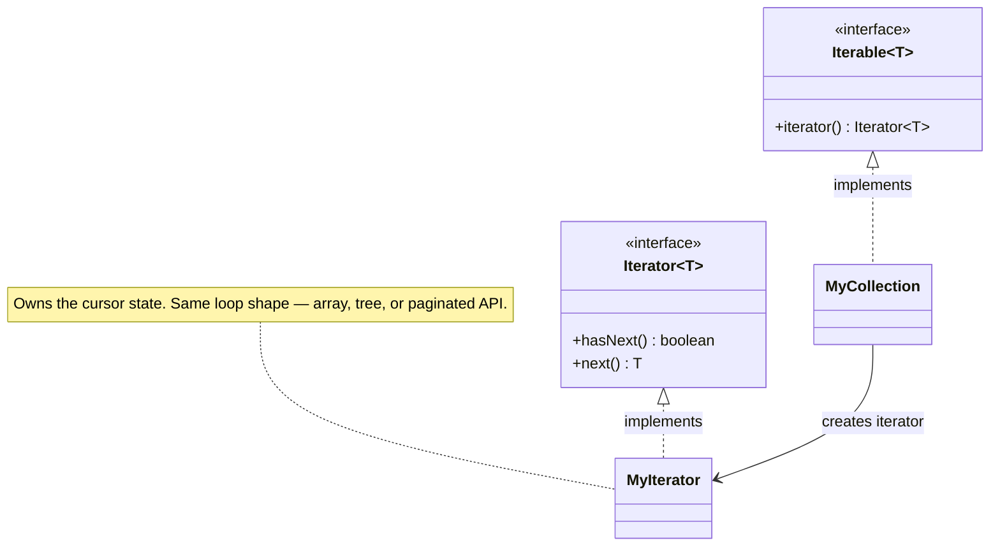

import QuickNav from '@site/src/components/QuickNav';
import CodeTabs from '@site/src/components/CodeTabs';
import Pillbar from '@site/src/components/Pillbar';

# Iterator

<Pillbar pills={[
  { label: 'family', value: 'behavioral' },
  { label: 'aka', value: 'Cursor' },
  { label: 'complexity', value: '★☆☆' },
  { label: 'popularity', value: '★★★' },
]} />

<QuickNav items={[
  { label: 'INTENT',     href: '#intent' },
  { label: 'PROBLEM',    href: '#problem' },
  { label: 'SOLUTION',   href: '#solution' },
  { label: 'ANALOGY',    href: '#real-world-analogy' },
  { label: 'STRUCTURE',  href: '#structure' },
  { label: 'CODE',       href: '#code' },
  { label: 'PROS & CONS',href: '#pros--cons' },
  { label: 'RELATIONS',  href: '#relations-with-other-patterns' },
]} />

## Intent

> **Provide a way to access the elements of an aggregate object sequentially without exposing its underlying representation.**

## Problem

You have a `RingBuffer<T>`, a `Tree<T>`, and a paginated REST API. Each stores data differently — a circular array, a linked structure, a sequence of HTTP pages. Forcing every caller to learn the internal layout (head pointer, recursion, page tokens) leaks implementation details and breaks the moment you change them.

## Solution

Move traversal into a dedicated **iterator** object that exposes only `hasNext()` and `next()`. The collection produces an iterator on demand; the caller writes a uniform `while (it.hasNext()) ...` loop and never touches the storage layout. The same shape lets you express lazy / infinite sequences as iterators that fetch on demand.

## Real-World Analogy

A radio's "scan" button. You press it once and the radio walks through stations one at a time — you don't know whether the radio is sweeping FM frequencies, reading from a preset list, or pulling from internet streams. The interface is "give me the next station."

## Structure

## Code

<CodeTabs
  groupId="im-lang"
  title="Iterator"
  java={`// Java already gives you Iterable / Iterator — most custom collections
// just need to implement them.

public class RingBuffer<T> implements Iterable<T> {
  private final T[] buf;
  private int head, size;

  @SuppressWarnings("unchecked")
  public RingBuffer(int cap) { buf = (T[]) new Object[cap]; }

  public void offer(T v) { /* fill / overwrite */ }

  @Override
  public Iterator<T> iterator() {
    return new Iterator<>() {
      private int i = 0;
      public boolean hasNext() { return i < size; }
      public T next() {
        if (!hasNext()) throw new NoSuchElementException();
        return buf[(head + i++) % buf.length];
      }
    };
  }
}

RingBuffer<String> log = new RingBuffer<>(100);
for (String s : log) System.out.println(s);`}
  kotlin={`// Kotlin implements Iterable directly; or expose a Sequence for laziness.
class RingBuffer<T>(cap: Int) : Iterable<T> {
  @Suppress("UNCHECKED_CAST")
  private val buf = arrayOfNulls<Any>(cap) as Array<T?>
  private var head = 0
  private var size = 0

  fun offer(v: T) { /* fill / overwrite */ }

  override fun iterator(): Iterator<T> = object : Iterator<T> {
    private var i = 0
    override fun hasNext() = i < size
    override fun next(): T {
      if (!hasNext()) throw NoSuchElementException()
      return buf[(head + i++) % buf.size] as T
    }
  }
}

val log = RingBuffer<String>(100)
for (s in log) println(s)`}
/>

## Pros & Cons

| Pros | Cons |
| --- | --- |
| Hides storage layout — caller writes one loop shape | Iterator state is fragile under concurrent modification |
| Supports lazy / infinite sequences naturally | Implementing remove safely is hard — many collections forbid it |
| Multiple iterators can walk the same collection independently | Adds a class per traversal strategy |

## Relations with Other Patterns

- **Composite** trees are nearly always traversed via Iterator (depth-first, breadth-first, pre/post-order).
- **Visitor** is a heavier alternative that lets the *operation* be the polymorphic thing — Iterator only varies the traversal.
- **Factory Method** appears as `iterator()` — the polymorphic creator of the iterator instance.
- **Java's `Stream`** and **Kotlin's `Sequence` / `Flow`** are lazy iterator-style pipelines.
