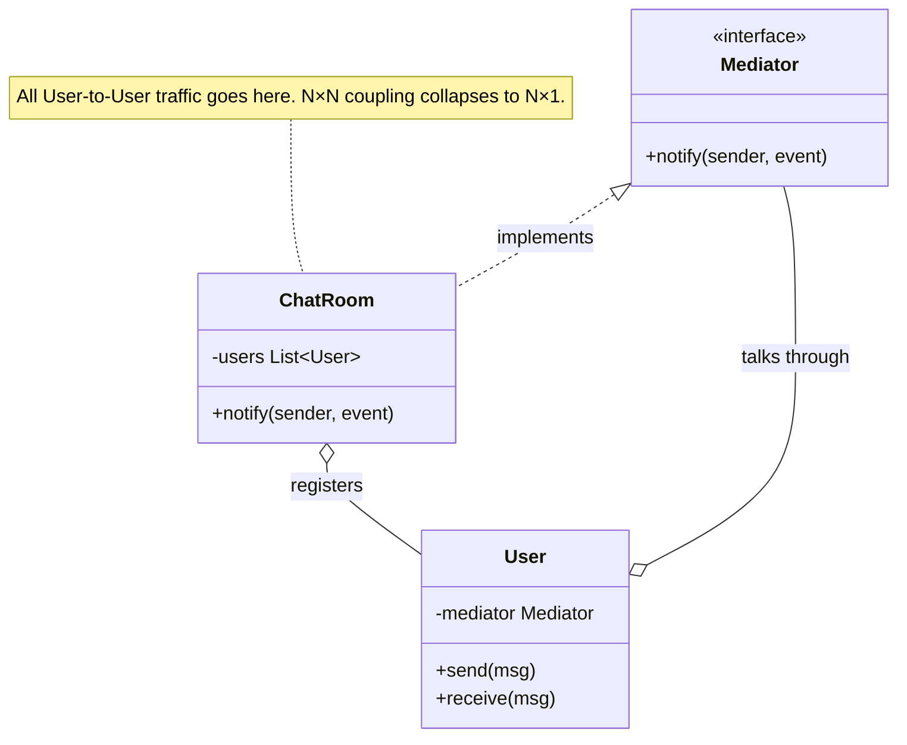

import QuickNav from '@site/src/components/QuickNav';
import CodeTabs from '@site/src/components/CodeTabs';
import Pillbar from '@site/src/components/Pillbar';

# Mediator

<Pillbar pills={[
  { label: 'family', value: 'behavioral' },
  { label: 'aka', value: 'Controller' },
  { label: 'complexity', value: '★★☆' },
  { label: 'popularity', value: '★★☆' },
]} />

<QuickNav items={[
  { label: 'INTENT',     href: '#intent' },
  { label: 'PROBLEM',    href: '#problem' },
  { label: 'SOLUTION',   href: '#solution' },
  { label: 'ANALOGY',    href: '#real-world-analogy' },
  { label: 'STRUCTURE',  href: '#structure' },
  { label: 'CODE',       href: '#code' },
  { label: 'PROS & CONS',href: '#pros--cons' },
  { label: 'RELATIONS',  href: '#relations-with-other-patterns' },
]} />

## Intent

> **Define an object that encapsulates how a set of objects interact, so the objects don't refer to each other directly.**

## Problem

A chat room has N users. If `User` objects send messages to each other directly, every user needs a reference to every other user — N² coupling. Adding a new collaborator (logging, moderation, presence) forces every user to learn about it. The web of references becomes the source of truth, and the source of every bug.

## Solution

Introduce a **mediator** (the chat room itself). Users only know the mediator; they call `mediator.send(...)`. The mediator decides who else needs to hear it. New collaborators (a `Moderator`, a `Logger`) register with the mediator without any user knowing.

## Real-World Analogy

Air traffic control. Pilots don't radio each other to coordinate landings — that would be chaos. Each plane talks only to the tower; the tower has a complete picture and tells each plane when to climb, turn, or land. Adding a new aircraft type doesn't require existing planes to learn its callsign.

## Structure

## Code

<CodeTabs
  groupId="im-lang"
  title="Mediator · chat room"
  java={`public interface Mediator {
  void send(String from, String msg);
  void register(User u);
}

public class User {
  private final String name;
  private final Mediator mediator;
  public User(String name, Mediator m) {
    this.name = name; this.mediator = m;
    m.register(this);
  }
  public void send(String msg) { mediator.send(name, msg); }
  public void receive(String from, String msg) {
    System.out.println(name + " sees: [" + from + "] " + msg);
  }
  public String name() { return name; }
}

public class ChatRoom implements Mediator {
  private final List<User> users = new ArrayList<>();
  public void register(User u) { users.add(u); }
  public void send(String from, String msg) {
    for (User u : users) if (!u.name().equals(from)) u.receive(from, msg);
  }
}

ChatRoom room = new ChatRoom();
User a = new User("Alice", room);
User b = new User("Bob",   room);
a.send("hi!");`}
  kotlin={`interface Mediator {
  fun send(from: String, msg: String)
  fun register(u: User)
}

class User(val name: String, private val mediator: Mediator) {
  init { mediator.register(this) }
  fun send(msg: String) = mediator.send(name, msg)
  fun receive(from: String, msg: String) =
    println("\$name sees: [\$from] \$msg")
}

class ChatRoom : Mediator {
  private val users = mutableListOf<User>()
  override fun register(u: User) { users += u }
  override fun send(from: String, msg: String) {
    users.filter { it.name != from }.forEach { it.receive(from, msg) }
  }
}

val room = ChatRoom()
val a = User("Alice", room)
val b = User("Bob",   room)
a.send("hi!")`}
/>

## Pros & Cons

| Pros | Cons |
| --- | --- |
| Removes tangled N×N references | The mediator can grow into a god-class |
| Components become independently reusable | One central bottleneck — failure here halts the whole interaction |
| Easy to add a new participant without touching others | Indirection hides who actually calls whom |

## Relations with Other Patterns

- **Facade** simplifies a *one-way* interaction with a subsystem; Mediator is *bidirectional* among peers.
- **Observer** can implement Mediator's notification step (the mediator publishes; participants subscribe).
- **Singleton** is a common scope for the mediator — one ChatRoom per session.
- **Spring's `ApplicationEventPublisher`** is essentially a Mediator for in-process events.
