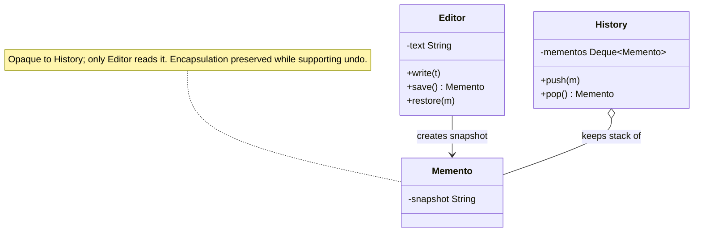

import QuickNav from '@site/src/components/QuickNav';
import CodeTabs from '@site/src/components/CodeTabs';
import Pillbar from '@site/src/components/Pillbar';

# Memento

<Pillbar pills={[
  { label: 'family', value: 'behavioral' },
  { label: 'aka', value: 'Snapshot · Token' },
  { label: 'complexity', value: '★★☆' },
  { label: 'popularity', value: '★★☆' },
]} />

<QuickNav items={[
  { label: 'INTENT',     href: '#intent' },
  { label: 'PROBLEM',    href: '#problem' },
  { label: 'SOLUTION',   href: '#solution' },
  { label: 'ANALOGY',    href: '#real-world-analogy' },
  { label: 'STRUCTURE',  href: '#structure' },
  { label: 'CODE',       href: '#code' },
  { label: 'PROS & CONS',href: '#pros--cons' },
  { label: 'RELATIONS',  href: '#relations-with-other-patterns' },
]} />

## Intent

> **Capture an object's internal state in a way that the object can be restored to it later, without exposing the state to callers.**

## Problem

A text editor needs undo. Saving the entire editor object isn't viable (its fields are private, often huge), and copying every field by hand from outside the class breaks encapsulation. You want a *checkpoint token* that only the editor itself knows how to make and apply, but that callers can hold and pass back later.

## Solution

The originator (`Editor`) produces an opaque `Memento` object — a value that captures whatever subset of state is needed to restore — and accepts a `Memento` later to roll back. Callers (a `History` / `Caretaker`) keep mementos in a stack but can't peek inside them. The originator is the *only* class that can read the memento.

## Real-World Analogy

A save point in a video game. The game knows what to write to the save file (HP, inventory, position) and how to read it back. You — the caretaker — just hold the save slot. You can't open it and edit your HP, but you can ask the game to "load slot 3" and the game knows what to do.

## Structure

## Code

<CodeTabs
  groupId="im-lang"
  title="Memento · editor"
  java={`public class Editor {
  private String text = "";

  public void write(String t) { text += t; }
  public String text() { return text; }

  // Memento — an opaque, immutable snapshot
  public Memento save() { return new Memento(text); }
  public void restore(Memento m) { this.text = m.snapshot; }

  public static final class Memento {
    private final String snapshot;
    private Memento(String s) { snapshot = s; }
  }
}

public class History {
  private final Deque<Editor.Memento> stack = new ArrayDeque<>();
  public void push(Editor.Memento m) { stack.push(m); }
  public Editor.Memento pop()        { return stack.pop(); }
}

Editor e = new Editor();
History h = new History();

e.write("Hello, ");
h.push(e.save());
e.write("world");

h.push(e.save());
e.write("!");
System.out.println(e.text());     // "Hello, world!"

e.restore(h.pop());
System.out.println(e.text());     // "Hello, world"`}
  kotlin={`class Editor {
  private var text: String = ""

  fun write(t: String) { text += t }
  fun text(): String = text

  fun save(): Memento = Memento(text)
  fun restore(m: Memento) { text = m.snapshot }

  class Memento internal constructor(internal val snapshot: String)
}

class History {
  private val stack = ArrayDeque<Editor.Memento>()
  fun push(m: Editor.Memento) { stack.addFirst(m) }
  fun pop(): Editor.Memento = stack.removeFirst()
}

val e = Editor()
val h = History()

e.write("Hello, ")
h.push(e.save())
e.write("world")

h.push(e.save())
e.write("!")
println(e.text())          // "Hello, world!"

e.restore(h.pop())
println(e.text())          // "Hello, world"`}
/>

## Pros & Cons

| Pros | Cons |
| --- | --- |
| Preserves encapsulation — internals stay private | Long histories eat memory; need a bounded stack or diff-based snapshots |
| Simple undo / checkpoint semantics | Snapshotting a huge object is expensive; capture diffs where you can |
| Caretaker doesn't need to understand state | Snapshots can be invalidated by external state the originator doesn't own |

## Relations with Other Patterns

- **Command** + **Memento** is the canonical undo pair — Command captures *what was done*; Memento captures *what to restore*.
- **Prototype** is a different way to clone — Memento is for *later restore*; Prototype is for *immediate reproduction*.
- **Iterator** can walk a history of mementos to support time-travel debugging.
- **Snapshot isolation** in databases is essentially a Memento applied to whole tables.
