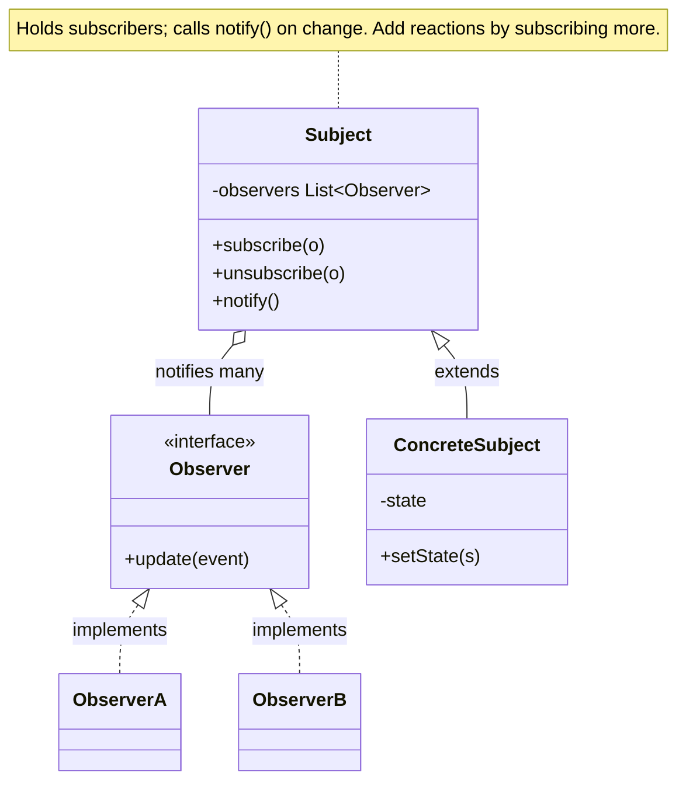

import QuickNav from '@site/src/components/QuickNav';
import CodeTabs from '@site/src/components/CodeTabs';
import Pillbar from '@site/src/components/Pillbar';

# Observer

<Pillbar pills={[
  { label: 'family', value: 'behavioral' },
  { label: 'aka', value: 'Publish-Subscribe · Listener' },
  { label: 'complexity', value: '★★☆' },
  { label: 'popularity', value: '★★★' },
]} />

<QuickNav items={[
  { label: 'INTENT',     href: '#intent' },
  { label: 'PROBLEM',    href: '#problem' },
  { label: 'SOLUTION',   href: '#solution' },
  { label: 'ANALOGY',    href: '#real-world-analogy' },
  { label: 'STRUCTURE',  href: '#structure' },
  { label: 'CODE',       href: '#code' },
  { label: 'PROS & CONS',href: '#pros--cons' },
  { label: 'RELATIONS',  href: '#relations-with-other-patterns' },
]} />

## Intent

> **Define a one-to-many dependency between objects so that when one changes state, all its dependents are notified and updated automatically.**

## Problem

When an order is placed, several things must happen: inventory decrements, a confirmation email is sent, the analytics service records the event, the warehouse picks it up. Calling each service inline from `OrderService.place()` couples it to every downstream consumer; the list grows whenever someone wants to react to a new event.

## Solution

The producer (`OrderTopic`) maintains a list of subscribers and a `publish` method. Each subscriber registers with the producer and exposes one method (`onEvent`) the producer calls. The producer doesn't know what subscribers do; subscribers don't know what other subscribers exist. Add a new reaction by registering one more subscriber.

## Real-World Analogy

A newspaper subscription. The newspaper (subject) doesn't know who its readers are by name — it just sends the day's issue to everyone on the subscriber list. Readers can join or leave at any time, and the paper keeps running without changes. A new reader doesn't require the paper to be rewritten.

## Structure

## Code

<CodeTabs
  groupId="im-lang"
  title="Observer"
  java={`public interface OrderEvent { String type(); Order order(); }
public interface OrderObserver { void onEvent(OrderEvent e); }

public class OrderTopic {
  private final List<OrderObserver> subs = new CopyOnWriteArrayList<>();

  public void subscribe(OrderObserver o)   { subs.add(o); }
  public void unsubscribe(OrderObserver o) { subs.remove(o); }

  public void publish(OrderEvent e) {
    for (OrderObserver o : subs) o.onEvent(e);
  }
}

class InventoryUpdater implements OrderObserver {
  public void onEvent(OrderEvent e) { /* decrement stock */ }
}
class EmailSender implements OrderObserver {
  public void onEvent(OrderEvent e) { /* send confirmation */ }
}

OrderTopic topic = new OrderTopic();
topic.subscribe(new InventoryUpdater());
topic.subscribe(new EmailSender());
topic.publish(new OrderPlacedEvent(order));`}
  kotlin={`interface OrderEvent { val type: String; val order: Order }
fun interface OrderObserver { fun onEvent(e: OrderEvent) }

class OrderTopic {
  private val subs = CopyOnWriteArrayList<OrderObserver>()
  fun subscribe(o: OrderObserver)   { subs += o }
  fun unsubscribe(o: OrderObserver) { subs -= o }
  fun publish(e: OrderEvent) = subs.forEach { it.onEvent(e) }
}

val topic = OrderTopic()
topic.subscribe { e -> /* inventory */ }
topic.subscribe { e -> /* email */ }
topic.publish(OrderPlacedEvent(order))`}
/>

## Pros & Cons

| Pros | Cons |
| --- | --- |
| Publisher and subscribers stay decoupled | Synchronous publish runs on the publisher's thread — one slow subscriber stalls the rest |
| Add or remove subscribers without touching the publisher | Forgetting to unsubscribe leaks memory (especially with long-lived publishers) |
| Open/Closed for new event reactions | Notification order is rarely guaranteed |

## Relations with Other Patterns

- **Mediator** also coordinates participants; the difference is Mediator is *bidirectional* among peers, while Observer is *one-way* from subject to subscribers.
- **Singleton** is a common scope for an event bus.
- **Publish/subscribe** infrastructure (Spring `ApplicationEventPublisher`, Kotlin `Flow`, RxJava `Subject`, Kafka) is Observer at scale.
- **Command** is often the *payload* an Observer publishes ("here's what happened").
