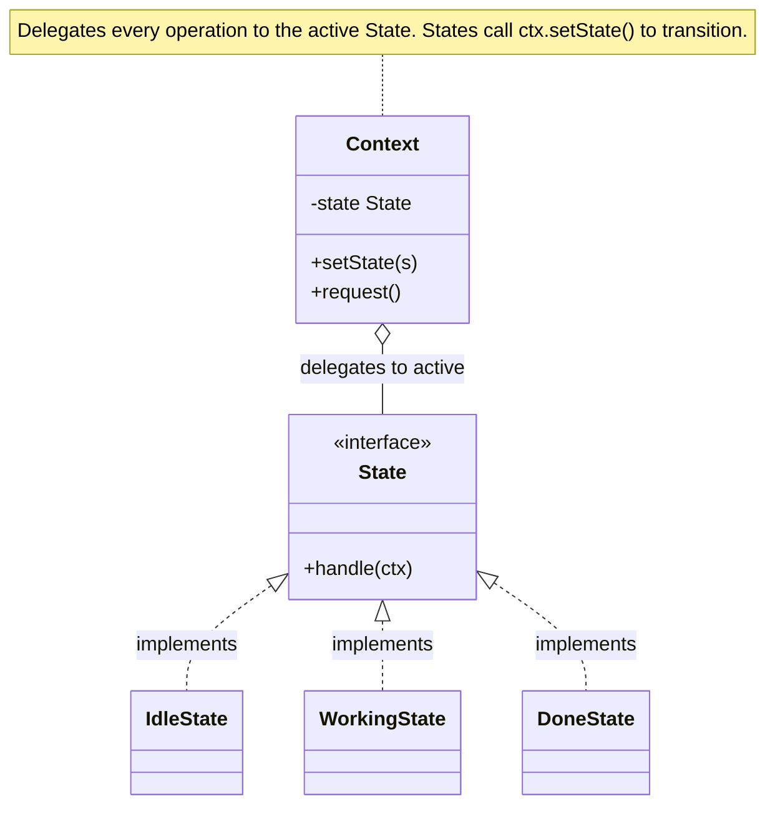

import QuickNav from '@site/src/components/QuickNav';
import CodeTabs from '@site/src/components/CodeTabs';
import Pillbar from '@site/src/components/Pillbar';

# State

<Pillbar pills={[
  { label: 'family', value: 'behavioral' },
  { label: 'aka', value: '—' },
  { label: 'complexity', value: '★★★' },
  { label: 'popularity', value: '★★☆' },
]} />

<QuickNav items={[
  { label: 'INTENT',     href: '#intent' },
  { label: 'PROBLEM',    href: '#problem' },
  { label: 'SOLUTION',   href: '#solution' },
  { label: 'ANALOGY',    href: '#real-world-analogy' },
  { label: 'STRUCTURE',  href: '#structure' },
  { label: 'CODE',       href: '#code' },
  { label: 'PROS & CONS',href: '#pros--cons' },
  { label: 'RELATIONS',  href: '#relations-with-other-patterns' },
]} />

## Intent

> **Allow an object to alter its behaviour when its internal state changes. The object appears to change its class.**

## Problem

A vending machine accepts coins, lets you pick an item, dispenses, and resets. The legal operations differ by stage: you can't dispense before paying; you can't insert coins while dispensing; you can't cancel after committing. A naive design buries it all in `if (status == "IDLE") ... else if (status == "HAS_MONEY") ...` chains repeated across every method — fragile and impossible to extend.

## Solution

Create one class per state (`IdleState`, `HasMoneyState`, `DispensingState`), each implementing the same `State` interface. The context (`VendingMachine`) holds a reference to the currently active state and delegates every operation to it. Each state class enforces its legal transitions by calling `context.setState(...)`. New states slot in without editing existing ones.

## Real-World Analogy

A traffic light. When green, "wait" is illegal — cars go. When yellow, "go" becomes "slow". When red, "go" becomes "stop". The same input (a car arriving) produces different responses depending on the light's state. The light's behaviour changes; the cars don't have to read the light's logic.

## Structure

## Code

<CodeTabs
  groupId="im-lang"
  title="State · vending machine"
  java={`public interface State {
  void insertMoney(int cents);
  void selectItem(String code);
  void dispense();
  void cancel();
}

public class VendingMachine {
  private State state;
  int deposit; Item selected;
  Map<String, Item> inventory = new HashMap<>();

  public VendingMachine() { state = new IdleState(this); }
  void setState(State s) { this.state = s; }
  void refund(int n) { /* return coins */ }
  void dispenseChange(int n) { /* return coins */ }
  void reset() { deposit = 0; selected = null; }

  public void insertMoney(int cents) { state.insertMoney(cents); }
  public void selectItem(String c)   { state.selectItem(c); }
  public void dispense()             { state.dispense(); }
  public void cancel()               { state.cancel(); }
}

public class IdleState implements State {
  private final VendingMachine m;
  public IdleState(VendingMachine m) { this.m = m; }
  public void insertMoney(int cents) {
    m.deposit += cents;
    m.setState(new HasMoneyState(m));
  }
  public void selectItem(String c) { throw new IllegalStateException("insert money first"); }
  public void dispense()           { throw new IllegalStateException(); }
  public void cancel()             { /* no-op */ }
}

public class HasMoneyState implements State {
  private final VendingMachine m;
  public HasMoneyState(VendingMachine m) { this.m = m; }
  public void insertMoney(int cents) { m.deposit += cents; }
  public void selectItem(String code) {
    Item i = m.inventory.get(code);
    if (i == null || i.stock == 0)  throw new IllegalStateException("out of stock");
    if (m.deposit < i.price)        throw new IllegalStateException("not enough");
    m.selected = i;
    m.setState(new DispensingState(m));
  }
  public void dispense() { throw new IllegalStateException("pick an item"); }
  public void cancel()   { m.refund(m.deposit); m.reset(); m.setState(new IdleState(m)); }
}

public class DispensingState implements State {
  private final VendingMachine m;
  public DispensingState(VendingMachine m) { this.m = m; }
  public void insertMoney(int cents) { throw new IllegalStateException(); }
  public void selectItem(String c)   { throw new IllegalStateException(); }
  public void dispense() {
    m.selected.stock--;
    int change = m.deposit - m.selected.price;
    if (change > 0) m.dispenseChange(change);
    m.reset();
    m.setState(new IdleState(m));
  }
  public void cancel() { throw new IllegalStateException("already committed"); }
}`}
  kotlin={`interface State {
  fun insertMoney(cents: Int)
  fun selectItem(code: String)
  fun dispense()
  fun cancel()
}

class VendingMachine {
  var state: State = IdleState(this); private set
  var deposit = 0
  var selected: Item? = null
  val inventory = mutableMapOf<String, Item>()

  fun transition(s: State) { state = s }
  fun refund(n: Int) { /* return coins */ }
  fun dispenseChange(n: Int) { /* return coins */ }
  fun reset() { deposit = 0; selected = null }

  fun insertMoney(cents: Int) = state.insertMoney(cents)
  fun selectItem(code: String) = state.selectItem(code)
  fun dispense()  = state.dispense()
  fun cancel()    = state.cancel()
}

class IdleState(private val m: VendingMachine) : State {
  override fun insertMoney(cents: Int) {
    m.deposit += cents
    m.transition(HasMoneyState(m))
  }
  override fun selectItem(code: String) = error("insert money first")
  override fun dispense()               = error("nothing selected")
  override fun cancel()                 { /* no-op */ }
}

class HasMoneyState(private val m: VendingMachine) : State {
  override fun insertMoney(cents: Int) { m.deposit += cents }
  override fun selectItem(code: String) {
    val item = m.inventory[code] ?: error("not stocked")
    require(item.stock > 0)         { "out of stock" }
    require(m.deposit >= item.price) { "not enough" }
    m.selected = item
    m.transition(DispensingState(m))
  }
  override fun dispense() = error("pick an item")
  override fun cancel() {
    m.refund(m.deposit); m.reset(); m.transition(IdleState(m))
  }
}

class DispensingState(private val m: VendingMachine) : State {
  override fun insertMoney(cents: Int)  = error("already committed")
  override fun selectItem(code: String) = error("already committed")
  override fun dispense() {
    val item = m.selected!!
    item.stock--
    val change = m.deposit - item.price
    if (change > 0) m.dispenseChange(change)
    m.reset(); m.transition(IdleState(m))
  }
  override fun cancel() = error("already committed")
}`}
/>

## Pros & Cons

| Pros | Cons |
| --- | --- |
| Replaces sprawling `if/else` ladders with focused classes | Adds many classes for what may be a small state set |
| Legal transitions are enforced by the type system | Transitions are scattered across state classes — hard to see the whole machine at a glance |
| New states added without editing existing ones | The context exposes internals so state classes can mutate it (the trade-off Memento avoids) |

## Relations with Other Patterns

- **Strategy** and State look identical structurally. The difference is *intent*: Strategy is chosen by the client and stays put; State *transitions* the context as a normal part of operation.
- **Memento** can snapshot the (context, state) pair for undo or save-game.
- **Singleton** state classes save allocations if states carry no instance data.
- For complex transitions, a dedicated **state-machine library** (Spring StateMachine, XState) gives you visualisation and guards for free.
