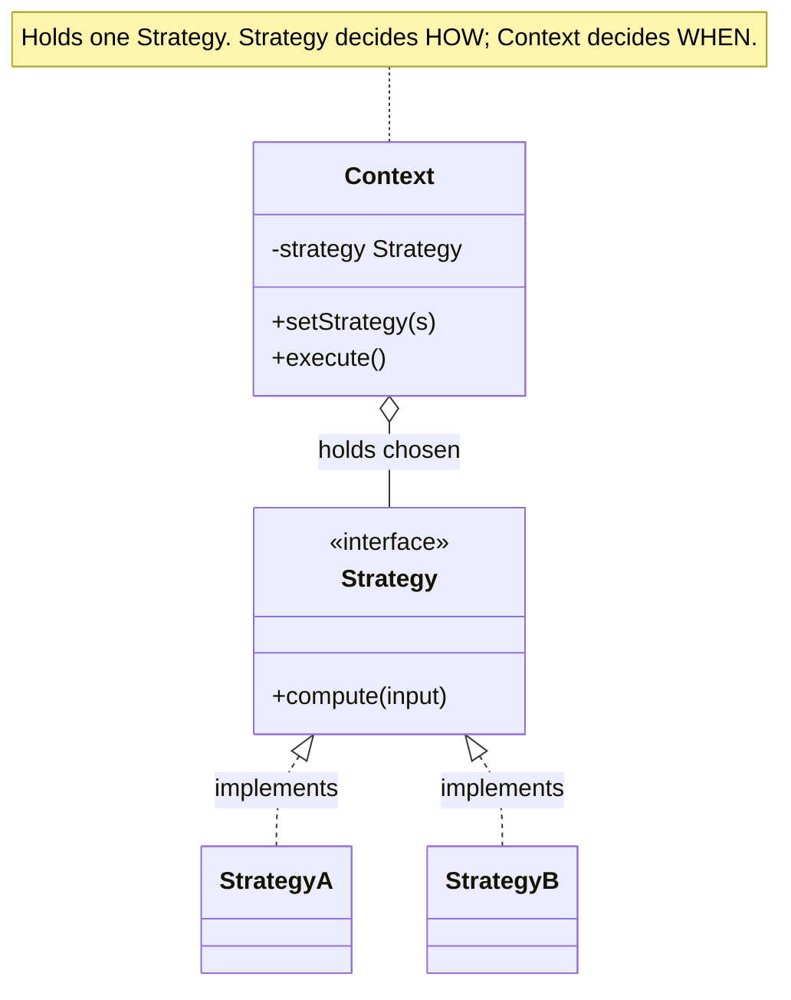

import QuickNav from '@site/src/components/QuickNav';
import CodeTabs from '@site/src/components/CodeTabs';
import Pillbar from '@site/src/components/Pillbar';

# Strategy

<Pillbar pills={[
  { label: 'family', value: 'behavioral' },
  { label: 'aka', value: 'Policy' },
  { label: 'complexity', value: '★☆☆' },
  { label: 'popularity', value: '★★★' },
]} />

<QuickNav items={[
  { label: 'INTENT',     href: '#intent' },
  { label: 'PROBLEM',    href: '#problem' },
  { label: 'SOLUTION',   href: '#solution' },
  { label: 'ANALOGY',    href: '#real-world-analogy' },
  { label: 'STRUCTURE',  href: '#structure' },
  { label: 'CODE',       href: '#code' },
  { label: 'PROS & CONS',href: '#pros--cons' },
  { label: 'RELATIONS',  href: '#relations-with-other-patterns' },
]} />

## Intent

> **Define a family of algorithms, encapsulate each one, and make them interchangeable. The algorithm can vary independently from the client that uses it.**

## Problem

A checkout service computes price with several rules: standard, Black Friday discount, staff pricing, gift-card-only. A `switch (pricingRule)` block inside `total()` works for two — by ten it's a wall of code that no one wants to touch. Worse, A/B testing a new rule requires editing the central switch and shipping a release.

## Solution

Pull each rule into its own class implementing a shared `PricingStrategy` interface. The `Checkout` holds a `PricingStrategy` reference and calls `pricing.compute(order)`. Choose the rule at construction or swap it at runtime; A/B tests become "pick the strategy by request feature flag."

## Real-World Analogy

A trip from A to B. You can drive, take the train, ride a bike, or walk. Each is a distinct *strategy* with the same interface (`getMeFrom(A, B)`) — they pick differently on speed, cost, weather, fitness. You choose one when you leave the house; you don't rewrite your day to switch.

## Structure

## Code

<CodeTabs
  groupId="im-lang"
  title="Strategy"
  java={`public interface PricingStrategy {
  long compute(Order o);
}

public class StandardPricing    implements PricingStrategy { public long compute(Order o) { return o.subtotal(); } }
public class BlackFridayPricing implements PricingStrategy { public long compute(Order o) { return Math.round(o.subtotal() * 0.6); } }
public class StaffPricing       implements PricingStrategy { public long compute(Order o) { return Math.round(o.subtotal() * 0.5); } }

public class Checkout {
  private PricingStrategy pricing;
  public Checkout(PricingStrategy p) { this.pricing = p; }
  public void setStrategy(PricingStrategy p) { this.pricing = p; }
  public long total(Order o) { return pricing.compute(o); }
}

Checkout c = new Checkout(new BlackFridayPricing());
long t = c.total(order);`}
  kotlin={`fun interface PricingStrategy { fun compute(o: Order): Long }

val standard:    PricingStrategy = PricingStrategy { it.subtotal }
val blackFriday: PricingStrategy = PricingStrategy { (it.subtotal * 0.6).toLong() }
val staff:       PricingStrategy = PricingStrategy { (it.subtotal * 0.5).toLong() }

class Checkout(var pricing: PricingStrategy) {
  fun total(o: Order): Long = pricing.compute(o)
}

val c = Checkout(blackFriday)
val t = c.total(order)`}
/>

## Pros & Cons

| Pros | Cons |
| --- | --- |
| Replaces conditionals with a polymorphic call | More classes / lambdas — overkill for one-shot logic |
| Algorithms swappable at runtime | The client needs to know *which* strategy to pick (often via DI or a registry) |
| Open/Closed for new algorithms | Each strategy must accept the same input shape — limiting when needs diverge |

## Relations with Other Patterns

- **State** has the same structural shape but transitions itself; Strategy is set by the client and stays put.
- **Template Method** locks in the *skeleton* and varies a step; Strategy varies the *whole algorithm*.
- **Command** wraps a *call*; Strategy wraps an *algorithm*.
- **Decorator** changes how an object behaves by wrapping; Strategy by swapping a delegate. Decorator composes; Strategy substitutes.
- **Factory Method** or a registry is the usual way to pick the right strategy at runtime.
