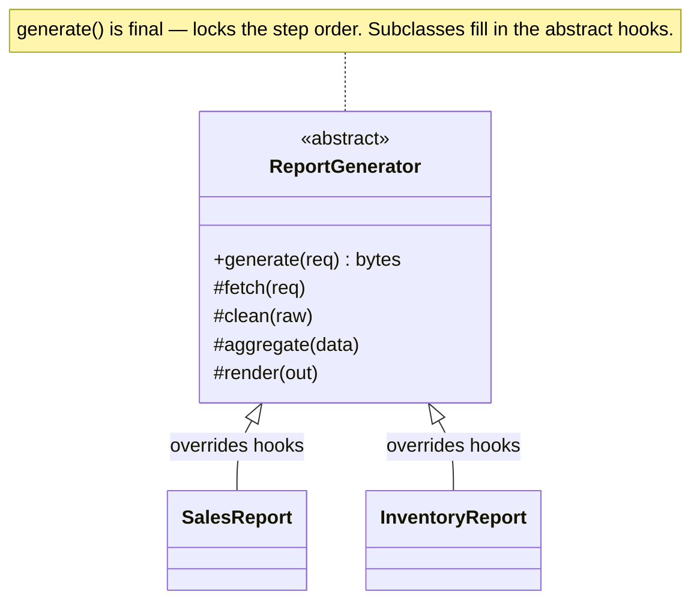

import QuickNav from '@site/src/components/QuickNav';
import CodeTabs from '@site/src/components/CodeTabs';
import Pillbar from '@site/src/components/Pillbar';

# Template Method

<Pillbar pills={[
  { label: 'family', value: 'behavioral' },
  { label: 'aka', value: '—' },
  { label: 'complexity', value: '★☆☆' },
  { label: 'popularity', value: '★★★' },
]} />

<QuickNav items={[
  { label: 'INTENT',     href: '#intent' },
  { label: 'PROBLEM',    href: '#problem' },
  { label: 'SOLUTION',   href: '#solution' },
  { label: 'ANALOGY',    href: '#real-world-analogy' },
  { label: 'STRUCTURE',  href: '#structure' },
  { label: 'CODE',       href: '#code' },
  { label: 'PROS & CONS',href: '#pros--cons' },
  { label: 'RELATIONS',  href: '#relations-with-other-patterns' },
]} />

## Intent

> **Define the skeleton of an algorithm in a base class, deferring some steps to subclasses. Subclasses can redefine steps without changing the algorithm's structure.**

## Problem

Several reports — Sales, Inventory, Tax — share the same flow: load data, normalize, aggregate, render. Only the *load* and *render* steps differ per report. Copy-pasting the four-step skeleton into every report class duplicates orchestration and lets subtle ordering bugs creep in (someone aggregates before normalizing in one of them).

## Solution

Put the skeleton (`generate()`) in an abstract base class and mark it `final` so subclasses can't break the order. Each variable step becomes an abstract or overridable hook method. Subclasses implement the hooks; the base class guarantees they're called in the right sequence.

## Real-World Analogy

A coffee chain's drink recipe. Every drink shares the same skeleton — grind beans, brew, pour, serve. Only the bean type, brew time, and additions vary. A barista training manual locks in the order; new drinks (cold brew, espresso) override the steps that differ but inherit the rest.

## Structure

## Code

<CodeTabs
  groupId="im-lang"
  title="Template Method"
  java={`public abstract class ReportGenerator {

  // Template method — final so subclasses can't break the order
  public final byte[] generate(ReportRequest r) {
    Data raw = fetch(r);
    Data normalized = clean(raw);
    Object computed = aggregate(normalized);
    return render(computed);
  }

  // Hooks — subclasses must implement
  protected abstract Data fetch(ReportRequest r);
  protected abstract Object aggregate(Data data);
  protected abstract byte[] render(Object computed);

  // Default behaviour — subclasses may override
  protected Data clean(Data raw) { return raw; }
}

public class SalesReport extends ReportGenerator {
  protected Data fetch(ReportRequest r)   { return db.querySales(r.range()); }
  protected Object aggregate(Data data)   { return data.groupBySku(); }
  protected byte[] render(Object out)     { return Pdf.render(out); }
}`}
  kotlin={`abstract class ReportGenerator {
  // Template method — final so subclasses can't break the order
  fun generate(r: ReportRequest): ByteArray {
    val raw = fetch(r)
    val normalized = clean(raw)
    val computed = aggregate(normalized)
    return render(computed)
  }

  protected abstract fun fetch(r: ReportRequest): Data
  protected abstract fun aggregate(data: Data): Any
  protected abstract fun render(computed: Any): ByteArray

  protected open fun clean(raw: Data): Data = raw    // default; subclasses may override
}

class SalesReport : ReportGenerator() {
  override fun fetch(r: ReportRequest): Data = db.querySales(r.range)
  override fun aggregate(data: Data): Any    = data.groupBySku()
  override fun render(computed: Any): ByteArray = Pdf.render(computed)
}`}
/>

## Pros & Cons

| Pros | Cons |
| --- | --- |
| Algorithm structure stays in one place, enforced | Subclassing for variation locks you into inheritance |
| Subclasses focus only on what's different | Hard to compose multiple variations (no multiple inheritance in Java) |
| Default hook implementations reduce subclass boilerplate | Adding a new step to the skeleton ripples to every subclass |

## Relations with Other Patterns

- **Strategy** is the composition-based alternative: instead of subclassing to override a hook, inject a `Strategy` object. Strategy → swap whole algorithm; Template Method → keep skeleton, swap one step.
- **Factory Method** is a *specific kind* of Template Method whose hook is creating an object.
- **Spring's `JdbcTemplate`** and **`RestTemplate`** are canonical Template Methods.
- **Java's `AbstractList`** uses Template Method — subclasses implement `get(i)` and `size()`; iteration falls out automatically.
