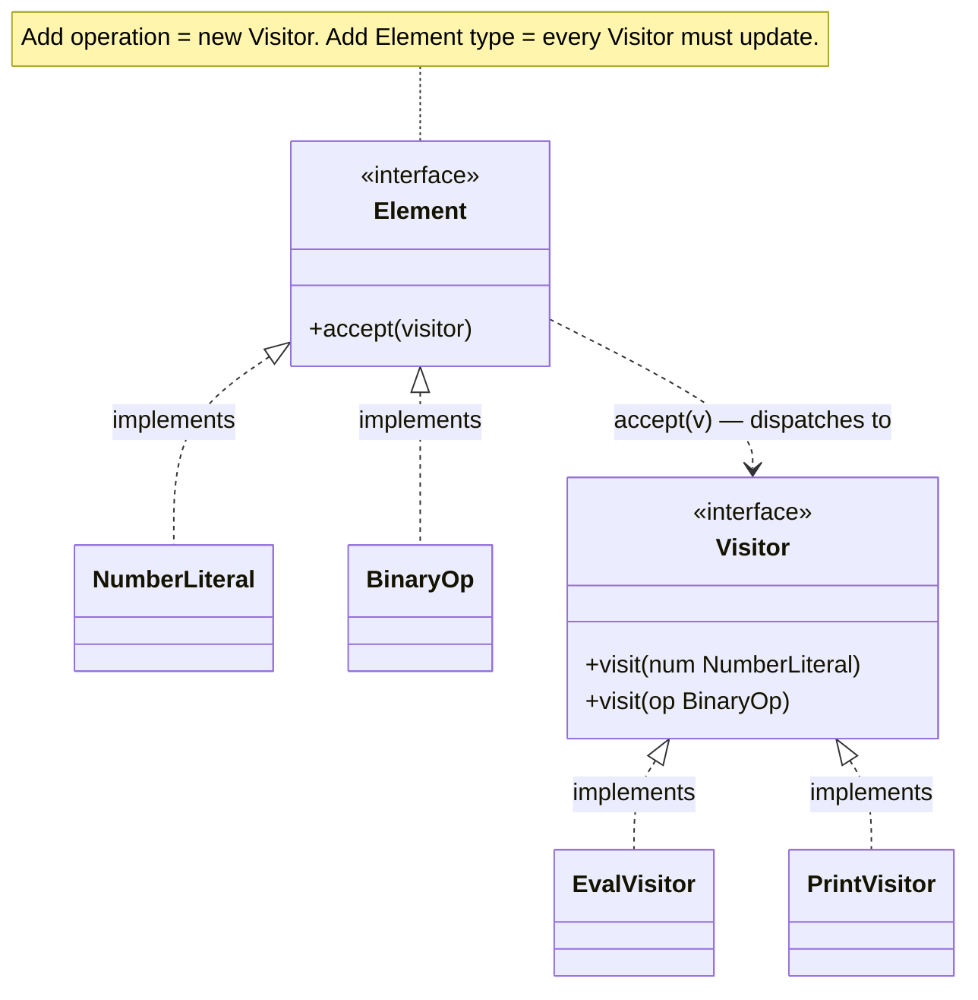

import QuickNav from '@site/src/components/QuickNav';
import CodeTabs from '@site/src/components/CodeTabs';
import Pillbar from '@site/src/components/Pillbar';

# Visitor

<Pillbar pills={[
  { label: 'family', value: 'behavioral' },
  { label: 'aka', value: '—' },
  { label: 'complexity', value: '★★★' },
  { label: 'popularity', value: '★★☆' },
]} />

<QuickNav items={[
  { label: 'INTENT',     href: '#intent' },
  { label: 'PROBLEM',    href: '#problem' },
  { label: 'SOLUTION',   href: '#solution' },
  { label: 'ANALOGY',    href: '#real-world-analogy' },
  { label: 'STRUCTURE',  href: '#structure' },
  { label: 'CODE',       href: '#code' },
  { label: 'PROS & CONS',href: '#pros--cons' },
  { label: 'RELATIONS',  href: '#relations-with-other-patterns' },
]} />

## Intent

> **Represent an operation to be performed on the elements of an object structure. Visitor lets you define a new operation without changing the classes of the elements on which it operates.**

## Problem

You have an AST with twenty node types — `NumberLiteral`, `BinaryOp`, `VariableRef`, … — and you keep needing new operations: evaluate, pretty-print, type-check, lint, optimize. Adding each operation as a method on every node class means editing twenty classes per operation. The classes balloon and lose their focus.

## Solution

Flip the dependency. Define a `Visitor` interface with one `visit(NodeType)` overload per node type. Each operation becomes a `Visitor` implementation. Each node has one `accept(Visitor)` method that double-dispatches to the right `visit(...)`. New operations are new visitor classes — node classes stay untouched.

The trade-off inverts: adding a new *operation* is cheap, adding a new *node type* now forces every visitor to update.

## Real-World Analogy

A medical insurance auditor. The insurer has a fixed set of policy types: life, auto, home. Periodically a new audit needs to run across them all — fraud check, premium recalc, regulatory report. Sending an auditor (visitor) who knows how to inspect each policy type lets you add audits without modifying policy code.

## Structure

## Code

<CodeTabs
  groupId="im-lang"
  title="Visitor · AST"
  java={`public interface Visitor<R> {
  R visit(NumberLiteral n);
  R visit(BinaryOp op);
}

public interface Expr {
  <R> R accept(Visitor<R> v);
}

public class NumberLiteral implements Expr {
  public final double value;
  public NumberLiteral(double v) { value = v; }
  public <R> R accept(Visitor<R> v) { return v.visit(this); }
}

public class BinaryOp implements Expr {
  public final Expr left, right;
  public final char op;
  public BinaryOp(Expr l, char op, Expr r) { left = l; this.op = op; right = r; }
  public <R> R accept(Visitor<R> v) { return v.visit(this); }
}

// Operation #1
public class EvalVisitor implements Visitor<Double> {
  public Double visit(NumberLiteral n) { return n.value; }
  public Double visit(BinaryOp op) {
    double l = op.left.accept(this);
    double r = op.right.accept(this);
    return switch (op.op) {
      case '+' -> l + r;
      case '-' -> l - r;
      case '*' -> l * r;
      case '/' -> l / r;
      default  -> throw new IllegalArgumentException();
    };
  }
}

// Operation #2 — added later, no changes to AST classes
public class PrintVisitor implements Visitor<String> {
  public String visit(NumberLiteral n) { return Double.toString(n.value); }
  public String visit(BinaryOp op) {
    return "(" + op.left.accept(this) + " " + op.op + " " + op.right.accept(this) + ")";
  }
}

Expr ast = new BinaryOp(new NumberLiteral(1), '+', new NumberLiteral(2));
System.out.println(ast.accept(new EvalVisitor()));   // 3.0
System.out.println(ast.accept(new PrintVisitor()));  // (1.0 + 2.0)`}
  kotlin={`interface Visitor<R> {
  fun visit(n: NumberLiteral): R
  fun visit(op: BinaryOp): R
}

sealed interface Expr { fun <R> accept(v: Visitor<R>): R }

class NumberLiteral(val value: Double) : Expr {
  override fun <R> accept(v: Visitor<R>) = v.visit(this)
}

class BinaryOp(val left: Expr, val op: Char, val right: Expr) : Expr {
  override fun <R> accept(v: Visitor<R>) = v.visit(this)
}

class EvalVisitor : Visitor<Double> {
  override fun visit(n: NumberLiteral) = n.value
  override fun visit(op: BinaryOp): Double {
    val l = op.left.accept(this)
    val r = op.right.accept(this)
    return when (op.op) {
      '+' -> l + r;  '-' -> l - r
      '*' -> l * r;  '/' -> l / r
      else -> throw IllegalArgumentException()
    }
  }
}

class PrintVisitor : Visitor<String> {
  override fun visit(n: NumberLiteral) = n.value.toString()
  override fun visit(op: BinaryOp) =
    "(\${op.left.accept(this)} \${op.op} \${op.right.accept(this)})"
}

val ast: Expr = BinaryOp(NumberLiteral(1.0), '+', NumberLiteral(2.0))
println(ast.accept(EvalVisitor()))    // 3.0
println(ast.accept(PrintVisitor()))   // (1.0 + 2.0)`}
/>

## Pros & Cons

| Pros | Cons |
| --- | --- |
| Add new operations without touching element classes | Adding a new *element type* forces every visitor to update |
| Each operation lives in one focused class | Double-dispatch (`accept` + `visit`) is hard to read and explain |
| Accumulating state across visits is straightforward | Visitor must access element internals — usually via public state or friend access |
| Sealed hierarchies + Kotlin/Java `when`/`switch` patterns can replace it cleanly | |

## Relations with Other Patterns

- **Composite** trees are the canonical Visitor target — the visitor walks the recursive structure.
- **Iterator** can drive a Visitor (iterate elements, then accept(v) on each).
- **Strategy** also varies behaviour, but Visitor specifically handles a fixed family of element types via double-dispatch.
- **Sealed classes** + `switch`/`when` pattern matching (Java 21+, Kotlin) often replace Visitor with less ceremony.
