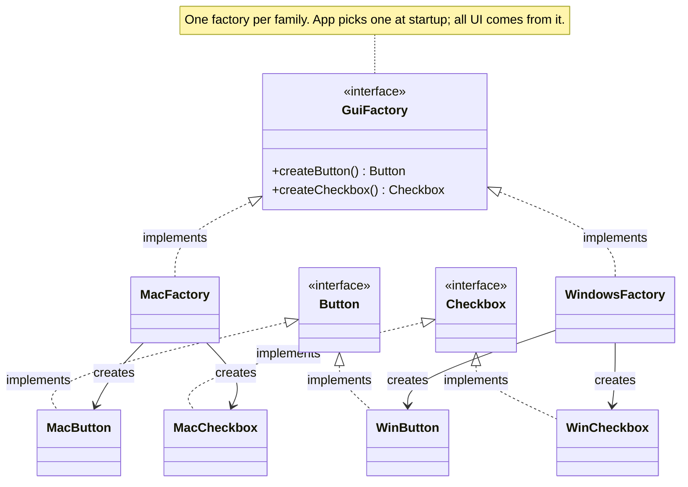

import QuickNav from '@site/src/components/QuickNav';
import CodeTabs from '@site/src/components/CodeTabs';
import Pillbar from '@site/src/components/Pillbar';

# Abstract Factory

<Pillbar pills={[
  { label: 'family', value: 'creational' },
  { label: 'aka', value: 'Kit' },
  { label: 'complexity', value: '★★★' },
  { label: 'popularity', value: '★★☆' },
]} />

<QuickNav items={[
  { label: 'INTENT',     href: '#intent' },
  { label: 'PROBLEM',    href: '#problem' },
  { label: 'SOLUTION',   href: '#solution' },
  { label: 'ANALOGY',    href: '#real-world-analogy' },
  { label: 'STRUCTURE',  href: '#structure' },
  { label: 'CODE',       href: '#code' },
  { label: 'PROS & CONS',href: '#pros--cons' },
  { label: 'RELATIONS',  href: '#relations-with-other-patterns' },
]} />

## Intent

> **Produce families of related objects without specifying their concrete classes — and guarantee the products of one family are used together.**

## Problem

You ship a cross-platform UI toolkit with `Button`, `Checkbox`, and `Window` types. Each must look native on macOS, Windows, and Linux. If application code calls `new MacButton()` here and `new WindowsCheckbox()` there, nothing stops a mismatched UI on a single screen. The hard constraint isn't "let me pick a concrete class" — it's "*all my widgets must come from the same family*".

## Solution

Define one interface — `GuiFactory` — with a method for each product type (`createButton`, `createCheckbox`, `createWindow`). Each platform implements that interface and returns its own concrete products. The application picks a factory once at startup and uses it for everything; the type system then prevents cross-family contamination.

## Real-World Analogy

A furniture catalogue. A "Modern" living-room set has a Modern sofa, a Modern chair, a Modern coffee table — and they look right together. A "Victorian" set has its own matching pieces. You don't mail-order a Modern sofa and a Victorian chair to the same room. The catalogue (factory) hands you a coordinated set.

## Structure

## Code

<CodeTabs
  groupId="im-lang"
  title="AbstractFactory"
  java={`public interface Button   { void render(); }
public interface Checkbox { void render(); }

public interface GuiFactory {
  Button   createButton();
  Checkbox createCheckbox();
}

public class MacFactory implements GuiFactory {
  public Button   createButton()   { return new MacButton(); }
  public Checkbox createCheckbox() { return new MacCheckbox(); }
}

public class WindowsFactory implements GuiFactory {
  public Button   createButton()   { return new WinButton(); }
  public Checkbox createCheckbox() { return new WinCheckbox(); }
}

public class Application {
  private final GuiFactory ui;
  public Application(GuiFactory ui) { this.ui = ui; }

  public void draw() {
    ui.createButton().render();
    ui.createCheckbox().render();
  }
}

// Wiring at startup:
GuiFactory factory = isMac() ? new MacFactory() : new WindowsFactory();
new Application(factory).draw();`}
  kotlin={`interface Button   { fun render() }
interface Checkbox { fun render() }

interface GuiFactory {
  fun createButton(): Button
  fun createCheckbox(): Checkbox
}

class MacFactory : GuiFactory {
  override fun createButton()   = MacButton()
  override fun createCheckbox() = MacCheckbox()
}

class WindowsFactory : GuiFactory {
  override fun createButton()   = WinButton()
  override fun createCheckbox() = WinCheckbox()
}

class Application(private val ui: GuiFactory) {
  fun draw() {
    ui.createButton().render()
    ui.createCheckbox().render()
  }
}

// Wiring at startup
val factory: GuiFactory = if (isMac()) MacFactory() else WindowsFactory()
Application(factory).draw()`}
/>

## Pros & Cons

| Pros | Cons |
| --- | --- |
| Guarantees products from one family always match | Adding a new **product type** forces every concrete factory to change |
| Application code stays free of `if (os == ...)` branches | Pile of interfaces and concrete classes — heavy for small problems |
| Easy to swap an entire family for tests (`FakeGuiFactory`) | Beginners conflate it with Factory Method (it's a family of them) |

## Relations with Other Patterns

- **Factory Method** is the building block; Abstract Factory groups several factory methods on one interface.
- **Builder** focuses on stepwise *construction*; Abstract Factory focuses on *family consistency*.
- **Prototype** can be used inside an Abstract Factory: each `create*` method clones a template instead of instantiating.
- **Singleton** is a common scope for the concrete factories — one `MacFactory` per process is plenty.
- **Bridge** addresses a similar two-dimensional problem (abstraction × implementation) via composition rather than parallel hierarchies.
