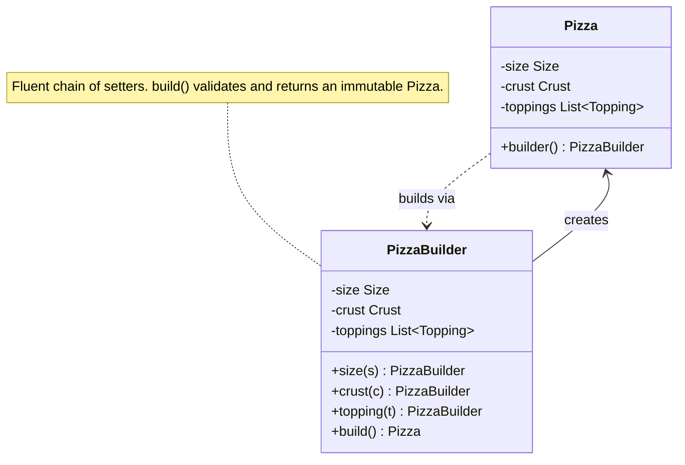
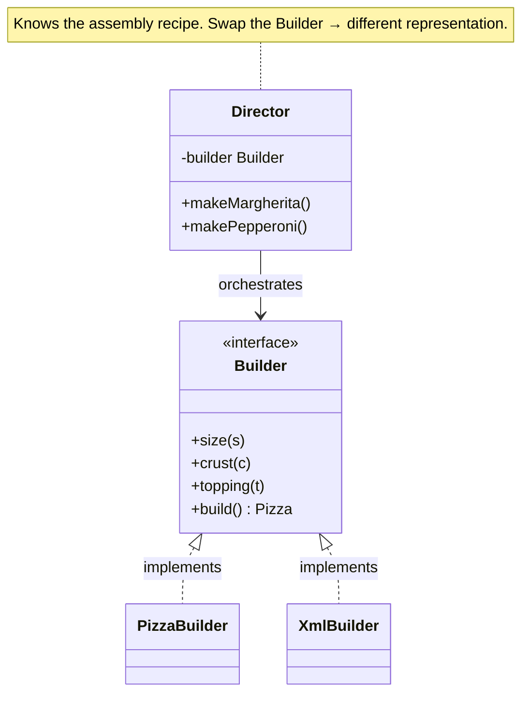

import QuickNav from '@site/src/components/QuickNav';
import CodeTabs from '@site/src/components/CodeTabs';
import Pillbar from '@site/src/components/Pillbar';

# Builder

<Pillbar pills={[
  { label: 'family', value: 'creational' },
  { label: 'aka', value: '—' },
  { label: 'complexity', value: '★★☆' },
  { label: 'popularity', value: '★★★' },
]} />

<QuickNav items={[
  { label: 'INTENT',     href: '#intent' },
  { label: 'PROBLEM',    href: '#problem' },
  { label: 'SOLUTION',   href: '#solution' },
  { label: 'ANALOGY',    href: '#real-world-analogy' },
  { label: 'STRUCTURE',  href: '#structure' },
  { label: 'CODE',       href: '#code' },
  { label: 'PROS & CONS',href: '#pros--cons' },
  { label: 'RELATIONS',  href: '#relations-with-other-patterns' },
]} />

## Intent

> **Separate the construction of a complex object from its representation, so the same construction code can build different objects.**

## Problem

A `Pizza` has size, crust, sauce, cheese, and a list of toppings. Most fields are optional. A telescoping constructor — `new Pizza(LARGE, THIN, MARINARA, MOZZARELLA, null, null, false, true, 3)` — is unreadable, error-prone, and impossible to maintain as new options arrive.

Sub-classing per combination (`ThinLargeMargheritaPizza`) explodes combinatorially. You want **one** target class and a fluent way to assemble it.

## Solution

A separate `Builder` holds intermediate state. The client calls one setter per concern (`.size(LARGE).crust(THIN).topping(MUSHROOMS)`) and finally `.build()`, which validates and returns an immutable target. Optional fields stay optional; required ones are checked at `build()` time.

## Real-World Analogy

Ordering a custom sandwich at a deli. You don't shout one giant sentence — "give me a six-inch wheat with turkey, swiss, lettuce, tomato, no onions, light mayo, toasted!" — you point at one ingredient at a time, in any order, while the worker assembles the sandwich. The order of choices doesn't matter; only the final hand-off does.

## Structure

For the full Director / Builder variant (multiple representations from one director):

## Code

<CodeTabs
  groupId="im-lang"
  title="Builder"
  java={`public final class Pizza {
  private final Size size;
  private final Crust crust;
  private final List<Topping> toppings;

  private Pizza(Builder b) {
    this.size = b.size;
    this.crust = b.crust;
    this.toppings = List.copyOf(b.toppings);
  }

  public static Builder builder() { return new Builder(); }

  public static class Builder {
    private Size size = Size.MEDIUM;
    private Crust crust = Crust.REGULAR;
    private final List<Topping> toppings = new ArrayList<>();

    public Builder size(Size s)         { this.size = s; return this; }
    public Builder crust(Crust c)       { this.crust = c; return this; }
    public Builder topping(Topping t)   { this.toppings.add(t); return this; }

    public Pizza build() {
      if (size == null || crust == null) throw new IllegalStateException("incomplete");
      return new Pizza(this);
    }
  }
}

// Usage:
Pizza p = Pizza.builder()
    .size(Size.LARGE)
    .crust(Crust.THIN)
    .topping(Topping.MUSHROOMS)
    .topping(Topping.OLIVES)
    .build();`}
  kotlin={`// Kotlin's named/default args usually replace Builder entirely:
data class Pizza(
  val size: Size = Size.MEDIUM,
  val crust: Crust = Crust.REGULAR,
  val toppings: List<Topping> = emptyList(),
)

val p = Pizza(
  size = Size.LARGE,
  crust = Crust.THIN,
  toppings = listOf(Topping.MUSHROOMS, Topping.OLIVES),
)`}
/>

## Pros & Cons

| Pros | Cons |
| --- | --- |
| Readable fluent API for objects with many optional parts | More code than a single constructor for trivial cases |
| Built object can be immutable | Two classes (target + builder) to maintain |
| Validation at `build()` time fails fast | Languages with named args (Kotlin, Python) often make it redundant |
| Same Builder interface can produce different representations | |

## Relations with Other Patterns

- **Factory Method** picks *which* class to build; Builder controls *how* to assemble one.
- **Abstract Factory** returns ready-made families; Builder hands you one object you assembled step by step.
- **Composite** trees are often constructed with a Builder (the builder walks the input and emits the tree).
- Modern Java **records** replace hand-rolled builders for simple immutable holders; Lombok's `@Builder` generates the boilerplate when records aren't enough.
