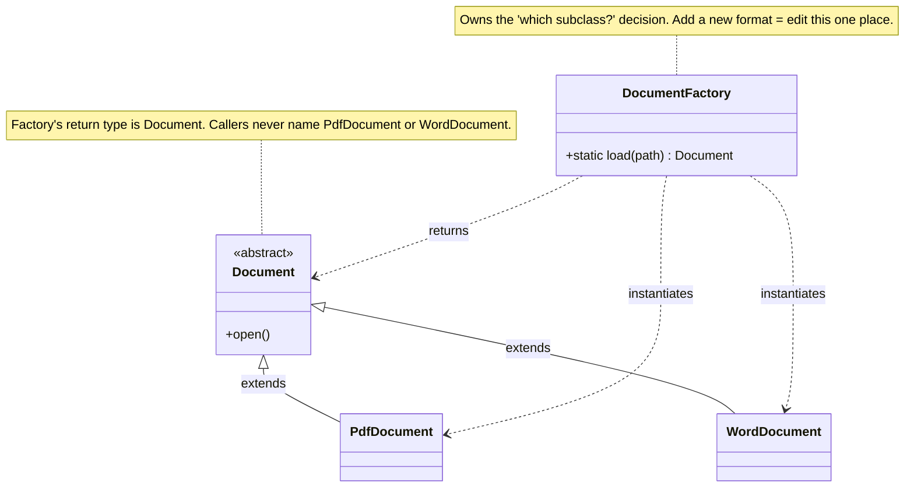

import QuickNav from '@site/src/components/QuickNav';
import CodeTabs from '@site/src/components/CodeTabs';
import Pillbar from '@site/src/components/Pillbar';

# Factory Method

<Pillbar pills={[
  { label: 'family', value: 'creational' },
  { label: 'aka', value: 'Virtual Constructor' },
  { label: 'complexity', value: '★★☆' },
  { label: 'popularity', value: '★★★' },
]} />

<QuickNav items={[
  { label: 'INTENT',     href: '#intent' },
  { label: 'PROBLEM',    href: '#problem' },
  { label: 'SOLUTION',   href: '#solution' },
  { label: 'ANALOGY',    href: '#real-world-analogy' },
  { label: 'STRUCTURE',  href: '#structure' },
  { label: 'CODE',       href: '#code' },
  { label: 'PROS & CONS',href: '#pros--cons' },
  { label: 'RELATIONS',  href: '#relations-with-other-patterns' },
]} />

## Intent

> **Define an interface for creating an object; let subclasses (or a method) decide which concrete class to instantiate.**

## Problem

A piece of code needs *some* `Document`, but which concrete subclass — `PdfDocument`, `WordDocument`, `MarkdownDocument` — depends on the file extension, the user's preference, or a config flag. Sprinkling `if/else` chains over `new` calls couples the caller to every concrete class and turns "add a new format" into a code-wide patch.

## Solution

Move the `new` into a single method whose return type is the *interface*. Callers ask the factory for a `Document` and don't see the branching. Adding `EpubDocument` later requires editing one place — the factory — and nothing else.

## Real-World Analogy

A pizzeria has one published menu (the abstract factory method, `orderPizza(type)`), but two locations — Naples and New York — make pizza their own way. The customer orders "a Margherita"; whichever location takes the order produces its variant. The customer never instantiates a `NaplesMargherita` directly.

## Structure

## Code

<CodeTabs
  groupId="im-lang"
  title="Factory Method"
  java={`public abstract class Document {
  public abstract void open();

  // Factory method (static form — Spring users will recognize @Bean methods)
  public static Document load(Path path) {
    String name = path.getFileName().toString().toLowerCase();
    if (name.endsWith(".pdf"))  return new PdfDocument(path);
    if (name.endsWith(".docx")) return new WordDocument(path);
    throw new IllegalArgumentException("Unsupported: " + path);
  }
}

class PdfDocument extends Document {
  PdfDocument(Path p) { /* read PDF */ }
  public void open()  { /* render PDF */ }
}

class WordDocument extends Document {
  WordDocument(Path p) { /* read DOCX */ }
  public void open()   { /* render DOCX */ }
}

// Usage
Document doc = Document.load(Path.of("memo.docx"));
doc.open();`}
  kotlin={`sealed class Document {
  abstract fun open()
  companion object {
    fun load(path: Path): Document = when (path.toString().lowercase().substringAfterLast('.')) {
      "pdf"  -> PdfDocument(path)
      "docx" -> WordDocument(path)
      else   -> throw IllegalArgumentException("Unsupported: \$path")
    }
  }
}
class PdfDocument(private val p: Path)  : Document() { override fun open() { /* ... */ } }
class WordDocument(private val p: Path) : Document() { override fun open() { /* ... */ } }`}
/>

The *registry* variant scales better: the factory holds a map from key → constructor, so new types are added without touching the factory itself.

<CodeTabs
  groupId="im-lang"
  title="Factory Method · registry variant"
  java={`public class DocumentFactory {
  private static final Map<String, Function<Path, Document>> registry = new HashMap<>();

  public static void register(String ext, Function<Path, Document> ctor) {
    registry.put(ext, ctor);
  }

  public static Document load(Path p) {
    String ext = p.toString().substring(p.toString().lastIndexOf('.') + 1);
    Function<Path, Document> ctor = registry.get(ext);
    if (ctor == null) throw new IllegalArgumentException("Unsupported: " + ext);
    return ctor.apply(p);
  }
}

// Plugin registers itself at startup:
DocumentFactory.register("pdf",  PdfDocument::new);
DocumentFactory.register("docx", WordDocument::new);`}
/>

## Pros & Cons

| Pros | Cons |
| --- | --- |
| Single point to change when types are added | Risks becoming a god-class if too many product families pile in |
| Callers decouple from concrete classes | Slightly more indirection than a plain `new` |
| Easy to plug in test doubles | Static factory methods can be hard to mock without rewiring |
| Works with a runtime registry for plugin systems | |

## Relations with Other Patterns

- **Abstract Factory** is essentially a *family* of related factory methods, grouped on one interface.
- **Builder** focuses on *how* to construct one complex object; Factory Method focuses on *which* class to construct.
- **Prototype** is a different answer to the "pick a concrete type at runtime" question — clone instead of instantiate.
- **Template Method** often calls factory methods at variable steps of the algorithm.
