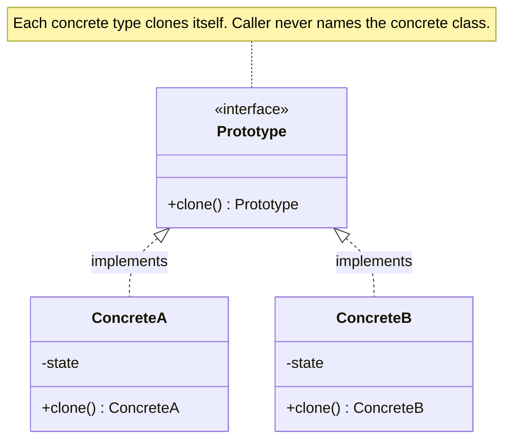

import QuickNav from '@site/src/components/QuickNav';
import CodeTabs from '@site/src/components/CodeTabs';
import Pillbar from '@site/src/components/Pillbar';

# Prototype

<Pillbar pills={[
  { label: 'family', value: 'creational' },
  { label: 'aka', value: 'Clone' },
  { label: 'complexity', value: '★★☆' },
  { label: 'popularity', value: '★★☆' },
]} />

<QuickNav items={[
  { label: 'INTENT',     href: '#intent' },
  { label: 'PROBLEM',    href: '#problem' },
  { label: 'SOLUTION',   href: '#solution' },
  { label: 'ANALOGY',    href: '#real-world-analogy' },
  { label: 'STRUCTURE',  href: '#structure' },
  { label: 'CODE',       href: '#code' },
  { label: 'PROS & CONS',href: '#pros--cons' },
  { label: 'RELATIONS',  href: '#relations-with-other-patterns' },
]} />

## Intent

> **Copy existing objects without making the cloning code depend on their concrete classes.**

## Problem

Some objects are expensive to construct from scratch: a `LegalDocumentTemplate` parses 50 KB of XSLT, resolves brand assets, validates schemas. Allocating a fresh one per request kills throughput. Worse, if a caller wants "a copy of *this* object whose actual class I don't know" (e.g. it received a `Shape` reference), constructing one requires reflection or type-checking ladders.

## Solution

Make the object itself responsible for cloning. Each prototype implements a `clone()` method that returns a new instance with the same state. The caller never names a concrete class — `original.clone()` works for any subtype.

A *prototype registry* often pairs with the pattern: a name-keyed pool of pre-built templates that clients clone on demand.

## Real-World Analogy

Cell division. A cell doesn't ask a "cell factory" to build a copy from raw materials; it splits, producing two cells with the same internal state. Whatever the original was — muscle, nerve, skin — the copy is the same type without anyone external picking the type.

## Structure

## Code

<CodeTabs
  groupId="im-lang"
  title="Prototype"
  java={`public class Report implements Cloneable {
  private String title;
  private List<Section> sections;
  private Style style;            // assume expensive to build

  public Report(String title, Style style) {
    this.title = title;
    this.style = style;
    this.sections = new ArrayList<>();
  }

  @Override
  public Report clone() {
    try {
      Report copy = (Report) super.clone();
      copy.sections = new ArrayList<>(this.sections); // shallow per element; deep where needed
      return copy;
    } catch (CloneNotSupportedException e) {
      throw new AssertionError(e);
    }
  }

  public void addSection(Section s) { sections.add(s); }
}

// Usage: build a template once, clone per request
Report template = new Report("Quarterly Report", buildExpensiveStyle());
Report q1 = template.clone(); q1.addSection(new Section("Q1 data"));
Report q2 = template.clone(); q2.addSection(new Section("Q2 data"));`}
  kotlin={`data class Report(
  val title: String,
  val style: Style,
  val sections: MutableList<Section> = mutableListOf(),
) {
  // data class gives us copy() for free; we override only what needs deep-cloning
  fun deepCopy(): Report = copy(sections = sections.toMutableList())
  fun addSection(s: Section) { sections.add(s) }
}

// Usage: build a template once, clone per request
val template = Report("Quarterly Report", buildExpensiveStyle())
val q1 = template.deepCopy().apply { addSection(Section("Q1 data")) }
val q2 = template.deepCopy().apply { addSection(Section("Q2 data")) }`}
/>

## Pros & Cons

| Pros | Cons |
| --- | --- |
| Avoids re-running expensive construction | Deep-vs-shallow copy is a perennial foot-gun |
| Caller doesn't need to know concrete types | `Cloneable` in Java has a [notoriously awkward contract](https://www.artima.com/articles/josh-bloch-on-design#part13) |
| Plays well with a registry of pre-built templates | Cloning objects with cyclic references requires care |
| Hands you a fresh object you can mutate without touching the template | |

## Relations with Other Patterns

- **Abstract Factory** can use Prototype internally — each `create*` method clones a template rather than calling `new`.
- **Composite** trees are commonly cloned with Prototype (recursive deep-copy through the tree).
- **Memento** also captures state, but its purpose is *restore later*, not *reproduce now*.
- **Command** copies often use Prototype to snapshot the command's parameters before queueing.
