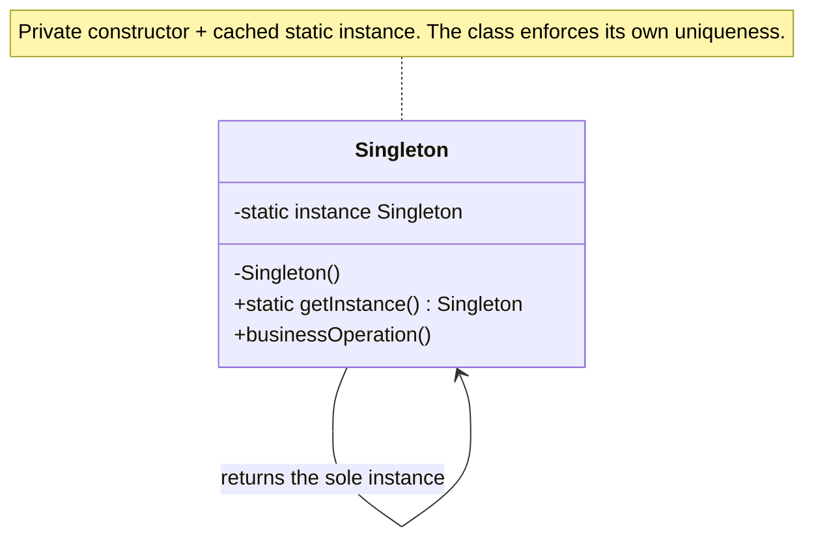

import QuickNav from '@site/src/components/QuickNav';
import CodeTabs from '@site/src/components/CodeTabs';
import Pillbar from '@site/src/components/Pillbar';

# Singleton

<Pillbar pills={[
  { label: 'family', value: 'creational' },
  { label: 'aka', value: '—' },
  { label: 'complexity', value: '★☆☆' },
  { label: 'popularity', value: '★★★' },
]} />

<QuickNav items={[
  { label: 'INTENT',     href: '#intent' },
  { label: 'PROBLEM',    href: '#problem' },
  { label: 'SOLUTION',   href: '#solution' },
  { label: 'ANALOGY',    href: '#real-world-analogy' },
  { label: 'STRUCTURE',  href: '#structure' },
  { label: 'CODE',       href: '#code' },
  { label: 'PROS & CONS',href: '#pros--cons' },
  { label: 'RELATIONS',  href: '#relations-with-other-patterns' },
]} />

## Intent

> **Ensure a class has exactly one instance and expose a globally accessible reference to it.**

## Problem

Some classes own a resource that the entire system must share through one identity: a database connection pool, a logger, an in-memory cache. Allowing arbitrary code to call `new` on these classes creates the wrong number of pools, conflicting log files, or duplicate caches that drift out of sync.

A naive global variable solves access but not creation — two threads can still race to allocate two instances. The class itself has to enforce uniqueness.

## Solution

Make the constructor private so outside code can't call `new`, and expose a static accessor that returns the same instance on every call. The first call constructs the instance; subsequent calls return the cached reference. Variants differ only in *when* and *how safely* that first construction happens.

## Real-World Analogy

A country's government. A nation has many citizens but only one *Government of X* at a time. Acts of parliament reference "the Government" without specifying which instance; the constitution guarantees there is only ever one.

## Structure

## Code

Joshua Bloch's recommendation: an `enum` with a single constant. Thread-safe by JVM guarantee, serialization-safe, reflection-safe — no manual locking.

<CodeTabs
  groupId="im-lang"
  title="Singleton · Bloch's enum form"
  java={`public enum Logger {
  INSTANCE;

  private final PrintStream out = System.out;

  public void log(String msg) {
    out.printf("%s  %s%n", Instant.now(), msg);
  }
}

// Usage:
Logger.INSTANCE.log("user logged in");`}
  kotlin={`object Logger {
  fun log(msg: String) {
    println("\${java.time.Instant.now()}  \$msg")
  }
}

// Usage:
Logger.log("user logged in")`}
/>

When you need lazy construction with thread safety — the canonical double-checked locking idiom (`volatile` is mandatory):

<CodeTabs
  groupId="im-lang"
  title="Singleton · double-checked locking"
  java={`public final class ConnectionPool {
  private static volatile ConnectionPool instance;

  private ConnectionPool() { /* expensive init */ }

  public static ConnectionPool get() {
    ConnectionPool local = instance;        // volatile read, single load
    if (local == null) {
      synchronized (ConnectionPool.class) {
        local = instance;
        if (local == null) instance = local = new ConnectionPool();
      }
    }
    return local;
  }
}`}
  kotlin={`class ConnectionPool private constructor() {
  // ... heavyweight init ...
  companion object {
    @Volatile private var instance: ConnectionPool? = null
    fun get(): ConnectionPool = instance ?: synchronized(this) {
      instance ?: ConnectionPool().also { instance = it }
    }
  }
}`}
/>

## Pros & Cons

| Pros | Cons |
| --- | --- |
| Single point of control over a shared resource | Hides dependencies — callers reach for `X.get()` instead of receiving `X` |
| Lazy initialization possible | Global mutable state poisons unit tests |
| Thread-safe with `enum` or correct DCL | Subclassing and mocking are awkward |
| Memory-efficient: only one allocation | Easy to misuse for things that *should* be plain DI beans |

## Relations with Other Patterns

- **Facade** is often implemented as a Singleton when one shared facade is enough.
- **Abstract Factory**, **Builder**, and **Prototype** can all be implemented as Singletons.
- **Spring beans** are scoped `singleton` by default — prefer DI-managed singletons over hand-rolled `INSTANCE` fields. Hand-roll only when a class must work outside any container (e.g. a library's logger).
- **Multiton** generalizes Singleton to a fixed, keyed set of instances (one per `Locale`, one per `ShardId`).
