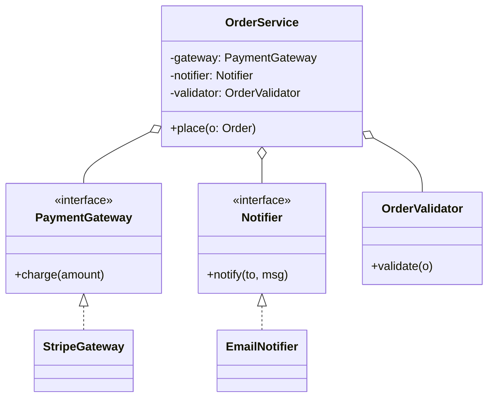

import QuickNav from '@site/src/components/QuickNav';
import CodeTabs from '@site/src/components/CodeTabs';
import Pillbar from '@site/src/components/Pillbar';

# SOLID Principles

<Pillbar pills={[
  { label: 'principles', value: 5 },
  { label: 'goal', value: 'maintainability' },
]} />

SOLID is the **rubric** you cite when arguing why a piece of code is shaped the way it is. Each letter prevents one specific failure mode in long-lived codebases.

<QuickNav items={[
  { label: 'S — SINGLE RESPONSIBILITY', href: '#s--single-responsibility' },
  { label: 'O — OPEN/CLOSED', href: '#o--openclosed' },
  { label: 'L — LISKOV SUBSTITUTION', href: '#l--liskov-substitution' },
  { label: 'I — INTERFACE SEGREGATION', href: '#i--interface-segregation' },
  { label: 'D — DEPENDENCY INVERSION', href: '#d--dependency-inversion' },
  { label: 'PUTTING IT TOGETHER', href: '#putting-it-together' },
]} />

## S — Single Responsibility

> **A class should have one reason to change.**

The smell is a class that does user validation **and** email **and** database persistence. Three responsibilities, three reasons to change, three risks of breaking when any one moves.

### Violation

<CodeTabs
  title="SRP · violation"
  java={`// One class doing input validation, persistence, and notification
public class UserService {
  public void register(String email, String password) {
    // 1) validate
    if (email == null || !email.contains("@")) throw new IllegalArgumentException();
    if (password.length() < 8) throw new IllegalArgumentException();

    // 2) persist
    try (var conn = DriverManager.getConnection(JDBC_URL)) {
      var ps = conn.prepareStatement("INSERT INTO users (email, pwd) VALUES (?, ?)");
      ps.setString(1, email);
      ps.setString(2, hash(password));
      ps.executeUpdate();
    } catch (SQLException e) { throw new RuntimeException(e); }

    // 3) notify
    var mail = new SimpleMailMessage();
    mail.setTo(email);
    mail.setSubject("Welcome");
    mail.setText("Hi! You signed up.");
    mailer.send(mail);
  }
}`}
  kotlin={`// One class doing input validation, persistence, and notification
class UserService(private val mailer: JavaMailSender) {
  fun register(email: String, password: String) {
    // 1) validate
    require(email.contains("@")) { "bad email" }
    require(password.length >= 8) { "weak password" }

    // 2) persist
    DriverManager.getConnection(JDBC_URL).use { conn ->
      conn.prepareStatement("INSERT INTO users (email, pwd) VALUES (?, ?)").use { ps ->
        ps.setString(1, email)
        ps.setString(2, hash(password))
        ps.executeUpdate()
      }
    }

    // 3) notify
    mailer.send(SimpleMailMessage().apply {
      setTo(email)
      subject = "Welcome"
      text = "Hi! You signed up."
    })
  }
}`}
/>

### Fix

<CodeTabs
  title="SRP · fix"
  java={`public class UserValidator {
  public void validate(String email, String password) { /* ... */ }
}

public class UserRepository {
  public void save(User u) { /* JDBC or JPA */ }
}

public class WelcomeMailer {
  public void send(String email) { /* SMTP */ }
}

public class UserService {
  private final UserValidator validator;
  private final UserRepository repo;
  private final WelcomeMailer mailer;

  public UserService(UserValidator v, UserRepository r, WelcomeMailer m) {
    this.validator = v; this.repo = r; this.mailer = m;
  }

  public void register(String email, String password) {
    validator.validate(email, password);
    repo.save(new User(email, hash(password)));
    mailer.send(email);
  }
}`}
  kotlin={`class UserValidator {
  fun validate(email: String, password: String) { /* ... */ }
}

class UserRepository {
  fun save(u: User) { /* JDBC or JPA */ }
}

class WelcomeMailer {
  fun send(email: String) { /* SMTP */ }
}

class UserService(
  private val validator: UserValidator,
  private val repo: UserRepository,
  private val mailer: WelcomeMailer,
) {
  fun register(email: String, password: String) {
    validator.validate(email, password)
    repo.save(User(email, hash(password)))
    mailer.send(email)
  }
}`}
/>

Each collaborator has one reason to change. `UserService` now **orchestrates** instead of doing.

---

## O — Open/Closed

> **Open for extension, closed for modification.**

Adding a new variant should not require editing the existing class. The classic smell is a switch on `type`.

### Violation

<CodeTabs
  title="OCP · violation"
  java={`public class PaymentService {
  public double computeFee(Payment p) {
    switch (p.type()) {
      case CARD:   return p.amount() * 0.029 + 0.30;
      case ACH:    return 0.25;
      case WALLET: return p.amount() * 0.015;
      default: throw new IllegalArgumentException();
    }
  }
}`}
  kotlin={`class PaymentService {
  fun computeFee(p: Payment): Double = when (p.type) {
    PaymentType.CARD   -> p.amount * 0.029 + 0.30
    PaymentType.ACH    -> 0.25
    PaymentType.WALLET -> p.amount * 0.015
  }
}`}
/>

Adding a new payment type means **editing** `PaymentService`, risking regressions in the existing cases.

### Fix — Strategy pattern

<CodeTabs
  title="OCP · fix"
  java={`public interface FeeStrategy {
  double compute(Payment p);
}

public class CardFee   implements FeeStrategy { public double compute(Payment p) { return p.amount() * 0.029 + 0.30; } }
public class AchFee    implements FeeStrategy { public double compute(Payment p) { return 0.25; } }
public class WalletFee implements FeeStrategy { public double compute(Payment p) { return p.amount() * 0.015; } }

public class PaymentService {
  private final Map<PaymentType, FeeStrategy> strategies;
  public PaymentService(Map<PaymentType, FeeStrategy> s) { this.strategies = s; }

  public double computeFee(Payment p) {
    var s = strategies.get(p.type());
    if (s == null) throw new IllegalArgumentException();
    return s.compute(p);
  }
}`}
  kotlin={`fun interface FeeStrategy { fun compute(p: Payment): Double }

val cardFee:   FeeStrategy = FeeStrategy { it.amount * 0.029 + 0.30 }
val achFee:    FeeStrategy = FeeStrategy { 0.25 }
val walletFee: FeeStrategy = FeeStrategy { it.amount * 0.015 }

class PaymentService(private val strategies: Map<PaymentType, FeeStrategy>) {
  fun computeFee(p: Payment): Double =
    strategies[p.type]?.compute(p) ?: throw IllegalArgumentException(p.type.toString())
}`}
/>

Adding `BankTransferFee` means **adding a new class**, not modifying the old one.

---

## L — Liskov Substitution

> **Subtypes must be substitutable for their base types.**

The famous counterexample: `Square extends Rectangle`. Mathematically yes; programmatically, setting `width` on a `Square` violates the `Rectangle` contract.

### Violation

<CodeTabs
  title="LSP · violation"
  java={`public class Rectangle {
  protected int w, h;
  public void setW(int w) { this.w = w; }
  public void setH(int h) { this.h = h; }
  public int area() { return w * h; }
}

public class Square extends Rectangle {
  @Override public void setW(int w) { this.w = this.h = w; }
  @Override public void setH(int h) { this.w = this.h = h; }
}

// Code that worked for Rectangle now breaks:
Rectangle r = new Square();
r.setW(4); r.setH(5);
assert r.area() == 20;   // fails — area is 25
`}
  kotlin={`open class Rectangle(var w: Int, var h: Int) {
  open fun area() = w * h
}

class Square(side: Int) : Rectangle(side, side) {
  override var w: Int
    get() = super.w
    set(v) { super.w = v; super.h = v }
  override var h: Int
    get() = super.h
    set(v) { super.w = v; super.h = v }
}

// Code that worked for Rectangle now breaks
val r: Rectangle = Square(0)
r.w = 4; r.h = 5
check(r.area() == 20)   // fails — area is 25
`}
/>

### Fix

Make `Square` and `Rectangle` siblings, not parent/child.

<CodeTabs
  title="LSP · fix"
  java={`public interface Shape { int area(); }

public final class Rectangle implements Shape {
  private final int w, h;
  public Rectangle(int w, int h) { this.w = w; this.h = h; }
  public int area() { return w * h; }
}

public final class Square implements Shape {
  private final int side;
  public Square(int side) { this.side = side; }
  public int area() { return side * side; }
}`}
  kotlin={`sealed interface Shape { fun area(): Int }

data class Rectangle(val w: Int, val h: Int) : Shape {
  override fun area() = w * h
}

data class Square(val side: Int) : Shape {
  override fun area() = side * side
}`}
/>

Both are `Shape`s. Neither tries to pretend it's the other.

---

## I — Interface Segregation

> **Many small interfaces beat one fat interface.**

Forcing every implementer to honor twelve methods, ten of which they don't care about, leads to "throw UnsupportedOperationException" implementations.

### Violation

<CodeTabs
  title="ISP · violation"
  java={`public interface Worker {
  void code();
  void review();
  void deploy();
  void onCall();
  void mentor();
  void hire();
}

public class Intern implements Worker {
  public void code()    { /* ok */ }
  public void review()  { throw new UnsupportedOperationException(); }
  public void deploy()  { throw new UnsupportedOperationException(); }
  public void onCall()  { throw new UnsupportedOperationException(); }
  public void mentor()  { throw new UnsupportedOperationException(); }
  public void hire()    { throw new UnsupportedOperationException(); }
}`}
  kotlin={`interface Worker {
  fun code()
  fun review()
  fun deploy()
  fun onCall()
  fun mentor()
  fun hire()
}

class Intern : Worker {
  override fun code()    { /* ok */ }
  override fun review()  = throw UnsupportedOperationException()
  override fun deploy()  = throw UnsupportedOperationException()
  override fun onCall()  = throw UnsupportedOperationException()
  override fun mentor()  = throw UnsupportedOperationException()
  override fun hire()    = throw UnsupportedOperationException()
}`}
/>

### Fix

<CodeTabs
  title="ISP · fix"
  java={`public interface Codes      { void code(); }
public interface Reviews    { void review(); }
public interface Deploys    { void deploy(); }
public interface OnCallable { void onCall(); }
public interface Mentors    { void mentor(); }
public interface Hires      { void hire(); }

public class Intern  implements Codes {
  public void code() { /* ... */ }
}

public class Senior  implements Codes, Reviews, Deploys, OnCallable, Mentors {
  /* ... */
}`}
  kotlin={`fun interface Codes      { fun code() }
fun interface Reviews    { fun review() }
fun interface Deploys    { fun deploy() }
fun interface OnCallable { fun onCall() }
fun interface Mentors    { fun mentor() }
fun interface Hires      { fun hire() }

class Intern : Codes {
  override fun code() { /* ... */ }
}

class Senior : Codes, Reviews, Deploys, OnCallable, Mentors {
  override fun code()    { /* ... */ }
  override fun review()  { /* ... */ }
  override fun deploy()  { /* ... */ }
  override fun onCall()  { /* ... */ }
  override fun mentor()  { /* ... */ }
}`}
/>

Each class implements only the abilities it actually has. Test fakes and mocks get simpler too.

---

## D — Dependency Inversion

> **Depend on abstractions, not on concretes.**

The high-level policy should not know which low-level adapter is plugged in. That's what dependency injection containers are for.

### Violation

<CodeTabs
  title="DIP · violation"
  java={`public class OrderService {
  public void place(Order o) {
    var stripe = new StripeClient(System.getenv("STRIPE_KEY"));   // hard-coded
    stripe.charge(o.amount());
    new EmailSender().send(o.customerEmail(), "Order confirmed");  // hard-coded
  }
}`}
  kotlin={`class OrderService {
  fun place(o: Order) {
    val stripe = StripeClient(System.getenv("STRIPE_KEY"))   // hard-coded
    stripe.charge(o.amount)
    EmailSender().send(o.customerEmail, "Order confirmed")   // hard-coded
  }
}`}
/>

`OrderService` cannot be tested without real network calls; swapping payment provider means editing this class.

### Fix

<CodeTabs
  title="DIP · fix"
  java={`public interface PaymentGateway { void charge(Money amount); }
public interface Notifier        { void notify(String to, String msg); }

public class OrderService {
  private final PaymentGateway gateway;
  private final Notifier notifier;

  public OrderService(PaymentGateway g, Notifier n) { this.gateway = g; this.notifier = n; }

  public void place(Order o) {
    gateway.charge(o.amount());
    notifier.notify(o.customerEmail(), "Order confirmed");
  }
}

// In production, Spring wires StripeGateway / EmailNotifier.
// In tests, InMemoryGateway / RecordingNotifier.`}
  kotlin={`interface PaymentGateway { fun charge(amount: Money) }
interface Notifier        { fun notify(to: String, msg: String) }

class OrderService(
  private val gateway: PaymentGateway,
  private val notifier: Notifier,
) {
  fun place(o: Order) {
    gateway.charge(o.amount)
    notifier.notify(o.customerEmail, "Order confirmed")
  }
}

// In production, Spring wires StripeGateway / EmailNotifier.
// In tests, InMemoryGateway / RecordingNotifier.`}
/>

`OrderService` now talks to **interfaces**. The concrete adapters live elsewhere.

---

## Putting it together

A composite example that respects all five principles:

- **S** — each class has one responsibility.
- **O** — adding `PayPalGateway` requires no changes to `OrderService`.
- **L** — every `PaymentGateway` implementation honors the interface contract (no throwing `UnsupportedOperationException`).
- **I** — `Notifier` doesn't carry `validate()` or `charge()`; it only has what notifying needs.
- **D** — `OrderService` depends on abstractions; concretes are injected.

If you've cited all five during a design discussion, you've covered the OOP-principles dimension of the rubric.

---

## Practice Problems

Each problem asks you to recognize **which principle is being violated** and refactor toward it. State the smell, identify the principle, then code the fix.

### 1. The 1,200-line `OrderService`

You inherit an `OrderService` that validates input, queries inventory, charges the card, emails the customer, writes an audit log, and computes loyalty points. Tests are slow; every new feature breaks an unrelated test.

- **Violated**: SRP.
- **Fix**: Split into `OrderValidator`, `InventoryClient`, `PaymentGateway`, `Notifier`, `AuditLog`, `LoyaltyService`; `OrderService` orchestrates.

### 2. Shipping-cost calculator with a `switch`

A `ShippingService.cost(parcel)` method `switch`es on `Carrier { UPS, USPS, FEDEX }`. Marketing wants to add DHL.

- **Violated**: OCP.
- **Fix**: Strategy interface `CarrierRate.cost(parcel)`; one class per carrier; inject a `Map<Carrier, CarrierRate>`.

### 3. `Penguin extends Bird`

A `Bird` class has `fly()`. `Penguin extends Bird` throws `UnsupportedOperationException` from `fly()`. A flock-fly-formation service calls `fly()` on every member of the flock.

- **Violated**: LSP.
- **Fix**: Split into `Bird` and `FlyingBird` (or `Flying` interface). `Penguin` is a `Bird` but not `Flying`.

### 4. The fat `IPrinter` interface

`IPrinter { print(); scan(); fax(); staple(); duplex(); }`. A simple `LaserPrinter` only `print()`s; it has to no-op or throw on the others.

- **Violated**: ISP.
- **Fix**: One capability per interface (`CanPrint`, `CanScan`, `CanFax`, ...). Each device implements only what it supports.

### 5. `ReportGenerator` that imports MySQL JDBC

A `ReportGenerator` directly imports `com.mysql.cj.jdbc.MysqlDataSource` and constructs one. The team wants to add Postgres support and an in-memory variant for tests.

- **Violated**: DIP.
- **Fix**: `ReportGenerator` depends on `DataSource` (JDK interface); the concrete vendor data source is injected.

### 6. Spring AOP `@Transactional` self-call

A bean method `outer()` calls `this.inner()`, where `inner` is annotated `@Transactional`. The transaction doesn't open.

- **Discussion**: This is a *consequence* of the proxy pattern; SOLID interpretation: by tying transactional behaviour to *the same class*, we're forcing two concerns into one type. Refactor `inner()` into a separate bean.

### 7. Mock-heavy unit test

A test file has 12 mocks. Almost every test calls `mock.when(...).thenReturn(...)`.

- **Likely violation**: DIP done badly (too many fine-grained dependencies) or SRP (the unit under test does too many things).
- **Fix**: Combine collaborators into higher-level ports, or split the class.

### 8. "Just add a flag"

A service method gains a `boolean` parameter every quarter — `bool dryRun`, `bool skipNotification`, `bool useNewPath`. Now there are seven booleans and 128 combinations.

- **Violated**: OCP (every new option modifies the method) + sometimes SRP (the method is now several methods).
- **Fix**: Replace flags with strategy / policy objects, or split the method by use case.

### 9. Refactor a god-class

Given `EmployeeManager` with 35 methods touching payroll, benefits, scheduling, and onboarding, propose an end-state architecture. Which SOLID principles does each split exercise?

- **All five** apply at different layers. This is a 20-minute open-ended discussion question.
