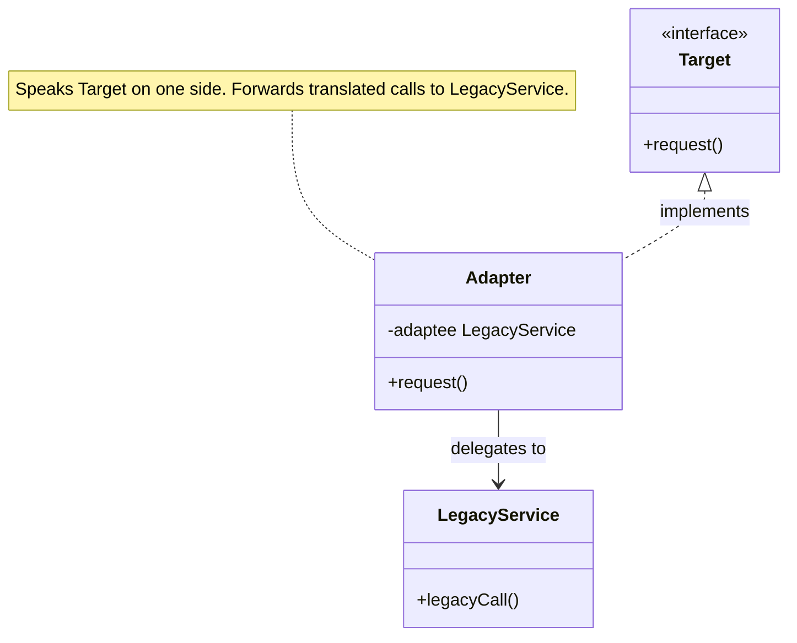

import QuickNav from '@site/src/components/QuickNav';
import CodeTabs from '@site/src/components/CodeTabs';
import Pillbar from '@site/src/components/Pillbar';

# Adapter

<Pillbar pills={[
  { label: 'family', value: 'structural' },
  { label: 'aka', value: 'Wrapper' },
  { label: 'complexity', value: '★☆☆' },
  { label: 'popularity', value: '★★★' },
]} />

<QuickNav items={[
  { label: 'INTENT',     href: '#intent' },
  { label: 'PROBLEM',    href: '#problem' },
  { label: 'SOLUTION',   href: '#solution' },
  { label: 'ANALOGY',    href: '#real-world-analogy' },
  { label: 'STRUCTURE',  href: '#structure' },
  { label: 'CODE',       href: '#code' },
  { label: 'PROS & CONS',href: '#pros--cons' },
  { label: 'RELATIONS',  href: '#relations-with-other-patterns' },
]} />

## Intent

> **Convert the interface of a class into another interface clients expect, so classes with incompatible interfaces can collaborate.**

## Problem

You're consuming a third-party library — say, `LegacyTemperatureService.readFahrenheit()` — but the rest of your application talks `Celsius`. You can't (or shouldn't) modify the library. Sprinkling unit-conversion `* 5/9` math wherever the library is called duplicates logic and couples every caller to the library's shape.

## Solution

Introduce an **adapter** class that implements the interface your code expects (`Thermometer.readCelsius()`) and internally delegates to the incompatible class, translating arguments and return values across the gap. Callers see only the target interface; the adapter is the only place that knows the legacy API exists.

## Real-World Analogy

A travel power-plug adapter. Your laptop's two-prong charger doesn't fit a UK three-prong socket. The adapter is a small box that exposes one shape (UK plug) on one side and another (EU socket) on the other; it forwards the electricity without changing it. Nothing in your laptop or in the wall knows the adapter exists.

## Structure

**Object adapter** (composition — preferred):

## Code

<CodeTabs
  groupId="im-lang"
  title="Adapter"
  java={`// Existing third-party class we cannot modify
public class LegacyTemperatureService {
  public double readFahrenheit() { /* ... */ return 75.0; }
}

// What our app expects
public interface Thermometer {
  double readCelsius();
}

// Adapter
public class FahrenheitToCelsiusAdapter implements Thermometer {
  private final LegacyTemperatureService legacy;
  public FahrenheitToCelsiusAdapter(LegacyTemperatureService legacy) {
    this.legacy = legacy;
  }

  @Override
  public double readCelsius() {
    return (legacy.readFahrenheit() - 32) * 5 / 9;
  }
}

// Usage
Thermometer t = new FahrenheitToCelsiusAdapter(new LegacyTemperatureService());
double c = t.readCelsius();`}
  kotlin={`// Third-party class we cannot modify
class LegacyTemperatureService {
  fun readFahrenheit(): Double = 75.0
}

// What our app expects
interface Thermometer {
  fun readCelsius(): Double
}

// Adapter
class FahrenheitToCelsiusAdapter(private val legacy: LegacyTemperatureService) : Thermometer {
  override fun readCelsius(): Double = (legacy.readFahrenheit() - 32) * 5.0 / 9.0
}

// Usage
val t: Thermometer = FahrenheitToCelsiusAdapter(LegacyTemperatureService())
val c = t.readCelsius()`}
/>

## Pros & Cons

| Pros | Cons |
| --- | --- |
| Lets you reuse classes you can't modify | Adds a layer of indirection per integration point |
| Single Responsibility — translation lives in one class | Tempting to use as a dumping ground for cross-cutting logic |
| Open/Closed — add new adapters without touching adaptees | Two-direction adapters (both sides translate) double the surface |

## Relations with Other Patterns

- **Decorator** also wraps an object but keeps the *same* interface; Adapter changes it.
- **Bridge** is set up *before* the classes exist, separating abstraction from implementation in advance; Adapter is set up *after the fact* to reconcile mismatches.
- **Proxy** keeps the same interface and adds control (lazy, security); Adapter changes the interface.
- **Facade** simplifies a *whole subsystem*; an Adapter typically wraps *one* class.
