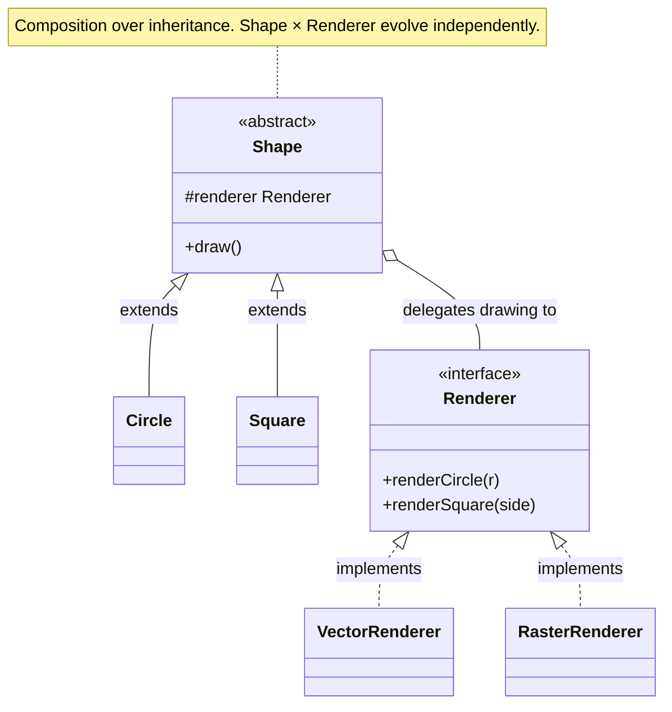

import QuickNav from '@site/src/components/QuickNav';
import CodeTabs from '@site/src/components/CodeTabs';
import Pillbar from '@site/src/components/Pillbar';

# Bridge

<Pillbar pills={[
  { label: 'family', value: 'structural' },
  { label: 'aka', value: '—' },
  { label: 'complexity', value: '★★★' },
  { label: 'popularity', value: '★★☆' },
]} />

<QuickNav items={[
  { label: 'INTENT',     href: '#intent' },
  { label: 'PROBLEM',    href: '#problem' },
  { label: 'SOLUTION',   href: '#solution' },
  { label: 'ANALOGY',    href: '#real-world-analogy' },
  { label: 'STRUCTURE',  href: '#structure' },
  { label: 'CODE',       href: '#code' },
  { label: 'PROS & CONS',href: '#pros--cons' },
  { label: 'RELATIONS',  href: '#relations-with-other-patterns' },
]} />

## Intent

> **Split a class that varies in two orthogonal directions into two hierarchies — abstraction and implementation — that can be developed independently.**

## Problem

You have `Shape` with subclasses `Circle` and `Square`, and a `Renderer` choice between vector and raster. A naive design produces `VectorCircle`, `RasterCircle`, `VectorSquare`, `RasterSquare` — and the count grows as `shapes × renderers`. Adding a third renderer means adding one new class per existing shape, and vice versa.

## Solution

Split into two hierarchies. `Shape` ("abstraction") delegates the actual drawing to a `Renderer` ("implementor") it holds via composition. Now you can extend either axis without touching the other: a new `Triangle` works with every renderer; a new `SvgRenderer` works with every shape.

## Real-World Analogy

A TV remote and the TVs it can control. The remote (abstraction) defines what buttons exist — power, volume, channel. Each TV brand (implementation) defines what those signals mean at the hardware level. You can ship a new universal remote without changing any TVs, and a TV maker can release a new model without forcing remote makers to redesign.

## Structure

## Code

<CodeTabs
  groupId="im-lang"
  title="Bridge"
  java={`public interface Renderer {
  void renderCircle(double r);
  void renderSquare(double side);
}

public class VectorRenderer implements Renderer {
  public void renderCircle(double r)    { System.out.println("vector circle r=" + r); }
  public void renderSquare(double side) { System.out.println("vector square " + side); }
}

public class RasterRenderer implements Renderer {
  public void renderCircle(double r)    { System.out.println("raster circle " + r + "px"); }
  public void renderSquare(double side) { System.out.println("raster square " + side); }
}

public abstract class Shape {
  protected final Renderer renderer;
  protected Shape(Renderer r) { this.renderer = r; }
  public abstract void draw();
}

public class Circle extends Shape {
  private final double r;
  public Circle(Renderer rend, double r) { super(rend); this.r = r; }
  public void draw() { renderer.renderCircle(r); }
}

public class Square extends Shape {
  private final double side;
  public Square(Renderer rend, double side) { super(rend); this.side = side; }
  public void draw() { renderer.renderSquare(side); }
}

new Circle(new VectorRenderer(), 5).draw();
new Square(new RasterRenderer(), 3).draw();`}
  kotlin={`interface Renderer {
  fun renderCircle(r: Double)
  fun renderSquare(side: Double)
}

class VectorRenderer : Renderer {
  override fun renderCircle(r: Double)    = println("vector circle r=\$r")
  override fun renderSquare(side: Double) = println("vector square \$side")
}

class RasterRenderer : Renderer {
  override fun renderCircle(r: Double)    = println("raster circle \${r}px")
  override fun renderSquare(side: Double) = println("raster square \$side")
}

abstract class Shape(protected val renderer: Renderer) {
  abstract fun draw()
}

class Circle(r: Renderer, private val radius: Double) : Shape(r) {
  override fun draw() = renderer.renderCircle(radius)
}

class Square(r: Renderer, private val side: Double) : Shape(r) {
  override fun draw() = renderer.renderSquare(side)
}

Circle(VectorRenderer(), 5.0).draw()
Square(RasterRenderer(), 3.0).draw()`}
/>

## Pros & Cons

| Pros | Cons |
| --- | --- |
| Avoids class explosion when two axes vary | Two-step indirection — code is less direct |
| Each hierarchy evolves independently | Over-engineered for one-dimensional problems |
| Implementation can be swapped at runtime | Beginners conflate it with Adapter |

## Relations with Other Patterns

- **Adapter** is reactive — bolt-on translation after the fact. Bridge is proactive — designed before the implementations exist.
- **Abstract Factory** can pick which implementation a Bridge uses (e.g. `RendererFactory` chooses `VectorRenderer` vs `RasterRenderer`).
- **State** and **Strategy** also delegate to an internal object via composition, but answer different questions: State changes the *behaviour-for-its-current-mode*; Strategy picks one of several *algorithms*; Bridge separates two parallel hierarchies.
