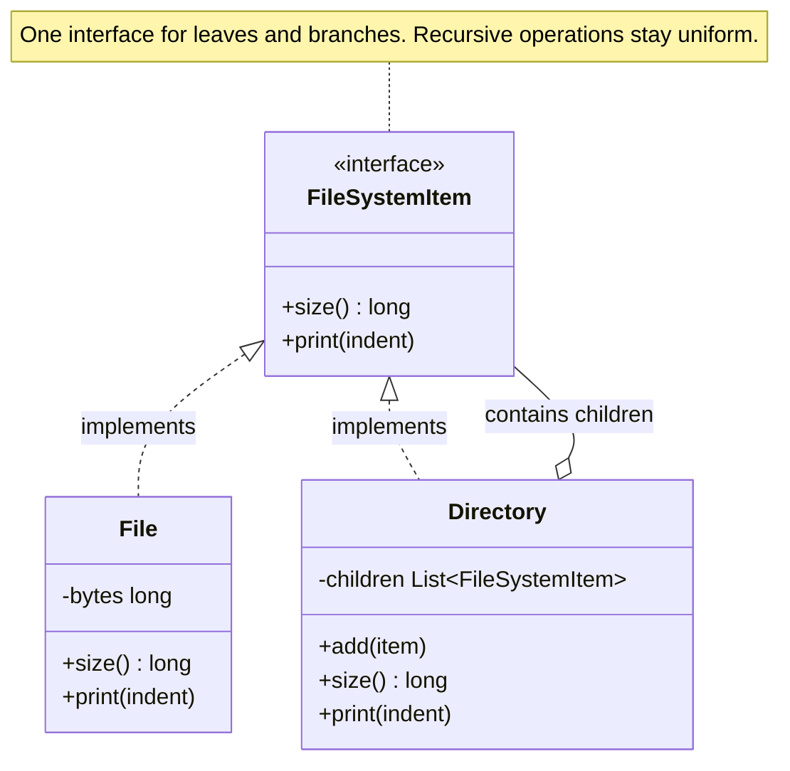

import QuickNav from '@site/src/components/QuickNav';
import CodeTabs from '@site/src/components/CodeTabs';
import Pillbar from '@site/src/components/Pillbar';

# Composite

<Pillbar pills={[
  { label: 'family', value: 'structural' },
  { label: 'aka', value: 'Object Tree' },
  { label: 'complexity', value: '★★☆' },
  { label: 'popularity', value: '★★☆' },
]} />

<QuickNav items={[
  { label: 'INTENT',     href: '#intent' },
  { label: 'PROBLEM',    href: '#problem' },
  { label: 'SOLUTION',   href: '#solution' },
  { label: 'ANALOGY',    href: '#real-world-analogy' },
  { label: 'STRUCTURE',  href: '#structure' },
  { label: 'CODE',       href: '#code' },
  { label: 'PROS & CONS',href: '#pros--cons' },
  { label: 'RELATIONS',  href: '#relations-with-other-patterns' },
]} />

## Intent

> **Compose objects into tree structures and let clients treat individual objects and compositions of objects uniformly.**

## Problem

A file system has files and directories. Computing total size requires walking the tree. If `File` and `Directory` expose different shapes, every traversal sprinkles `if (item is Directory) ... else ...` checks. New leaf or branch types compound the pain.

## Solution

Define one **component** interface (`size()`, `print()`) that both leaves (`File`) and composites (`Directory`) implement. `Directory.size()` recursively asks each child for its size, never caring whether a child is a file or another directory. Traversal code becomes a single uniform loop.

## Real-World Analogy

A box of items, where each item can be either a thing (a book) or another box. To find the total weight of the outer box, you weigh each child — and for child *boxes*, you recursively weigh their contents. The interface is the same: every box and every thing reports a weight.

## Structure

## Code

<CodeTabs
  groupId="im-lang"
  title="Composite · file system"
  java={`public interface FileSystemItem {
  long size();
  void print(int indent);
}

public class FileItem implements FileSystemItem {
  private final String name;
  private final long bytes;
  public FileItem(String n, long b) { name = n; bytes = b; }
  public long size() { return bytes; }
  public void print(int indent) {
    System.out.println(" ".repeat(indent) + name + " (" + bytes + ")");
  }
}

public class Directory implements FileSystemItem {
  private final String name;
  private final List<FileSystemItem> children = new ArrayList<>();
  public Directory(String n) { name = n; }
  public void add(FileSystemItem c) { children.add(c); }
  public long size() {
    return children.stream().mapToLong(FileSystemItem::size).sum();
  }
  public void print(int indent) {
    System.out.println(" ".repeat(indent) + name + "/");
    children.forEach(c -> c.print(indent + 2));
  }
}

Directory root = new Directory("project");
root.add(new FileItem("README.md", 1200));
Directory src = new Directory("src");
src.add(new FileItem("Main.java", 4500));
root.add(src);

root.print(0);
System.out.println("total = " + root.size());`}
  kotlin={`sealed interface FileSystemItem {
  fun size(): Long
  fun print(indent: Int)
}

class FileItem(val name: String, val bytes: Long) : FileSystemItem {
  override fun size() = bytes
  override fun print(indent: Int) = println(" ".repeat(indent) + "\$name (\$bytes)")
}

class Directory(val name: String) : FileSystemItem {
  private val children = mutableListOf<FileSystemItem>()
  fun add(c: FileSystemItem) { children += c }
  override fun size() = children.sumOf { it.size() }
  override fun print(indent: Int) {
    println(" ".repeat(indent) + "\$name/")
    children.forEach { it.print(indent + 2) }
  }
}

val root = Directory("project").apply {
  add(FileItem("README.md", 1200))
  add(Directory("src").apply { add(FileItem("Main.kt", 4500)) })
}
root.print(0)
println("total = \${root.size()}")`}
/>

## Pros & Cons

| Pros | Cons |
| --- | --- |
| Uniform treatment of leaves and branches | Forces a common interface even where one side has no meaning (e.g. `File.add()`) |
| Recursive algorithms become trivial | Type safety weakens — leaves and branches lose distinguishing methods |
| Open/Closed — new node types implement one interface | Deeply nested trees can blow the stack with naive recursion |

## Relations with Other Patterns

- **Iterator** often traverses Composites (depth-first or breadth-first).
- **Visitor** lets you add operations across a Composite hierarchy without modifying the node classes.
- **Decorator** also wraps a `Component` reference, but adds behaviour rather than aggregating children.
- **Chain of Responsibility** is sometimes built on a Composite-shaped node where parents forward to children.
- **Builder** is a common companion — Builders walk a tree-shaped input and emit a Composite.
