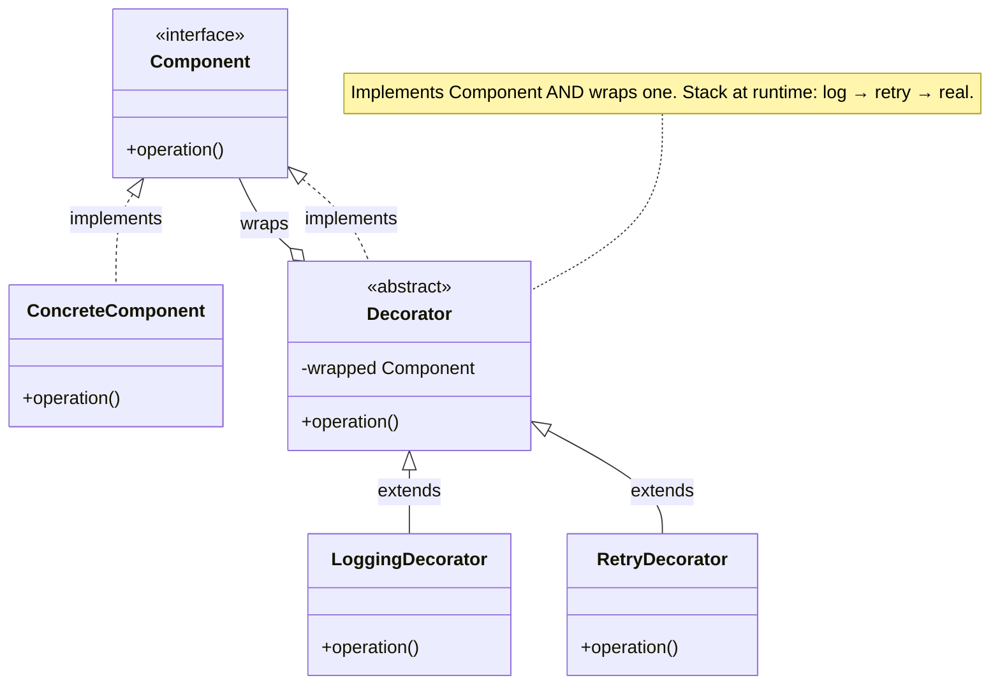

import QuickNav from '@site/src/components/QuickNav';
import CodeTabs from '@site/src/components/CodeTabs';
import Pillbar from '@site/src/components/Pillbar';

# Decorator

<Pillbar pills={[
  { label: 'family', value: 'structural' },
  { label: 'aka', value: 'Wrapper' },
  { label: 'complexity', value: '★★☆' },
  { label: 'popularity', value: '★★★' },
]} />

<QuickNav items={[
  { label: 'INTENT',     href: '#intent' },
  { label: 'PROBLEM',    href: '#problem' },
  { label: 'SOLUTION',   href: '#solution' },
  { label: 'ANALOGY',    href: '#real-world-analogy' },
  { label: 'STRUCTURE',  href: '#structure' },
  { label: 'CODE',       href: '#code' },
  { label: 'PROS & CONS',href: '#pros--cons' },
  { label: 'RELATIONS',  href: '#relations-with-other-patterns' },
]} />

## Intent

> **Attach new responsibilities to an object dynamically by placing it inside a wrapper that exposes the same interface.**

## Problem

A `PaymentProcessor` calls Stripe. Now you need: structured logging on every call, retry on transient failure, an idempotency check, and metrics. Subclassing `StripeProcessor` per cross-cutting concern explodes (`LoggingRetryingMeteredStripeProcessor`). Editing the original class buries one responsibility under four.

## Solution

Define a shared interface (`PaymentProcessor`). Each decorator implements that interface and holds a reference to *another* `PaymentProcessor`. Each adds its concern (logging, retry, metrics) and then forwards to the wrapped processor. Stack them at runtime: `new RetryDecorator(new LoggingDecorator(new StripeProcessor()), 3)`. Each concern lives in one focused class.

## Real-World Analogy

A gift. The gift itself is the wrapped object. You add tissue paper, then a box, then wrapping paper, then a ribbon. Each layer is independent — you can put any gift in a box, any box in paper, any paper under a ribbon — and from the outside, anyone receiving the package still recognises it as "a gift" with the same interface (open it).

## Structure

## Code

<CodeTabs
  groupId="im-lang"
  title="Decorator"
  java={`public interface PaymentProcessor {
  void process(Payment p);
}

public class StripeProcessor implements PaymentProcessor {
  public void process(Payment p) { /* call Stripe API */ }
}

public abstract class PaymentDecorator implements PaymentProcessor {
  protected final PaymentProcessor wrapped;
  protected PaymentDecorator(PaymentProcessor wrapped) { this.wrapped = wrapped; }
}

public class LoggingDecorator extends PaymentDecorator {
  public LoggingDecorator(PaymentProcessor w) { super(w); }
  public void process(Payment p) {
    System.out.println("charging " + p.amount());
    wrapped.process(p);
    System.out.println("charged ok");
  }
}

public class RetryDecorator extends PaymentDecorator {
  private final int max;
  public RetryDecorator(PaymentProcessor w, int max) { super(w); this.max = max; }
  public void process(Payment p) {
    for (int i = 0; i < max; i++) {
      try { wrapped.process(p); return; }
      catch (Exception e) { if (i == max - 1) throw e; }
    }
  }
}

// Stack: retry around log around real
PaymentProcessor pp = new RetryDecorator(new LoggingDecorator(new StripeProcessor()), 3);
pp.process(payment);`}
  kotlin={`fun interface PaymentProcessor { fun process(p: Payment) }

class StripeProcessor : PaymentProcessor {
  override fun process(p: Payment) { /* call Stripe */ }
}

class LoggingDecorator(private val wrapped: PaymentProcessor) : PaymentProcessor {
  override fun process(p: Payment) {
    println("charging \${p.amount}")
    wrapped.process(p)
    println("charged ok")
  }
}

class RetryDecorator(
  private val wrapped: PaymentProcessor,
  private val max: Int,
) : PaymentProcessor {
  override fun process(p: Payment) {
    repeat(max) { i ->
      try { wrapped.process(p); return }
      catch (e: Exception) { if (i == max - 1) throw e }
    }
  }
}

// Stack: retry around log around real
val pp: PaymentProcessor = RetryDecorator(LoggingDecorator(StripeProcessor()), 3)
pp.process(payment)`}
/>

## Pros & Cons

| Pros | Cons |
| --- | --- |
| Add and remove behaviour at runtime | Stacks read inside-out at construction but outside-in at runtime — confusing |
| Each concern in its own focused class | Identity tricks: `equals` / `hashCode` / type checks on a decorated object surprise |
| Combine concerns in any order | Many tiny classes — heavy for a single cross-cutting concern |
| Open/Closed — original class never edited | Hard to remove a specific layer from the middle of a stack |

## Relations with Other Patterns

- **Adapter** changes the interface; Decorator keeps it the same and adds behaviour.
- **Proxy** also wraps and keeps the interface, but for control (lazy, auth, RPC) rather than behaviour extension.
- **Composite** + **Decorator** are siblings — both rely on a shared `Component` interface and recursive references.
- **Chain of Responsibility** looks similar but each handler may *stop* the chain; decorators always forward.
- **Java I/O** (`BufferedReader(InputStreamReader(FileInputStream))`) is a canonical Decorator stack.
