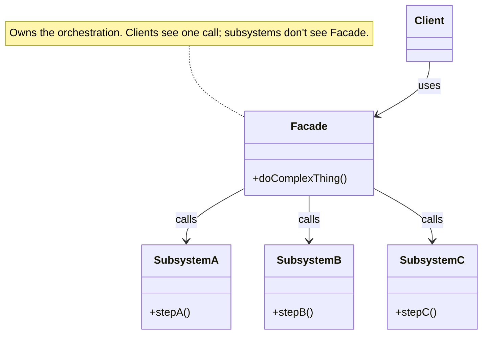

import QuickNav from '@site/src/components/QuickNav';
import CodeTabs from '@site/src/components/CodeTabs';
import Pillbar from '@site/src/components/Pillbar';

# Facade

<Pillbar pills={[
  { label: 'family', value: 'structural' },
  { label: 'aka', value: '—' },
  { label: 'complexity', value: '★☆☆' },
  { label: 'popularity', value: '★★★' },
]} />

<QuickNav items={[
  { label: 'INTENT',     href: '#intent' },
  { label: 'PROBLEM',    href: '#problem' },
  { label: 'SOLUTION',   href: '#solution' },
  { label: 'ANALOGY',    href: '#real-world-analogy' },
  { label: 'STRUCTURE',  href: '#structure' },
  { label: 'CODE',       href: '#code' },
  { label: 'PROS & CONS',href: '#pros--cons' },
  { label: 'RELATIONS',  href: '#relations-with-other-patterns' },
]} />

## Intent

> **Provide a unified, high-level interface to a set of interfaces in a subsystem, making the subsystem easier to use.**

## Problem

A "checkout" call must coordinate four subsystems: authenticate the user, reserve inventory, charge a payment, and schedule shipping. Every caller copies the same five-step orchestration and has to know about four collaborators. Changes to the flow ripple through every call-site.

## Solution

Introduce a **facade** class with one method (`checkout(token, order)`) that owns the orchestration internally and exposes only what callers need. The subsystems stay focused on their one job; the facade is the only place that knows the choreography.

## Real-World Analogy

A hotel concierge. You don't book restaurant tables, theatre tickets, and taxis individually — you ask the concierge to arrange dinner and a show, and they coordinate the underlying vendors. The concierge isn't *the* restaurant; they're a friendly front desk that knows where to call.

## Structure

## Code

<CodeTabs
  groupId="im-lang"
  title="Facade"
  java={`// Subsystems — each does one thing well
class AuthService      { boolean check(String token) { /* ... */ return true; } }
class InventoryService { boolean reserve(long sku, int qty) { /* ... */ return true; } }
class PaymentService   { void charge(long userId, Money amt) { /* ... */ } }
class ShipmentService  { String schedule(Order o) { /* ... */ return "TRACK-1"; } }

// Facade
public class CheckoutFacade {
  private final AuthService auth;
  private final InventoryService inv;
  private final PaymentService pay;
  private final ShipmentService ship;
  // constructor omitted

  public String checkout(String token, Order o) {
    if (!auth.check(token))             throw new IllegalStateException("auth");
    if (!inv.reserve(o.sku(), o.qty())) throw new IllegalStateException("oos");
    pay.charge(o.userId(), o.amount());
    return ship.schedule(o);
  }
}

// Caller — one line instead of five subsystem calls
String tracking = facade.checkout(jwt, order);`}
  kotlin={`class AuthService      { fun check(token: String) = true }
class InventoryService { fun reserve(sku: Long, qty: Int) = true }
class PaymentService   { fun charge(userId: Long, amount: Money) { /* ... */ } }
class ShipmentService  { fun schedule(o: Order): String = "TRACK-1" }

class CheckoutFacade(
  private val auth: AuthService,
  private val inv: InventoryService,
  private val pay: PaymentService,
  private val ship: ShipmentService,
) {
  fun checkout(token: String, o: Order): String {
    check(auth.check(token))                   { "auth" }
    check(inv.reserve(o.sku, o.qty))           { "oos" }
    pay.charge(o.userId, o.amount)
    return ship.schedule(o)
  }
}

val tracking = facade.checkout(jwt, order)`}
/>

## Pros & Cons

| Pros | Cons |
| --- | --- |
| One simple entry-point for common use cases | Tempting to evolve into a god-class that owns *everything* |
| Decouples callers from subsystem internals | Doesn't prevent advanced callers from reaching past the facade if subsystems remain public |
| Easier to swap or wrap the whole subsystem | Adds an extra layer for trivial subsystems |

## Relations with Other Patterns

- **Adapter** typically wraps one class to translate an interface; Facade orchestrates *several* classes to simplify a use case.
- **Mediator** also coordinates several objects, but it's central to *their* communication (objects talk through the mediator); a Facade is *one-way* — the subsystems don't know it exists.
- **Singleton** is a common scope for a Facade (one orchestrator per process).
- **Abstract Factory** can be an alternative when the goal is to hide *construction* of a related family, not *invocation* of behaviour.
