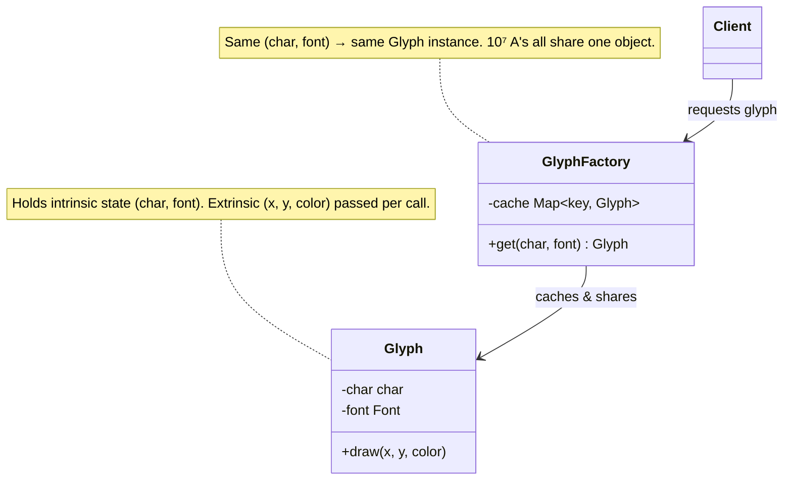

import QuickNav from '@site/src/components/QuickNav';
import CodeTabs from '@site/src/components/CodeTabs';
import Pillbar from '@site/src/components/Pillbar';

# Flyweight

<Pillbar pills={[
  { label: 'family', value: 'structural' },
  { label: 'aka', value: 'Cache' },
  { label: 'complexity', value: '★★★' },
  { label: 'popularity', value: '★☆☆' },
]} />

<QuickNav items={[
  { label: 'INTENT',     href: '#intent' },
  { label: 'PROBLEM',    href: '#problem' },
  { label: 'SOLUTION',   href: '#solution' },
  { label: 'ANALOGY',    href: '#real-world-analogy' },
  { label: 'STRUCTURE',  href: '#structure' },
  { label: 'CODE',       href: '#code' },
  { label: 'PROS & CONS',href: '#pros--cons' },
  { label: 'RELATIONS',  href: '#relations-with-other-patterns' },
]} />

## Intent

> **Share large numbers of fine-grained objects efficiently by separating intrinsic (shared) state from extrinsic (per-use) state.**

## Problem

A code editor renders 200,000 characters per file. A naive `Glyph` object per character — each carrying `char`, `font`, `weight`, plus per-render `x`, `y`, `color` — burns hundreds of megabytes and thrashes the GC. Most of that state repeats: 200,000 glyphs share maybe 60 distinct `(char, font, weight)` combinations.

## Solution

Split state into two parts:

- **Intrinsic** — shared, immutable, identifies the object (e.g. `char='A'`, `font=Inter`, `weight=Bold`). Cache these in a factory keyed by their combination.
- **Extrinsic** — passed in per use (e.g. `x=120`, `y=400`, `color=#000`). Never stored on the flyweight.

The factory hands out a shared instance for each intrinsic combination. Now 200,000 'A's all point at the same `Glyph` object; only the per-call `(x, y, color)` differs.

## Real-World Analogy

A single physical type-block in a printing press. The 'A' block has a fixed shape (intrinsic). The printer presses it onto different positions of the page (extrinsic). Hundreds of 'A's appear in the printed book, but only one block exists in the case.

## Structure

## Code

<CodeTabs
  groupId="im-lang"
  title="Flyweight"
  java={`public final class Glyph {
  private final char character;
  private final Font font;

  Glyph(char c, Font f) { character = c; font = f; }

  public void draw(Canvas canvas, int x, int y, Color color) {
    // intrinsic: character, font.  extrinsic: x, y, color
    canvas.drawChar(character, font, x, y, color);
  }
}

public class GlyphFactory {
  private final Map<String, Glyph> cache = new HashMap<>();

  public Glyph get(char c, Font f) {
    String key = c + "/" + f.id();
    return cache.computeIfAbsent(key, k -> new Glyph(c, f));
  }
}

// 10 million A's at different positions share ONE Glyph
GlyphFactory factory = new GlyphFactory();
for (int i = 0; i < 10_000_000; i++) {
  Glyph g = factory.get('A', font);
  g.draw(canvas, randomX(), randomY(), randomColor());
}`}
  kotlin={`class Glyph internal constructor(
  private val character: Char,
  private val font: Font,
) {
  fun draw(canvas: Canvas, x: Int, y: Int, color: Color) {
    // intrinsic: character, font.  extrinsic: x, y, color
    canvas.drawChar(character, font, x, y, color)
  }
}

class GlyphFactory {
  private val cache = mutableMapOf<String, Glyph>()
  fun get(c: Char, f: Font): Glyph =
    cache.getOrPut("\$c/\${f.id}") { Glyph(c, f) }
}

// 10 million A's at different positions share ONE Glyph
val factory = GlyphFactory()
repeat(10_000_000) {
  val g = factory.get('A', font)
  g.draw(canvas, randomX(), randomY(), randomColor())
}`}
/>

## Pros & Cons

| Pros | Cons |
| --- | --- |
| Order-of-magnitude memory savings when state is mostly shared | Complicates the design — easy to under-deliver if the intrinsic set is large |
| Plays well with `String.intern()`, `Integer.valueOf(0..127)`, glyph caches | Flyweights *must* be immutable — a hidden mutation poisons every caller |
| Decouples object identity from its position in the world | Cache eviction policy matters if the key-space grows unbounded |

## Relations with Other Patterns

- **Composite** trees often store Flyweights at the leaves (e.g. a UI scene graph reuses one `IconGlyph` for every star icon).
- **State** and **Strategy** objects can be implemented as Flyweights when many contexts share the same behaviour.
- **Factory Method** is the usual gatekeeper that returns shared flyweights.
- **Singleton** is the degenerate Flyweight — exactly one shared instance.
