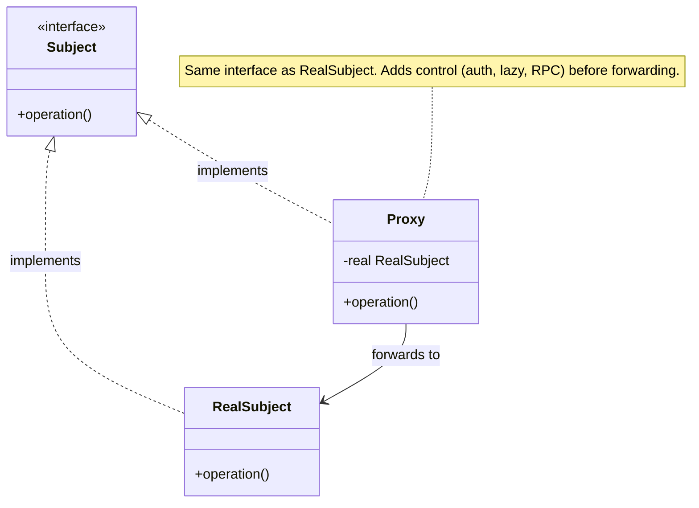

import QuickNav from '@site/src/components/QuickNav';
import CodeTabs from '@site/src/components/CodeTabs';
import Pillbar from '@site/src/components/Pillbar';

# Proxy

<Pillbar pills={[
  { label: 'family', value: 'structural' },
  { label: 'aka', value: 'Surrogate' },
  { label: 'complexity', value: '★★☆' },
  { label: 'popularity', value: '★★★' },
]} />

<QuickNav items={[
  { label: 'INTENT',     href: '#intent' },
  { label: 'PROBLEM',    href: '#problem' },
  { label: 'SOLUTION',   href: '#solution' },
  { label: 'ANALOGY',    href: '#real-world-analogy' },
  { label: 'STRUCTURE',  href: '#structure' },
  { label: 'CODE',       href: '#code' },
  { label: 'PROS & CONS',href: '#pros--cons' },
  { label: 'RELATIONS',  href: '#relations-with-other-patterns' },
]} />

## Intent

> **Provide a surrogate or placeholder for another object to control access to it.**

## Problem

Some objects shouldn't be touched directly:

- A `RealReport` takes 800 ms to load from disk — too expensive at startup if no one ever opens it.
- A `BankAccount.withdraw()` must be gated by authentication and audited.
- A `RemoteService` lives in another process — every call is a network round-trip the caller shouldn't have to encode.

Sprinkling lazy-loading, auth, and RPC code through callers spreads concerns and couples them to mechanics they shouldn't care about.

## Solution

Define a `Subject` interface that both the real object and the proxy implement. The proxy intercepts every call, does its job (defer loading, check permissions, dispatch over the wire), and then — if appropriate — forwards to the real object. Callers see the same interface; they don't know they're talking to a proxy.

Common flavours:

| Variant | What the proxy adds |
| --- | --- |
| **Virtual** | Lazy construction of the expensive real subject |
| **Protection** | Access control before forwarding |
| **Remote** | RPC stub that hides the network |
| **Smart** | Reference counting, caching, copy-on-write |

## Real-World Analogy

A bank cheque. The cheque is a proxy for the actual money in your account. The recipient treats it as if it were cash, but the bank can validate (does the account exist?), authorise (sufficient funds?), and log the transaction before any real money moves.

## Structure

## Code

<CodeTabs
  groupId="im-lang"
  title="Proxy · access control"
  java={`public interface FileSystem {
  byte[] read(String path);
}

public class RealFileSystem implements FileSystem {
  public byte[] read(String path) {
    try { return Files.readAllBytes(Path.of(path)); }
    catch (IOException e) { throw new UncheckedIOException(e); }
  }
}

public class SecurityProxy implements FileSystem {
  private final RealFileSystem real;
  private final Set<String> allowedRoots;

  public SecurityProxy(RealFileSystem real, Set<String> allowedRoots) {
    this.real = real; this.allowedRoots = allowedRoots;
  }

  public byte[] read(String path) {
    String abs = Path.of(path).toAbsolutePath().toString();
    if (allowedRoots.stream().noneMatch(abs::startsWith))
      throw new SecurityException("denied: " + abs);
    return real.read(path);
  }
}`}
  kotlin={`interface FileSystem {
  fun read(path: String): ByteArray
}

class RealFileSystem : FileSystem {
  override fun read(path: String): ByteArray = Files.readAllBytes(Path.of(path))
}

class SecurityProxy(
  private val real: RealFileSystem,
  private val allowedRoots: Set<String>,
) : FileSystem {
  override fun read(path: String): ByteArray {
    val abs = Path.of(path).toAbsolutePath().toString()
    require(allowedRoots.any { abs.startsWith(it) }) { "denied: \$abs" }
    return real.read(path)
  }
}`}
/>

<CodeTabs
  groupId="im-lang"
  title="Proxy · lazy loading"
  java={`public class ReportProxy implements Report {
  private final Supplier<Report> loader;
  private Report cached;

  public ReportProxy(Supplier<Report> loader) { this.loader = loader; }

  private Report real() {
    if (cached == null) cached = loader.get();
    return cached;
  }

  public String title()      { return real().title(); }
  public List<Row> rows()    { return real().rows(); }
}`}
  kotlin={`class ReportProxy(private val loader: () -> Report) : Report {
  private val real: Report by lazy(loader)

  override fun title(): String = real.title()
  override fun rows():  List<Row> = real.rows()
}`}
/>

## Pros & Cons

| Pros | Cons |
| --- | --- |
| Adds control (lazy, auth, audit, RPC) without touching the real subject | Adds latency — one indirection per call |
| Open/Closed — new proxies stack without editing existing code | Hard to debug — the call site lies about who handles the call |
| Powers framework magic (Spring AOP, Hibernate lazy loading) | Spring proxies only intercept calls **through the proxy** — `this.foo()` inside the same bean skips the proxy |

## Relations with Other Patterns

- **Adapter** changes the interface; Proxy keeps it the same.
- **Decorator** also wraps and forwards through the same interface, but decorators *enhance behaviour*; proxies *control access*. (The line is blurry — both share the wrapper shape.)
- **Facade** is a different beast — it simplifies a multi-class subsystem behind one interface, not stand in for one object.
- **Spring** generates proxies at runtime for `@Transactional`, `@Async`, `@Cacheable`, `@Secured`. Cglib subclasses the bean (so it can't be `final`); JDK dynamic proxies require an interface.
