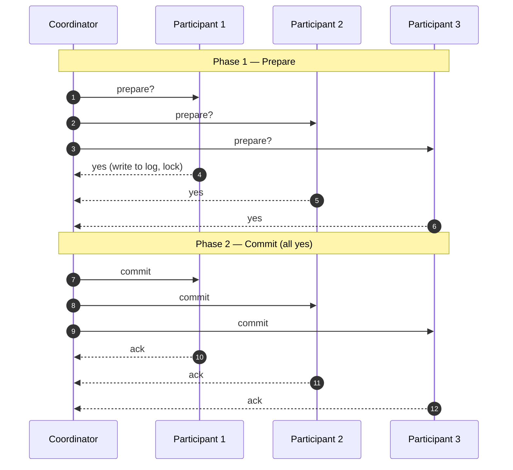
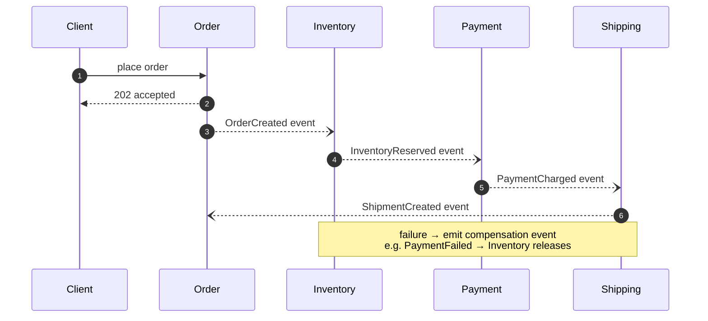
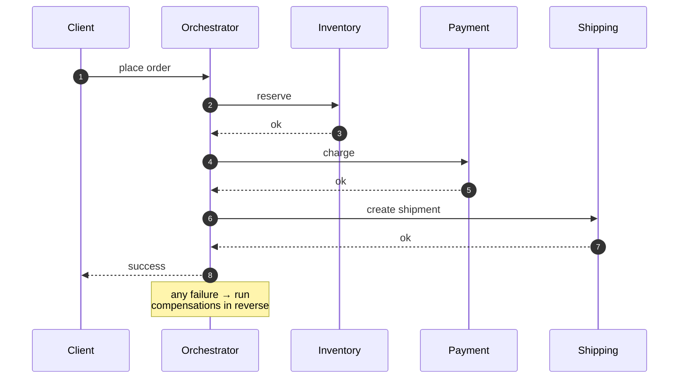

import QuickNav from '@site/src/components/QuickNav';
import CodeTabs from '@site/src/components/CodeTabs';
import Pillbar from '@site/src/components/Pillbar';
import { Checklist, ChecklistItem } from '@site/src/components/Checklist';

# System Design: Advanced Patterns & Concepts

<Pillbar pills={[
  { label: 'time', value: '3–4 hours' },
  { label: 'level', value: 'senior+' },
]} />

Advanced distributed-systems concepts that separate good system design answers from great ones.

<QuickNav items={[
  { label: 'TOPIC 8: DISTRIBUTED TRANSACTIONS', href: '#topic-8-distributed-transactions' },
  { label: 'TOPIC 9: CONSENSUS ALGORITHMS', href: '#topic-9-consensus-algorithms' },
  { label: 'TOPIC 10: OBSERVABILITY', href: '#topic-10-observability' },
  { label: 'CASE STUDY: URL SHORTENER', href: '#case-study-url-shortener' },
  { label: 'CHECKLIST', href: '#checklist' },
  { label: 'RESOURCES', href: '#resources' },
]} />

## Topic 8: Distributed Transactions

### What is it?

A transaction that updates state across **multiple services or partitions atomically**. Either all parts succeed or none do.

### Why is it hard?

Each service has its own database. You can't open one transaction across them. Network failures between services mean any global "commit" can be partially applied.

### The two main approaches

#### Two-Phase Commit (2PC)



1. **Prepare** — coordinator asks each participant "can you commit?"
2. **Commit / abort** — coordinator collects votes; if all yes, broadcast commit; else abort.

| Pros | Cons |
| --- | --- |
| Strong consistency | Coordinator is a SPOF |
| Easy to reason about | Blocking — locks held until commit |
| | High latency in failure cases |

#### Saga

A long-running transaction split into a sequence of **local transactions**, each with a **compensating action**. If step 5 fails, run compensations 4-down-to-1 in reverse.

- **Orchestrated** — one service drives the saga.
- **Choreographed** — each service listens for events and reacts.

Sagas are the modern microservices answer; 2PC is mostly historical or used inside a single DB.

### Example sequence

```text
Order saga:
  1. ReserveInventory       (compensate: ReleaseInventory)
  2. ChargePayment          (compensate: RefundPayment)
  3. CreateShipment         (compensate: CancelShipment)
  4. EmailCustomer
```

### Choreography vs. orchestration in detail

| | **Choreography (event-driven)** | **Orchestration (central coordinator)** |
| --- | --- | --- |
| Control flow | Each service listens for events and decides what to do next | One service calls the others in sequence |
| Coupling | Loose — services don't know about each other | Tighter — orchestrator knows the whole flow |
| Visibility | Hard to trace ("where did the order get stuck?") | Easy — one service has the state |
| Cycles | Hard to detect | Impossible by design |
| When | Few steps, stable flow, services are autonomous | Many steps, business-critical visibility |

Most real systems start choreographed and pivot to orchestrated when the flow grows past 4–5 steps. Camunda, Temporal, AWS Step Functions are typical orchestrators.

#### Choreography (event-driven) flow



Each service listens for one event and emits its own. No central coordinator — but no central view either.

#### Orchestration (central coordinator) flow



One service drives the flow and persists state durably. Easier to audit; the orchestrator itself needs HA.

### Idempotency key — making retries safe

Every saga step is invoked at-least-once; some are invoked twice. **Each external call carries an idempotency key** (typically `(saga_id, step_id)` or a UUID), and downstream services maintain a small "we've processed this key" table to deduplicate.

```http
POST /payments
Idempotency-Key: 7c2a-9b3f-...
```

Stripe, PayPal, and most payment APIs require this header for `POST`s. The server stores the request hash and response for ~24 hours; the same key replays the cached response instead of double-charging.

## Topic 9: Consensus Algorithms (High-Level)

### What is it?

A protocol by which N nodes agree on a single value, even with crashes and message reordering. Famous algorithms: **Paxos**, **Raft**, **Zab**.

### Why does this matter for interviews?

You will not be asked to implement Paxos. You **will** be asked questions like:

- "Why can't we just elect a leader by timing?"
- "What does Zookeeper do?"
- "Why do consensus algorithms need a quorum?"

### The high-level idea (Raft, simplified)

1. **Leader election** — when a leader's heartbeat is missed, followers start an election by incrementing a term and asking for votes. Majority wins.
2. **Log replication** — clients send writes to the leader; the leader appends to its log and replicates to followers. A log entry is **committed** once a majority has acknowledged.
3. **Safety** — committed entries are never lost; a new leader must contain all committed entries.

### Where you encounter consensus

| System | Consensus used for |
| --- | --- |
| Zookeeper / etcd | Cluster membership, config |
| Kafka (KRaft mode) | Controller election |
| CockroachDB / Spanner | Replicated state machines |
| Consul | Service discovery |

## Topic 10: Observability

### What is it?

The practice of running systems you can **debug from outside**. Three pillars:

| Pillar | Question it answers |
| --- | --- |
| **Metrics** | "How are things going?" |
| **Logs** | "What just happened?" |
| **Traces** | "Where did this single request spend its time?" |

### Design

- **Metrics** — time-series. Prometheus pull or push-based StatsD. Aggregate via labels (`service`, `endpoint`, `status`). Watch cardinality — every label combination is a separate series.
- **Logs** — append-only. Structured JSON. Centralize via Fluentd / Vector → store in Loki / Elasticsearch. Drop log levels below `INFO` in production.
- **Traces** — spans. Use OpenTelemetry for instrumentation. Sample aggressively (1% or less) for high-volume services.

### Alerts

- Alert on **SLO breaches**, not raw thresholds.
- Use **multi-window burn-rate alerts** — fires fast for outage, slow for chronic issues.
- Every alert should have a **runbook link**.

### Dashboards

Three dashboards per service: USE (Utilization, Saturation, Errors) for resources; RED (Rate, Errors, Duration) for endpoints; a third for business metrics.

### RED vs. USE — which methodology where

| Methodology | What it measures | For |
| --- | --- | --- |
| **RED** — Rate, Errors, Duration | Per-endpoint request behaviour | Request-driven services (APIs, web) |
| **USE** — Utilization, Saturation, Errors | Per-resource health | Backing resources (CPU, disk, DB, queue) |

The two are complementary. RED tells you "the customer experience is bad"; USE tells you "the CPU is pegged." Most modern dashboard libraries (Grafana templates, Datadog APM) build both from a single OTel instrumentation.

### ELK stack — centralized logging

The de-facto open-source logging pipeline:

```text
[ App ]──JSON logs──→ [ Filebeat / Vector ] ──→ [ Logstash (parse, enrich) ]
                                                       │
                                                       ▼
                                              [ Elasticsearch (index) ]
                                                       │
                                                       ▼
                                                 [ Kibana (UI) ]
```

Alternatives that drop pieces:

- **EFK** — replace Logstash with Fluentd (lighter, K8s-native).
- **Loki + Promtail + Grafana** — labels only, much cheaper, slower full-text search.
- **CloudWatch Logs / Cloud Logging** — managed equivalents.

The architecture matters less than: ship **structured JSON** with consistent fields (`service`, `request_id`, `user_id`, `level`); search by those fields, not by regex.

### SLI, SLO, SLA — the SRE vocabulary

| Term | What it is | Example |
| --- | --- | --- |
| **SLI** — Service Level **Indicator** | A measurable signal | "99th percentile latency for `POST /checkout`" |
| **SLO** — Service Level **Objective** | An internal target on an SLI | "99% of `POST /checkout` requests < 250 ms over a 30-day window" |
| **SLA** — Service Level **Agreement** | A contractual promise to customers, with penalties | "99.9% monthly availability; service credits if breached" |

SLAs ⊂ SLOs ⊂ SLIs. SLA is the public-facing weakest version; the SLO is what you alert on internally; SLIs are the raw data.

### Error budgets

If your SLO is 99.9% availability, your **error budget** is 0.1% — 43 minutes per month of downtime you're "allowed" to spend.

- If the budget is healthy → ship faster, take more risks.
- If you've burnt the budget mid-month → freeze risky deploys, focus on reliability.

The error budget *aligns dev and ops*: you can't argue about reliability vs. feature velocity once you've agreed on the SLO.

## Case Study: URL Shortener (TinyURL)

A short end-to-end walk-through of how the building blocks compose.

### Functional

- Create a short URL for a given long URL.
- Redirect `/:short` → long.
- Optional: custom alias, expiry.

### Numbers

- 500M shortens / month → ~200 writes/s peak.
- 50× read-to-write → ~10k reads/s peak.
- 7-char base-62 → ~3.5 trillion keys.

### API

```http
POST /api/shorten   body: { url, alias? }   → { short }
GET  /:short                                → 301 to long
```

### Architecture

```text
[ Clients ]
   ↓
[ CDN ]                    ← caches redirects for short TTL
   ↓
[ Load Balancer ]
   ↓
[ API servers ]
   ↓ (read-mostly)
[ Redis cache ]            ← hot redirects
   ↓ on miss
[ Postgres / DynamoDB ]    ← short → long mapping
```

### Key design decisions

- **ID generation**: counter behind Redis `INCR`, base62-encoded. Avoids collision retries.
- **Caching**: Redis with 24-hour TTL. CDN caches 301 with short TTL.
- **Scaling reads**: replicas + cache. Writes are cheap at this scale.
- **Custom aliases**: separate `CONFLICT` check on insert.

## Checklist

<Checklist>
  <ChecklistItem id="system-design-advanced-patterns-0-can-explain-why-2pc-blocks-and-why-sagas">Can explain why 2PC blocks and why sagas don't.</ChecklistItem>
  <ChecklistItem id="system-design-advanced-patterns-0-know-what-a-quorum-is-and-why-raft-paxos">Know what a quorum is and why Raft / Paxos need one.</ChecklistItem>
  <ChecklistItem id="system-design-advanced-patterns-0-can-name-the-three-observability-pillars">Can name the three observability pillars and the right tool for each.</ChecklistItem>
  <ChecklistItem id="system-design-advanced-patterns-0-walked-through-tinyurl-end-to-end-withou">Walked through TinyURL end-to-end without notes.</ChecklistItem>
  <ChecklistItem id="system-design-advanced-patterns-0-know-when-to-choose-orchestrated-vs-chor">Know when to choose orchestrated vs. choreographed saga.</ChecklistItem>
</Checklist>

## Resources

- [Raft paper (readable!)](https://raft.github.io)
- [Martin Kleppmann — Designing Data-Intensive Applications](https://dataintensive.net)
- [Pat Helland — Life Beyond Distributed Transactions](https://queue.acm.org/detail.cfm?id=3025012)
- [OpenTelemetry docs](https://opentelemetry.io)
- [Google SRE Workbook](https://sre.google/workbook/table-of-contents/)
