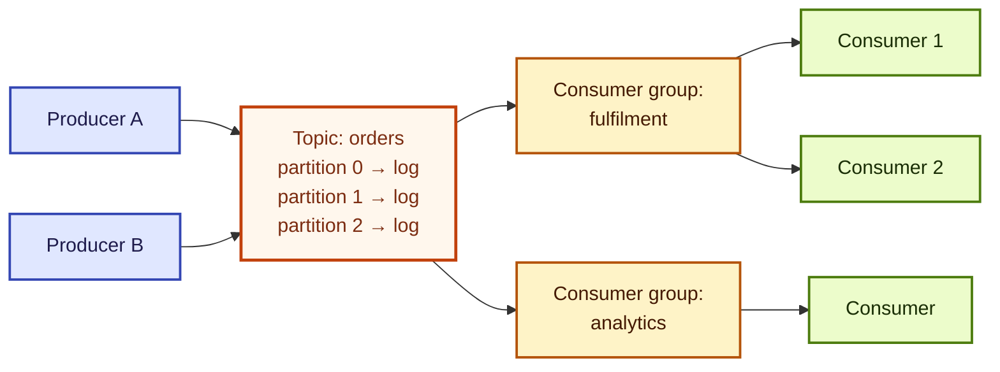
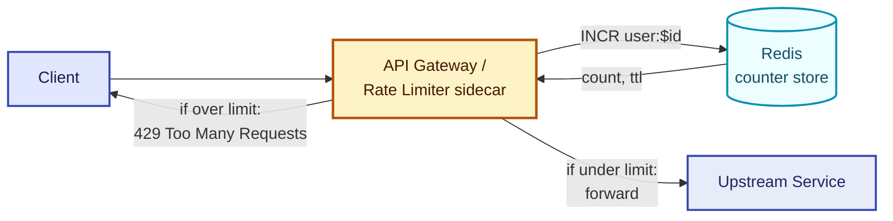
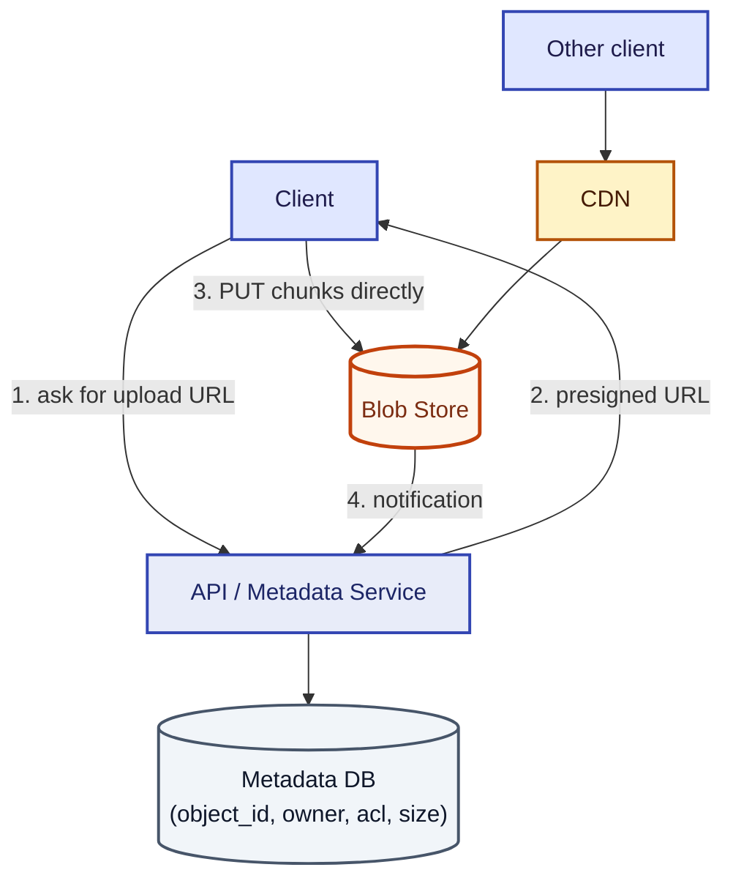
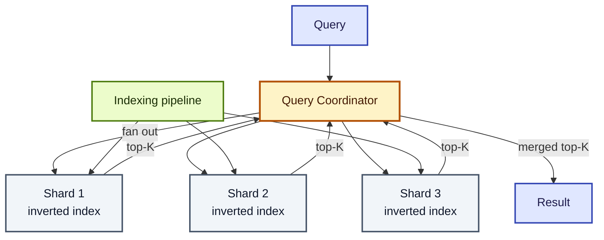
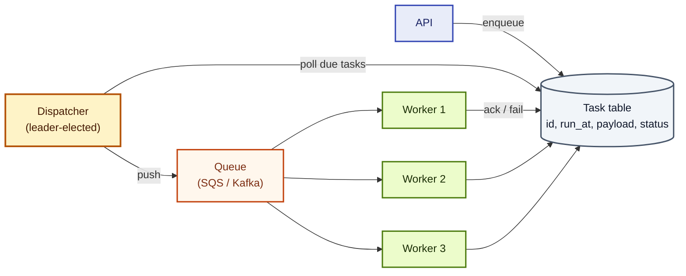
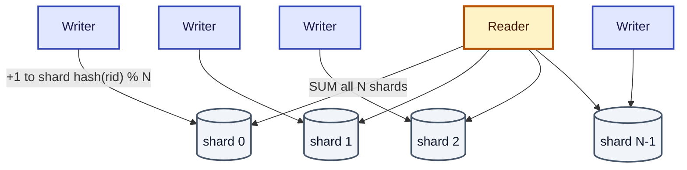

import QuickNav from '@site/src/components/QuickNav';
import CodeTabs from '@site/src/components/CodeTabs';
import Pillbar from '@site/src/components/Pillbar';

# System Design: Building Block Designs

<Pillbar pills={[
  { label: 'time', value: '4–5 hours' },
  { label: 'designs', value: 9 },
]} />

These are complete designs for foundational building blocks. In interviews you may be asked to design any of these. More importantly, understanding their internals helps you make better decisions when **using** them inside larger system designs.

<QuickNav items={[
  { label: 'KEY-VALUE STORE', href: '#design-key-value-store' },
  { label: 'PUB-SUB', href: '#design-pub-sub-system' },
  { label: 'RATE LIMITER', href: '#design-rate-limiter' },
  { label: 'BLOB STORE', href: '#design-blob-store' },
  { label: 'DISTRIBUTED SEARCH', href: '#design-distributed-search' },
  { label: 'TASK SCHEDULER', href: '#design-distributed-task-scheduler' },
  { label: 'SEQUENCER / ID GEN', href: '#design-sequencer--id-generator' },
  { label: 'SHARDED COUNTERS', href: '#design-sharded-counters' },
  { label: 'DISTRIBUTED MONITORING', href: '#design-distributed-monitoring' },
]} />

## Design: Key-Value Store

### What is it?

A KV store maps a key to a value, both opaque blobs. Examples: Redis, DynamoDB, Cassandra, etcd, BigTable.

### Why does it work?

- **Simple API** (`get`, `put`, `delete`) — easy to scale horizontally.
- **Sharding by hash of key** — uniform distribution.
- **Replication** — durability + read scale.
- **Quorum reads / writes** — tune consistency vs. latency.

### Core design choices

- **Consistent hashing** to assign keys to nodes; minimal data movement on rescale.
- **Vector clocks or Lamport timestamps** to detect conflicts in leaderless designs.
- **Hinted handoff** for transient node failures.
- **LSM tree (Cassandra) vs. B-tree (Postgres)** for storage engine.

### Architecture

```mermaid
flowchart TD
    C[Client] --> Router[Router / Coordinator]
    Router -->|hash(key)| N1[(Node 1<br/>partition A)]
    Router --> N2[(Node 2<br/>partition B)]
    Router --> N3[(Node 3<br/>partition C)]
    N1 -.replicate.-> R1a[(Replica 1a)]
    N1 -.replicate.-> R1b[(Replica 1b)]
    N2 -.replicate.-> R2a[(Replica 2a)]
    N3 -.replicate.-> R3a[(Replica 3a)]

    classDef client fill:#e0e7ff,stroke:#3346b3,stroke-width:2px,color:#1e1b4b
    classDef router fill:#fef3c7,stroke:#b45309,stroke-width:2.5px,color:#451a03
    classDef primary fill:#e8ecf9,stroke:#3346b3,stroke-width:2px,color:#1c2566
    classDef replica fill:#f1f5f9,stroke:#475569,stroke-width:2px,color:#0f172a

    class C client
    class Router router
    class N1,N2,N3 primary
    class R1a,R1b,R2a,R3a replica
```

Consistent hashing decides which node owns a key; each node has 2-3 replicas for durability. Quorum reads (e.g. R=2) tolerate one replica failure.

### Bottlenecks

- Hot keys → cache the hot tail in memory.
- Large values → store the value in a blob store, keep a pointer in the KV.

## Design: Pub-Sub System

### What is it?

Producers publish messages to topics; subscribers receive them. Examples: Kafka, Pulsar, SNS, Pub/Sub.

### Design



Two consumer groups read independently — each gets every message. Within a group, partitions are split across consumers (each partition is read by exactly one consumer in that group).

- **Topic-partitioned log** — each topic split into partitions; each partition is an append-only log.
- **Consumer groups** — each partition is consumed by exactly one consumer per group, enabling parallel processing.
- **Offset tracking** — consumer commits its position; restart resumes from there.
- **Retention** — keep messages for hours / days, enable replay.

### Tradeoffs

| Decision | Tradeoff |
| --- | --- |
| Partitions per topic | More = parallelism; fewer = ordering |
| Replication factor | More = durable; more = write cost |
| Retention period | Longer = replay; longer = storage cost |

## Design: Rate Limiter

### What is it?

A component that rejects requests above a per-user (or per-IP) threshold. Sits at the API gateway or as a sidecar.

### Algorithms

| Algorithm | Notes |
| --- | --- |
| Fixed window | Simple, allows 2× burst across boundary |
| Sliding window log | Exact, `O(N)` memory per user |
| Sliding window counter | Weighted blend; cheap |
| Token bucket | Smooth bursts, common in production |
| Leaky bucket | Smooths output rate |

### Architecture



Counters in Redis (`INCR` + `EXPIRE`). One round-trip per request — measure latency carefully. For very high RPS, use **probabilistic algorithms** (sliding window counter) or cache locally with periodic flush.

<CodeTabs
  title="TokenBucket"
  java={`public class TokenBucket {
  private final double capacity, refillPerSec;
  private double tokens;
  private long lastRefillNanos;

  public TokenBucket(double capacity, double refillPerSec) {
    this.capacity = capacity; this.refillPerSec = refillPerSec;
    this.tokens = capacity; this.lastRefillNanos = System.nanoTime();
  }

  public synchronized boolean tryConsume(double cost) {
    long now = System.nanoTime();
    double delta = (now - lastRefillNanos) / 1e9 * refillPerSec;
    tokens = Math.min(capacity, tokens + delta);
    lastRefillNanos = now;
    if (tokens < cost) return false;
    tokens -= cost; return true;
  }
}`}
  python={`import time, threading
class TokenBucket:
    def __init__(self, capacity: float, refill_per_sec: float):
        self.capacity, self.refill = capacity, refill_per_sec
        self.tokens, self.last = capacity, time.monotonic()
        self.lock = threading.Lock()
    def try_consume(self, cost: float) -> bool:
        with self.lock:
            now = time.monotonic()
            self.tokens = min(self.capacity, self.tokens + (now - self.last) * self.refill)
            self.last = now
            if self.tokens < cost: return False
            self.tokens -= cost
            return True`}
/>

## Design: Blob Store

### What is it?

An object store for large, opaque blobs (images, video, PDFs). Examples: S3, GCS, Azure Blob Storage.

### Design

- **Bucket / key namespace** — flat namespace, prefix-friendly.
- **Object replication** — eleven nines durability via multiple AZs.
- **Multipart upload** — split large objects into chunks; resume on failure.
- **Pre-signed URLs** — direct client uploads/downloads, bypass your servers.
- **Lifecycle policies** — auto-tier to cold storage (Glacier).

### Architecture



The control plane (your API) issues a short-lived signed URL; the data plane (uploads / downloads) goes direct to the blob store, bypassing your servers. CDN sits in front for hot reads.

### Common patterns

- Frontend uploads directly to S3 via pre-signed URL → backend gets metadata only.
- Large reads → CDN in front of the blob store.

## Design: Distributed Search

### What is it?

A service that returns matching documents for a text query in low milliseconds. Examples: Elasticsearch, Solr, Algolia.

### Design



Each shard answers the query against its slice of the index; the coordinator merges the partial top-Ks into a global top-K. Replicas serve query load and absorb failures.

- **Inverted index** — for each term, list of documents containing it.
- **Sharding** — split the index across nodes by document ID or term.
- **Replication** — copies of each shard for HA and read scale.
- **Query coordinator** — fans out to shards, merges top-K results.
- **Refresh interval** — how soon new writes become searchable (Elasticsearch default: 1s).

### Tradeoffs

- More shards → more parallelism, more coordination cost.
- Real-time search → smaller refresh interval, higher cost.

## Design: Distributed Task Scheduler

### What is it?

A service that schedules tasks at a future time or on a recurring schedule. Examples: cron, Airflow, AWS EventBridge Scheduler.

### Design



The dispatcher is leader-elected (via Zookeeper / etcd) to prevent two dispatchers handing the same task to two workers. Workers claim tasks via a visibility timeout — if they crash mid-execution, the task returns to the queue automatically.

- **Task table** — `(task_id, run_at, payload, status)`.
- **Workers** poll for tasks where `run_at <= now()` and `status = pending`.
- **Leader election** for the dispatcher to prevent duplicate execution.
- **Visibility timeout** — once a worker claims a task, hide it for N seconds; if not completed, return to pending.
- **Cron expressions** for recurring tasks.

### Bottlenecks

- Many small tasks → use a queue (SQS) instead of polling DB.
- Long-running tasks → split into checkpoints, write progress to durable store.

## Design: Sequencer / ID Generator

### What is it?

A service that generates monotonic, unique IDs (URL shortener codes, snowflake-style IDs, transaction IDs).

### Approaches

| Approach | Notes |
| --- | --- |
| Auto-increment column | Doesn't scale across regions |
| UUID v4 | Unique but unordered → bad index locality |
| Twitter Snowflake | 64-bit: timestamp + machine ID + counter. Sortable. |
| Redis `INCR` | Centralized, fast (~100k/s), single point of failure |
| Sharded counters | One counter per shard; merge or namespace |
| Database with batched ranges | Each app claims a range (e.g., 10k IDs) and serves them |

Snowflake is the most common interview answer.

## Design: Sharded Counters

### What is it?

A counter that can be incremented at very high write rate (likes, views) without contention.

### Why is it hard?

A single row with `UPDATE counter SET v = v + 1` becomes a write hotspot. Every increment is a serialization point.

### Design

- Split the counter into **N shards**: `counter:hot:0`, `counter:hot:1`, ..., `counter:hot:N−1`.
- Each increment hashes the request to a shard and increments only that one.
- **Read** sums all shards.
- Tradeoff: reads cost `O(N)` instead of `O(1)`.

For very high-rate counters, increment in-memory and **flush to durable store periodically**.



Writes spread across `N` keys; reads pay `O(N)` once and can be cached for seconds.

## Design: Distributed Monitoring

### What is it?

A system that ingests metrics, logs, and traces from many services and lets you query / alert on them. Examples: Datadog, Prometheus + Grafana, CloudWatch.

### Pillars

| Pillar | Tool | Cardinality |
| --- | --- | --- |
| Metrics | Time-series DB (Prometheus, InfluxDB) | Low (labels) |
| Logs | Append-only log store (Loki, Elasticsearch) | High |
| Traces | Span store (Jaeger, Tempo) | Per-request |

### Design

- **Push** (StatsD) vs. **pull** (Prometheus scraping) — pull is simpler operationally.
- **Sampling** for high-volume traces.
- **Retention tiers** — 7 days hot, 90 days warm, 1 year cold.
- **Alerts** keyed on **SLOs** (error budget, latency percentiles), not raw thresholds.
