import SystemDesignDiagram from '@site/src/components/SystemDesignDiagram';
import QuickNav from '@site/src/components/QuickNav';
import CodeTabs from '@site/src/components/CodeTabs';
import Pillbar from '@site/src/components/Pillbar';

# System Design Fundamentals

<Pillbar pills={[
  { label: 'time', value: '4–5 hours' },
  { label: 'rounds', value: '45–60 min' },
  { label: 'role', value: 'often the deciding round' },
]} />

System Design is **often the deciding factor for senior roles**. Master these fundamental concepts.

<QuickNav items={[
  { label: 'INTERVIEW FRAMEWORK', href: '#interview-framework' },
  { label: 'DISTRIBUTED SYSTEMS FOUNDATIONS', href: '#distributed-systems-foundations' },
  { label: 'THEOREMS & CORE CONCEPTS', href: '#theorems--core-concepts' },
  { label: 'NON-FUNCTIONAL CHARACTERISTICS', href: '#non-functional-system-characteristics' },
  { label: 'ARCHITECTURE OF SCALABLE APPLICATIONS', href: '#architecture-of-scalable-applications' },
  { label: 'TOPIC 1: SCALING BASICS', href: '#topic-1-scaling-basics' },
  { label: 'DNS', href: '#domain-name-system-dns' },
  { label: 'TOPIC 2: LOAD BALANCING', href: '#topic-2-load-balancing' },
  { label: 'TOPIC 3: CACHING', href: '#topic-3-caching' },
  { label: 'TOPIC 4: CDN', href: '#topic-4-cdn' },
  { label: 'TOPIC 5: DATABASES', href: '#topic-5-database-design' },
  { label: 'TOPIC 6: MESSAGE QUEUES', href: '#topic-6-message-queues' },
  { label: 'TOPIC 7: API GATEWAY', href: '#topic-7-api-gateway' },
]} />

## Interview Framework

A 45–60 minute conversation in six beats. Skipping a beat is the most common way to lose points at the wrong section.

1. **Requirements** — functional and non-functional. Pin numbers down early: users, RPS, payload size, P99.
2. **API design** — sketch three endpoints (request, response). This anchors the rest of the discussion.
3. **High-level architecture** — boxes and arrows; trace the data flow for one request.
4. **Data model & storage** — schemas, indexes, choice of SQL / NoSQL / object / cache.
5. **Scale & failure** — bottlenecks, caching, replication, partitioning, degradation under failure.
6. **Wrap-up** — what you'd revisit with more time and which trade-offs you knowingly made.

<SystemDesignDiagram />

## Distributed Systems Foundations

Three forces shape every distributed system:

- **Latency** — speed of light is real. Cross-region round-trips take ~150 ms; same-DC ~0.5 ms.
- **Partial failure** — nodes, disks, and networks fail independently. A "system is down" is rare; "system is degraded" is the norm.
- **Concurrency** — two clients may both be right at the same instant. Determining a single truth requires coordination, which costs latency.

### The 8 Fallacies of Distributed Computing

Things engineers wrongly assume when they're new to distributed systems (Sun / L. Peter Deutsch):

1. The network is **reliable**.
2. Latency is **zero**.
3. Bandwidth is **infinite**.
4. The network is **secure**.
5. Topology doesn't **change**.
6. There is **one administrator**.
7. Transport cost is **zero**.
8. The network is **homogeneous**.

Every one of these is *false* in production. If your design assumes any of them, name the fallacy in the interview and explain the mitigation.

### Types of failures

| Failure mode | What happens | How to handle |
| --- | --- | --- |
| **Fail-stop** | Node crashes and stays dead | Health checks + replacement |
| **Crash-recover** | Node crashes, then comes back with stale or partial state | Idempotency, leases, fencing tokens |
| **Omission** | Node silently drops messages | Timeouts + retries with backoff |
| **Byzantine** | Node sends wrong/malicious responses | Quorum + signatures; rare outside crypto / aerospace |

In an interview, you almost always design for **fail-stop + omission**. Byzantine fault tolerance is overkill unless asked.

### Exactly-once semantics

There is no truly exactly-once message delivery over an unreliable network. What you *can* deliver:

- **At-most-once** — fire-and-forget. Messages can be lost.
- **At-least-once** — retry until acknowledged. Duplicates can arrive.
- **Effectively-once** — at-least-once delivery **plus** idempotent processing on the consumer. This is what production systems actually do.

The mechanism: assign each message a stable **idempotency key**; consumers track processed keys (a short-lived KV record per key) and skip duplicates.

### System models

How does the network behave? Three idealisations:

| Model | Assumes | Reality check |
| --- | --- | --- |
| **Synchronous** | Messages arrive within a known bound; clocks are perfectly synchronised | A toy model; no real distributed system is fully synchronous |
| **Asynchronous** | No bound on message delivery; no clock guarantees | The FLP impossibility result: in a fully async system, consensus is impossible if even one node can crash |
| **Partially synchronous** | Messages *usually* arrive within a bound; clocks are *approximately* synchronised (NTP) | What real systems face. Raft and Paxos are designed for this model |

### Failure detection — completeness vs. accuracy

A failure detector decides "is this node dead?" given heartbeats and timeouts. There's a tension:

- **Completeness** — every dead node is eventually marked dead.
- **Accuracy** — no live node is wrongly marked dead.

Tuning is a trade-off:

| Timeout | Completeness | Accuracy |
| --- | --- | --- |
| Short (e.g. 1 s) | High — dead nodes detected fast | Low — healthy-but-slow nodes get marked dead |
| Long (e.g. 30 s) | Low — dead nodes linger in the rotation | High — only truly-dead nodes flagged |

Typical production: heartbeat every 1–5 s, declare failure after 3–10 missed beats.

### Stateless vs. stateful services

This split drives almost every scaling decision:

| | Stateless services | Stateful services |
| --- | --- | --- |
| **Stores data between requests?** | No | Yes |
| **Examples** | API server, web server, Lambda | Database, cache, message broker |
| **Scaling** | Easy — add more instances | Hard — needs partitioning + replication |
| **Failure recovery** | Simple — any instance can take any request | Complex — needs consensus or leader election |
| **Coordination** | None | Required |

**Design principle:** keep services stateless wherever possible; push state to dedicated stateful systems. This is the architectural reason microservices work — a stateless compute layer on top of stateful storage layers.

### Key vocabulary

| Term | Meaning |
| --- | --- |
| **Node** | A single host running a service |
| **Replica** | A copy of data for read scale or durability |
| **Shard / partition** | A horizontal slice of data, owned by one set of nodes |
| **Quorum** | The minimum number of replicas that must respond |
| **Leader** | The node accepting writes for a partition |
| **Eventual consistency** | All replicas converge given enough time and no new writes |

## Theorems & Core Concepts

### CAP

In the presence of a network **P**artition, you must choose between **C**onsistency and **A**vailability. A CP system rejects requests when partitioned; an AP system serves possibly-stale reads.

### PACELC

Extends CAP: **E**lse (no partition), trade **L**atency vs. **C**onsistency. PA/EL systems (Cassandra) optimize for latency in the common case; PC/EC systems (HBase, Spanner) optimize for consistency.

### ACID vs. BASE

| ACID (RDBMS) | BASE (many NoSQL) |
| --- | --- |
| **Atomicity** | **Basically Available** |
| **Consistency** | **Soft state** |
| **Isolation** | **Eventual consistency** |
| **Durability** | — |

### Idempotency

A request you can safely retry. Make every API that performs an action **idempotent** (use idempotency keys for POSTs).

### Consistency models — strongest to weakest

| Model | What it guarantees | Cost |
| --- | --- | --- |
| **Linearizability** | Every read sees the most recent write **globally**, as if there were a single copy | High (consensus, often Raft) |
| **Sequential** | All processes see operations in the **same order**, but not necessarily real-time | Medium |
| **Causal** | If A happens-before B, every node sees A before B; unrelated ops can be reordered | Lower than sequential |
| **Eventual** | Replicas converge if writes stop; mid-flight reads can be stale | Lowest |

Pick **eventual** for the read-heavy edges (feeds, profiles). Pick **linearizable** for the inner core (money, primary keys, leader election).

### Concurrency anomalies — what isolation levels prevent

When two transactions overlap, several "wrong" things can happen unless the DB isolates them:

| Anomaly | What goes wrong |
| --- | --- |
| **Dirty write** | Two transactions write the same row; later one overwrites an uncommitted earlier one |
| **Dirty read** | T1 reads a value written by T2 that hasn't committed (and may roll back) |
| **Fuzzy read (non-repeatable read)** | T1 reads row R; T2 commits an update to R; T1 reads R again and gets a different value |
| **Phantom read** | T1 runs `SELECT WHERE …` twice; T2 inserts a matching row in between; T1 sees a new "phantom" row the second time |
| **Write skew** | T1 and T2 both read overlapping data, then write disjoint rows whose update is illegal in the *combined* state |

### Isolation levels — what each one prevents

| Isolation level | Dirty read | Fuzzy read | Phantom read | Write skew | Performance |
| --- | :-: | :-: | :-: | :-: | :-: |
| **Read Uncommitted** | ✗ | ✗ | ✗ | ✗ | fastest |
| **Read Committed** (Postgres default) | ✓ | ✗ | ✗ | ✗ | fast |
| **Repeatable Read / Snapshot Isolation** (MySQL default) | ✓ | ✓ | ✓ (PG) / ✗ (MySQL with locks) | ✗ | medium |
| **Serializable** | ✓ | ✓ | ✓ | ✓ | slowest |

✓ = prevented · ✗ = allowed

Most apps run at **Read Committed**. Step up only when an anomaly causes a real bug.

### Replication models — full picture

The full replication taxonomy, with quorum configurations:

| Model | Writes go to | Reads | Pros | Cons |
| --- | --- | --- | --- | --- |
| **Single-master synchronous** | Master, waits for replica ACK | Master or replica | No data loss on master crash | Replica outage stalls writes |
| **Single-master asynchronous** | Master, replicates async | Master (or stale replica) | Fast writes | Can lose recent writes on master crash |
| **Single-master semi-synchronous** | Master, waits for ≥1 replica ACK | Master or replica | Tolerates one replica failure; almost no data loss | Mid-latency |
| **Multi-master** | Any master, async reconcile | Any master | Active-active across regions | Conflict resolution is hard (LWW, CRDTs, vector clocks) |
| **Quorum (Dynamo-style)** | W replicas | R replicas | Tunable consistency / latency | Reads can be slow if R is high |

#### Quorum knob

With `N` replicas, `W` writes required, `R` reads required, `W + R > N` guarantees read-your-writes.

| Config (N=3) | Effect |
| --- | --- |
| `W=3, R=1` | Read-optimised — fastest reads, slowest writes; one replica outage stalls writes |
| `W=1, R=3` | Write-optimised — fastest writes, slowest reads |
| `W=2, R=2` | Balanced — tolerates one replica failure for both reads and writes |

## Non-Functional System Characteristics

| Characteristic | Question |
| --- | --- |
| **Scalability** | Can it grow with traffic? |
| **Availability** | What's the uptime target? Four nines? Five? |
| **Latency** | What's the P99? P999? |
| **Durability** | If we say a write succeeded, will it survive crashes? |
| **Consistency** | How fresh are reads after writes? |
| **Maintainability** | How fast can a new engineer ship a feature? |
| **Cost** | What's the per-request cost at scale? |

### Availability — what the "nines" mean

| Availability | Downtime per year | Downtime per month |
| ---: | ---: | ---: |
| 99% (2 nines) | 3.65 days | 7.2 hours |
| 99.9% (3 nines) | 8.76 hours | 43.2 minutes |
| 99.95% | 4.38 hours | 21.6 minutes |
| 99.99% (4 nines) | 52.6 minutes | 4.3 minutes |
| 99.999% (5 nines) | 5.26 minutes | 26 seconds |

Each extra "nine" is *exponentially* more expensive. Most B2B SaaS targets 99.95%; 5 nines is rare and almost always achieved with redundant active-active across regions plus relentless automation.

### Reliability — MTBF and MTTR

- **MTBF** (Mean Time Between Failures) — how often does something break? Higher is better.
- **MTTR** (Mean Time To Recovery) — how fast do we recover? Lower is better.
- **Availability** ≈ `MTBF / (MTBF + MTTR)`.

Senior insight: as MTBF gets very large (rare faults), squeezing more "nines" gets hard. **Drive MTTR down** — observability + automated recovery — instead.

### Scalability — three dimensions

You don't just "scale up." Scalability has axes:

| Dimension | Question | Solutions |
| --- | --- | --- |
| **Size** | Can we handle 10× the data / users / load? | Horizontal scaling, sharding, async processing |
| **Geographic** | Can we serve users 10,000 km away with low latency? | CDN, multi-region, edge compute |
| **Administrative** | Can multiple teams own and ship parts independently? | Microservices, service mesh, contract testing |

A system can be size-scalable but geographically poor (single-region monolith), or admin-scalable but operationally fragile (50 microservices, no platform team).

### Maintainability — what makes a system shippable for years

Three sub-pillars, all worth more than any new feature:

| Pillar | Question | How to achieve it |
| --- | --- | --- |
| **Operability** | Can the on-call engineer fix it at 3 AM? | Good logs, dashboards, runbooks, feature flags |
| **Lucidity (simplicity)** | Can a new engineer reason about it? | Small services, clear contracts, no clever code |
| **Modifiability** | Can we add features without rewriting? | Loose coupling, dependency injection, additive schema changes |

### Fault tolerance — techniques

- **Replication** — multiple copies; survive node loss.
- **Checkpointing** — snapshot state periodically so recovery doesn't restart from zero.
- **Graceful degradation** — under failure, drop non-critical features (recommendations, analytics) before the critical path (checkout).
- **Retry with backoff and jitter** — don't reinforce a thundering herd.
- **Bulkheads** — isolate failure domains (separate thread pools, per-tenant rate limits).

## Architecture of Scalable Applications

A web-scale system at interview level is almost always some variant of this five-tier layout:

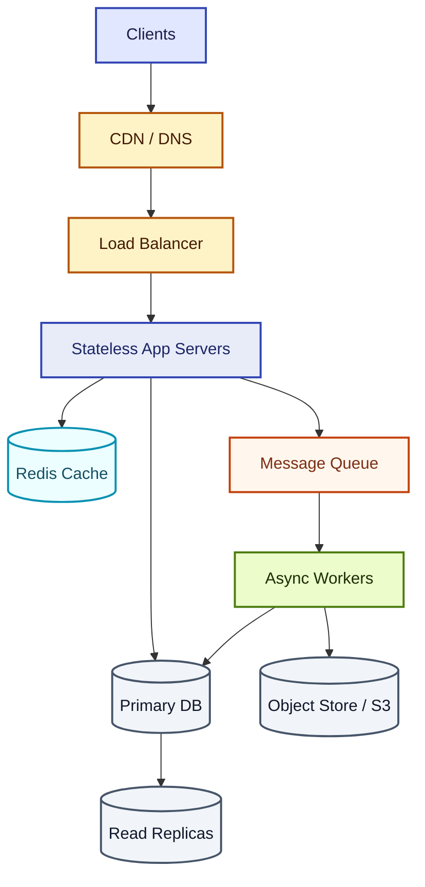

Memorize the shape; the rest is fitting your use-case to it.

### Application tier evolution

How the architecture grew historically — useful framing when an interviewer asks "why microservices?":

```text
┌─────────────────────────────────────────────────────────────────────────────┐
│                        APPLICATION TIER EVOLUTION                            │
├─────────────────────────────────────────────────────────────────────────────┤
│                                                                              │
│  1-TIER  Everything on one box (UI + logic + DB).                           │
│          ✓ no network latency   ✗ no scale, SPOF                            │
│          e.g. desktop apps                                                   │
│                                                                              │
│  2-TIER  Client ←──→ Server+DB                                              │
│          ✓ centralised data    ✗ thick client                               │
│          e.g. early enterprise apps                                          │
│                                                                              │
│  3-TIER  Client → App Server → DB                                           │
│          ✓ stateless app tier scales horizontally                            │
│          e.g. classic web app                                                │
│                                                                              │
│  N-TIER  Client → CDN → LB → App → Cache → DB + Queue + Workers + Object    │
│          ✓ each tier scales, fails, deploys independently                    │
│          e.g. modern web-scale system                                        │
│                                                                              │
└─────────────────────────────────────────────────────────────────────────────┘
```

### Monolith vs. microservices

| | Monolith | Microservices |
| --- | --- | --- |
| **Deployment** | One artefact | One per service |
| **Coupling** | Tight (in-process calls) | Loose (network calls) |
| **Data** | Shared schema | Per-service DB |
| **Failure mode** | One bug brings everything down | Failures isolate; cascade if not designed for |
| **Scaling** | Whole app together | Per service |
| **Best for** | Small teams, new products | Many teams, mature product |
| **Worst for** | 100+ engineers on the same repo | Day-1 startups |

Microservices are an **organisational** decision before a technical one.

## Topic 1: Scaling Basics

### Vertical vs. Horizontal

- **Vertical** — bigger box. Cheaper to implement, fails at one limit (CPU, RAM, IOPS), one node = one failure domain.
- **Horizontal** — more boxes. Adds complexity (state must be externalized) but scales linearly and survives node failures.

Senior answer: most systems do **vertical first** for simplicity, then horizontal once a single box can't keep up.

### Capacity estimation

### Latency numbers every programmer should know

| Operation | Latency | Mental "scale-up" |
| --- | --- | --- |
| L1 cache reference | `0.5 ns` | 1 second |
| Branch mispredict | `5 ns` | 10 seconds |
| L2 cache reference | `7 ns` | 14 seconds |
| Mutex lock / unlock | `25 ns` | 50 seconds |
| Memory access | `100 ns` | 3 minutes |
| Compress 1 KB (Zippy) | `3 µs` | 1 hour |
| Read 1 KB from memory | `250 ns` | 8 minutes |
| Same-DC RTT | `0.5 ms` | 11 days |
| SSD random read | `150 µs` | 4 days |
| Sequential read 1 MB from SSD | `1 ms` | 23 days |
| Sequential read 1 MB from disk | `20 ms` | ~1 year |
| Disk seek | `10 ms` | ~6 months |
| Cross-region RTT (CA → NL) | `150 ms` | ~7 years |

Memorize these; they let you sanity-check throughput numbers in seconds.

### QPS benchmarks (rough order of magnitude)

| Datastore | Approx QPS per node | Notes |
| --- | --- | --- |
| Bare web server (static) | 50k – 100k | Nginx, Caddy on commodity hardware |
| App server (logic, no DB) | 5k – 10k | Pure CPU work |
| MySQL | 1k – 5k reads / 100 – 1k writes | Per node; scale reads with replicas |
| PostgreSQL | 1k – 5k reads / 100 – 1k writes | Similar to MySQL |
| Redis (in-memory KV) | 100k+ | Single-threaded but very fast |
| Memcached | 200k+ | Multithreaded, slab allocator |
| Disk-bound NoSQL (Cassandra) | 1k – 10k | Per node |
| Kafka (per partition) | ~10k – 100k msg/s | Partition is the unit of parallelism |

Rule of thumb: **peak traffic ≈ 3× average**; **storage ≈ daily writes × retention × replication factor**.

### Server types and typical specs

| Server type | Typical spec | What's the bottleneck |
| --- | --- | --- |
| **Web server** | 4–8 vCPU, 8–16 GB RAM | Concurrent connections, TLS, gzip |
| **App server** | 8–16 vCPU, 16–32 GB RAM | Business logic, JIT, GC pauses |
| **Storage / DB server** | 16–64 vCPU, 64–256 GB RAM, NVMe SSD | I/O throughput, IOPS, working set in RAM |

### Estimation methodology — request, storage, bandwidth

Always quantify three things in the first five minutes of a design interview:

| What to estimate | Formula | Why |
| --- | --- | --- |
| **Request rate (QPS)** | `DAU × avg_actions_per_user / 86400 s × peak_multiplier (3×)` | Sizes the compute fleet |
| **Storage growth** | `daily_writes × avg_record_size × retention_days × replication_factor` | Sizes the DB and tier-down policy |
| **Bandwidth** | `QPS × avg_payload_bytes` (separately for read and write) | Sizes the LB / CDN / egress bill |

Do these out loud in interviews — even rough numbers (10⁶ DAU, 1 KB record, 2-year retention) instantly clarify which subsystems matter.

## Domain Name System (DNS)

DNS turns `api.example.com` into an IP. It's a global, hierarchical, eventually-consistent KV store. **TTL** controls staleness — every cache along the path (resolver, OS, browser) holds the answer for the TTL.

In interviews, mention:

- **Route 53 / Cloud DNS** for managed DNS with health checks and policy routing.
- **GeoDNS** for sending users to the closest region.
- **TTL trade-off** — short TTLs let you fail over quickly but multiply DNS query load.

### How users get routed to the right region

Three mechanisms; modern CDNs combine them:

| Method | How it works | Pros | Cons |
| --- | --- | --- | --- |
| **DNS redirection (GeoDNS)** | DNS resolver returns different A-records based on client IP geolocation | Simple, cacheable | Coarse; bound to DNS TTL |
| **Anycast** | The same IP is announced from many PoPs; BGP routes the user to the nearest | Sub-millisecond reroute on failure; protocol-agnostic | Operationally complex; requires AS / BGP infra |
| **HTTP redirect** | First hit returns `3xx` to a region-specific hostname | Fully dynamic | One extra round-trip per first visit |

Cloudflare and Fastly lean on anycast; AWS CloudFront combines anycast + DNS.

### DNS hierarchy

A resolution walks down the tree from right to left:

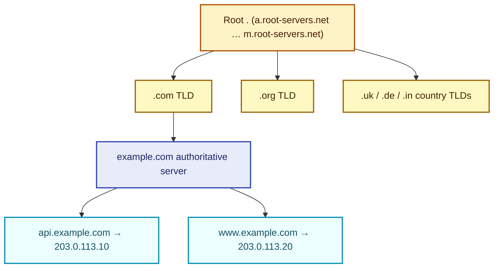

A typical resolution: browser cache → OS resolver cache → recursive resolver (often the ISP / 1.1.1.1 / 8.8.8.8) → root → TLD → authoritative. Each step is cached for the TTL.

### Common DNS resource records

| RR Type | Returns | Used for |
| --- | --- | --- |
| **A** | IPv4 address | Most lookups |
| **AAAA** | IPv6 address | Modern dual-stack |
| **CNAME** | Alias to another hostname | `www → app.example.com` |
| **MX** | Mail server hostname | Email routing |
| **TXT** | Arbitrary text | SPF, DKIM, domain verification |
| **NS** | Nameserver for the zone | Delegation |
| **SRV** | Hostname + port + priority | Service discovery (XMPP, SIP) |
| **PTR** | Reverse DNS (IP → name) | Mail server validation |

### Iterative vs. recursive resolution

When a client asks a DNS resolver, the resolver does the heavy lifting:

| Mode | Who does the walking | Who you ask |
| --- | --- | --- |
| **Recursive** | The resolver asks root → TLD → authoritative on your behalf and returns the final answer | What your OS uses (against 1.1.1.1 / 8.8.8.8 / your ISP) |
| **Iterative** | Each server replies "I don't know, ask this next one"; the asker walks the chain | What the recursive resolver does upstream |

End users always do **recursive**. The recursive resolver upstream does **iterative**.

### DNS caching — every layer caches

```text
Browser cache → OS cache → Local DNS resolver → ISP DNS server → Authoritative
```

Each layer respects the TTL on the response. The TTL is the lever you control:

| TTL | Use for | Cost |
| --- | --- | --- |
| **Short (60 s)** | About-to-fail-over critical services | Lots of DNS query load, more lookups |
| **Medium (300 s)** | Most production records | Balanced default |
| **Long (3600 s)** | Stable infrastructure records (NS, MX) | Slow to propagate changes |
| **Very long (86400 s)** | Root, TLD references | Almost never changes |

**Operational pattern:** when planning a cutover, drop TTL to 60 s 24 hours before; cut over; restore the long TTL.

### Why DNS works at planetary scale

- **Distributed hierarchy** — no single server holds the whole namespace; load splits across root → TLD → authoritative.
- **Heavy caching** — most lookups never reach the authoritative server.
- **Anycast** — root servers are physically replicated; BGP routes you to the nearest one.
- **Simple protocol** — UDP/53, single round-trip in the common case.

### Limitations of DNS for load balancing

DNS can do per-region routing (GeoDNS / latency-based), but **it is not a real load balancer**:

- Clients cache aggressively → can't react to per-second load shifts.
- No health-check granularity below "is this whole record dead?"
- A failed PoP keeps receiving traffic for the TTL window.

**Solution:** use DNS for the coarse decision (which region) and a real LB inside the region for the fine one (which app server).

## Topic 2: Load Balancing

Stateless app servers behind a load balancer scale horizontally and tolerate node failures.

### Load balancer overview

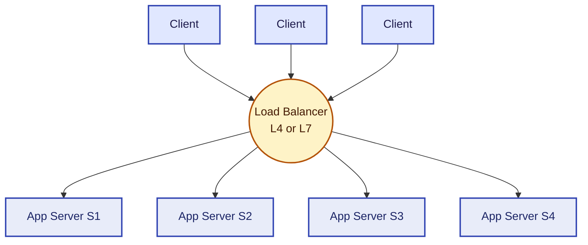

Health checks remove unhealthy backends from the pool; rolling deploys put pods in and out without dropping connections.

| Layer | Operates at | Examples |
| --- | --- | --- |
| L4 | TCP / UDP | NLB, HAProxy in TCP mode |
| L7 | HTTP / gRPC | ALB, Nginx, Envoy, Traefik |

L7 can route on path / header / cookie; L4 is faster and protocol-agnostic.

### Routing policies (load-balancing algorithms)

| Algorithm | Idea | When to pick |
| --- | --- | --- |
| **Round robin** | Send request `i` to server `i mod N` | Roughly uniform request cost |
| **Weighted round robin** | Each server gets a share proportional to its capacity | Heterogeneous backends |
| **Least connections** | Send to the server with the fewest active connections | Long-lived requests, variable cost |
| **IP hash** | `hash(client_ip) → server` | Cheap stickiness without state |
| **Consistent hashing** | Hash key onto a ring; each server owns an arc | Caches; minimizes churn on add/remove |

#### Why consistent hashing matters

Plain modulo (`hash(key) % N`) reshuffles ~`(N-1)/N` of keys when you add a server. With **consistent hashing** plus virtual nodes, adding a server only displaces ~`1/N` of the keys. Used in Cassandra, DynamoDB, Memcached clients, and ELB.

```text
              ┌──────────────┐
         S3   │              │   S1
          ○───┤     RING     ├───○
              │   (0 to 2³²) │
          ○───┤              ├───○
         S2   │              │   S4
              └──────────────┘

Each key hashes to a point on the ring; it's owned by the next
server clockwise. Add S5 → only the slice between S4 and S5
moves; the other ~3/4 of keys are untouched.
```

Session affinity ("sticky sessions") is a smell — externalize session state (Redis) and keep the app stateless.

## Topic 3: Caching

Cache when reads dominate and the same key is hot.

### Why caching is critical

| Lever | What it buys you |
| --- | --- |
| **Latency** | Microseconds (memory) instead of milliseconds (disk) or hundreds of ms (network) |
| **Load reduction** | Cache absorbs 90%+ of read traffic; backing store stays calm |
| **Cost** | Memory is cheaper than scaling out an RDBMS for read replicas |

**Rule of thumb:** target a 90–95% hit rate on the hot tier. Below 80% and the cache is more overhead than help; above 99% and you may be caching cold data unnecessarily.

### Caching at every layer

Caches sit at every hop in a request — each catches what the one below misses:

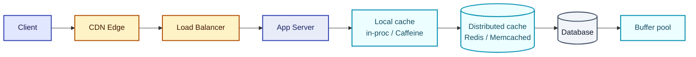

A request that hits CDN never even reaches your fleet. The strategy is *layer cake*: cheaper closer to the user, fresher closer to the DB.

### Cache locations — typical hit rates

| Layer | Technology | What's cached | Typical hit rate |
| --- | --- | --- | --- |
| **Browser / client** | HTTP cache, IndexedDB, service worker | Static assets, personalised UI fragments | ~50% |
| **CDN / edge** | Cloudflare, CloudFront, Fastly | Static media, public API responses | 90% |
| **Web / API layer** | Nginx, Varnish, reverse proxy | Page fragments, anonymous responses | 90–95% |
| **Application** | Local in-process (Caffeine, Guava) | Hot DTOs, computed values | 95%+ |
| **Distributed cache** | Redis, Memcached | Shared DB-derived data, sessions | ~95% |
| **Database** | Buffer pool, query plan cache | Hot blocks, parsed queries | ~99% |

Each layer absorbs misses from the one above it. The **effective access time (EAT)** is `Σ (hit_rate × layer_latency)`.

### Memcached vs. Redis

The two most common distributed cache choices. Pick by feature:

| Feature | Memcached | Redis |
| --- | --- | --- |
| **Data types** | Strings only | Strings, lists, sets, sorted sets, hashes, streams, bitmaps |
| **Persistence** | None | Optional AOF + RDB snapshots |
| **Replication** | No | Yes, async + Redis Sentinel / Cluster |
| **Clustering** | Client-side hashing | Built-in (Redis Cluster) with auto-sharding |
| **Memory efficiency** | Slab allocator — best for fixed-size values | More overhead but more features |
| **Multithreading** | Yes | Mostly single-threaded (multithreaded I/O since v6) |
| **Pub/Sub** | No | Yes |
| **Lua scripting** | No | Yes — atomic server-side scripts |
| **Max value size** | 1 MB | 512 MB |

**Choose Memcached** when you want a brutally simple, multithreaded KV cache. **Choose Redis** when you need any of: lists / sets / sorted sets, persistence, pub/sub, or atomic Lua scripts. Most modern systems default to Redis.

| Strategy | Write goes to | Read goes to | When |
| --- | --- | --- | --- |
| **Cache-aside** | DB only | cache → DB on miss | Most common |
| **Write-through** | cache + DB sync | cache | Strong consistency for cache |
| **Write-behind** | cache; flushed later | cache | Write-heavy, can tolerate loss |
| **Refresh-ahead** | DB | cache (pre-refreshed before expiry) | Predictable hot keys; latency-critical |

**Refresh-ahead** asynchronously re-populates entries that are *about to* expire — so reads never block on a stampede. Good for known-hot keys (top trending feed, "your profile"); wasteful for cold keys.

```text
1. Cache-Aside     App ──read──→ Cache ──miss──→ DB
                       ←─────data─────────────────
                       ──write──→ DB
                       (cache is loaded on next read)

2. Write-Through   App ──write──→ Cache ──sync──→ DB
                       (both updated atomically)

3. Write-Behind    App ──write──→ Cache ═══async═══→ DB
                       (cache responds immediately; DB lags)

4. Refresh-Ahead   App ──read──→ Cache
                                  │
                                  └─async─→ DB (before expiry)
```

### Eviction policies

| Policy | Idea | When |
| --- | --- | --- |
| **LRU** (Least Recently Used) | Evict the entry untouched longest | Default for almost everything |
| **LFU** (Least Frequently Used) | Evict the least-hit entry | Long-tail workloads with stable hot keys |
| **FIFO** | Evict the oldest entry by insertion | Simple bounded queues |
| **TTL** | Evict on age, regardless of usage | Time-sensitive data (sessions, OTPs) |

Redis defaults to a randomised LRU approximation; Memcached strictly LRU.

### Failure modes (the three big cache problems)

| Problem | What | Mitigation |
| --- | --- | --- |
| **Cache stampede** (thundering herd) | A popular key expires → thousands of misses hit the DB simultaneously | Request coalescing, **stale-while-revalidate**, randomised expiry jitter, refresh-ahead |
| **Cache penetration** | Repeated requests for a key that doesn't exist in the DB → every read misses and hits the DB | Cache the negative result (`null` with short TTL), or front with a **Bloom filter** that knows what does *not* exist |
| **Cache breakdown** | A single hot key expires under load → all the traffic that *was* hitting cache slams the DB at once | Never expire hot keys; refresh asynchronously |

#### Bloom filters

A **Bloom filter** is a space-efficient probabilistic set that answers "have we ever seen this key?" in O(1) memory bits per element. It can have false positives ("maybe in") but **no false negatives** — if it says "definitely not", it's not.

```text
Bit array of size m. k independent hash functions.
add(x):    for each hash h_i: set bit[h_i(x) % m]
contains(x): for each hash h_i: check bit[h_i(x) % m]
             if any bit is 0 → definitely NOT present
             if all bits 1   → probably present
```

Sit a Bloom filter in front of the cache for the "does this key exist at all?" question — kills cache penetration cheaply.

<CodeTabs
  title="CacheAside"
  java={`public User getUser(long id) {
  String key = "user:" + id;
  String cached = redis.get(key);
  if (cached != null) return mapper.readValue(cached, User.class);

  User user = db.findUser(id);
  if (user != null) {
    redis.setex(key, Duration.ofMinutes(5), mapper.writeValueAsString(user));
  }
  return user;
}`}
  python={`def get_user(uid: int) -> User | None:
    key = f"user:{uid}"
    cached = redis.get(key)
    if cached is not None: return User.parse_raw(cached)
    user = db.find_user(uid)
    if user is not None: redis.setex(key, 300, user.json())
    return user`}
/>

## Topic 4: CDN

A **Content Delivery Network** caches your content at edge POPs near users. Reduces latency, offloads origin, and absorbs DDoS.

### CDN overview

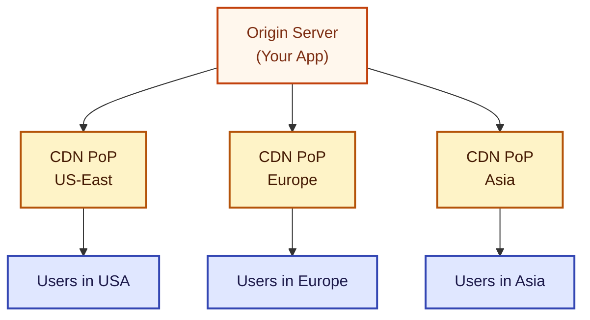

Users get content from the closest PoP; the origin only sees cache misses.

### What CDNs do well and what they don't

| Excel at | Can't do well |
| --- | --- |
| Static assets (images, CSS, JS, video) | Personalised dynamic content unique per user |
| Large-file delivery | Strong-consistency writes |
| Geographic latency reduction | Per-request authorisation logic |
| DDoS absorption (huge edge capacity) | Long-running connections (WebSockets often bypass CDN) |
| Public APIs with cacheable responses | Database queries themselves |

### Request flow — fast vs. slow path

```text
Cache HIT (fast path):    User → Edge PoP → User              (10–50 ms)
Cache MISS (slow path):   User → Edge PoP → Origin → Edge PoP → User
                                                                 (100–500 ms)
                          Subsequent requests in the region: HIT
```

The first request from a region pays the slow path; the next thousand are fast. For new content, **pre-warm** the edge before a launch.

### Popular CDNs

- **Cloudflare** — anycast network, broad free tier, integrated DDoS / WAF.
- **AWS CloudFront** — deep AWS integration, Lambda@Edge for dynamic logic.
- **Fastly** — programmable edge (VCL), instant purge.
- **Akamai** — oldest, largest footprint, enterprise contracts.
- **Google Cloud CDN** — integrated with GCP load balancing.

### Content consistency

The fundamental tension: edges cache content for performance, but content changes. Three knobs:

1. **TTR (Time To Refresh)** — async re-check after this many seconds; serve stale until then. Different from TTL (which evicts).
2. **Versioned URLs** — `app.abc123.js` → new content is a new URL. Old version stays cached harmlessly until eviction.
3. **Purge API** — explicit invalidation. Expensive, can take seconds to minutes globally.

The right answer is usually **versioned URLs + long TTL** for assets and **short TTL** for API responses.

### Multi-tier CDN architecture

For very high traffic, CDN providers stack tiers — the edge layer asks a regional **shield** layer, which asks origin:

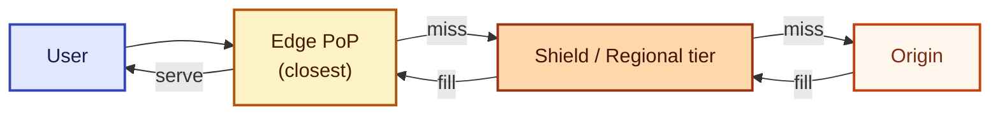

Why tiers? Without the shield, every edge miss hits the origin — a viral video could stampede with hundreds of edge nodes all asking at once. The shield collapses those into one origin fetch per region.

- Static assets (images, JS, CSS) → cache-aggressively, version with hashed filenames.
- Dynamic content → short TTL + edge functions (Cloudflare Workers, Lambda@Edge).
- Cache invalidation costs money and time — version URLs, don't purge.

### Push vs. Pull CDN

| Model | How content lands on the edge | Pros | Cons |
| --- | --- | --- | --- |
| **Pull CDN** | First request misses; edge fetches from origin and caches | Zero ops; only pay for what's accessed; self-pruning | First user pays the latency; can stampede origin on viral content |
| **Push CDN** | You upload content to the CDN proactively | Predictable latency; works for content you know will be hot | You pay for storage of everything; manual upload pipeline |

Most modern sites use **pull** (Cloudflare, CloudFront, Fastly). Push CDNs (some legacy media-heavy setups) are rare.

### Cache invalidation strategies

| Strategy | How | When |
| --- | --- | --- |
| **TTL-based** | Set a max-age; edge re-fetches after expiry | The default; works for content with a known freshness budget |
| **Versioned URLs** | Embed a content hash in the URL (`app.abc123.js`) | The right answer for static assets — old version stays cached, new version is a new URL |
| **Purge API** | Tell the CDN to evict a path | Use sparingly — expensive, can take seconds-to-minutes |
| **Stale-while-revalidate** | Serve stale; fetch fresh in the background | Best of both worlds for dynamic content |

## Topic 5: Database Design

### Five questions to ask before choosing a database

1. **What are my access patterns?** Lookup by ID? Range scan? Complex joins? Full-text? Geo? The query shape dictates the engine.
2. **How important is consistency?** Strong (banking) or eventual (timeline) — strong consistency costs latency.
3. **How much data and what growth rate?** TB now, PB in two years? Affects sharding strategy and choice between managed and self-hosted.
4. **Do I need transactions across multiple records?** If yes → SQL or a modern distributed SQL (Spanner, CockroachDB). If no → NoSQL is on the table.
5. **Is my data highly relational?** Many many-to-many joins? SQL. Mostly aggregates around one entity? Document or KV.

### Database picker

| When the data is... | Pick... |
| --- | --- |
| Strongly relational with joins | SQL (Postgres, MySQL, Aurora) |
| Document / key-value with simple access | DynamoDB, MongoDB, Cassandra |
| Time-series / events | InfluxDB, TimescaleDB, ClickHouse |
| Full-text search | Elasticsearch, OpenSearch |
| Graph relationships | Neo4j, Neptune |
| Wide-column / massive write | Cassandra, ScyllaDB, HBase |
| Newsql (SQL + scale) | CockroachDB, Spanner, YugabyteDB |

### SQL vs. NoSQL — side-by-side

| | SQL (relational) | NoSQL |
| --- | --- | --- |
| **Structure** | Fixed schema, normalised tables | Flexible — documents, KV, columns, graphs |
| **Scaling** | Vertical first; sharding is bolted on | Horizontal-first; sharding is built in |
| **ACID** | Strong by default | Often BASE; some NoSQL (DynamoDB) now offers transactions |
| **Joins** | First-class, optimised | Application-side or absent |
| **Best for** | Complex relationships, financial records, reports | High write throughput, flexible schema, simple access patterns |
| **Examples** | Postgres, MySQL, Oracle, MS SQL | DynamoDB, MongoDB, Cassandra, Redis, Neo4j |

**Practical reality:** most products use both — SQL for the core transactional model, NoSQL or specialised stores (search index, cache, time-series) at the edges.

### Indexes

Indexes are the difference between an `O(log n)` query and an `O(n)` table scan. Cover the columns your `WHERE` clauses actually use; remember every index slows down writes.

### Replication

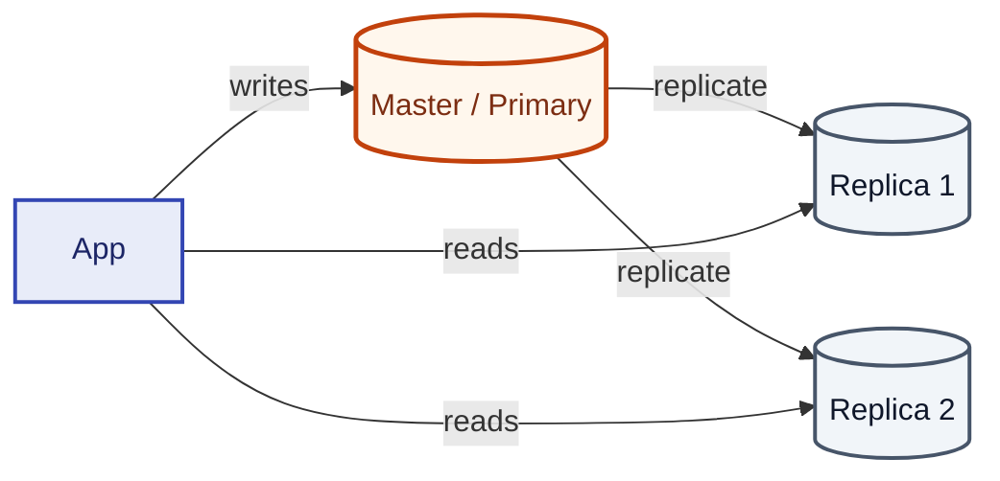

- **Leader-follower** — writes to leader, replicate to followers. Reads from followers may lag.
  - **Synchronous** — leader waits for follower ACK before responding. Strong consistency, but follower outage = write outage.
  - **Asynchronous** — leader responds immediately; followers catch up. Risk losing writes on leader crash.
  - **Semi-synchronous** — leader waits for at least one follower ACK. Compromise: tolerates one follower failure.
- **Multi-leader** — multiple writers, async reconcile. Concurrent writes to the same key produce **conflicts** that must be resolved (last-write-wins, CRDTs, vector clocks).
- **Leaderless / quorum** — Dynamo-style. `R + W > N` for read-your-writes (where N replicas, R reads required, W writes required).
  - `R = 1, W = N` → fast reads, slow writes (read-optimised).
  - `R = N, W = 1` → fast writes, slow reads (write-optimised).
  - `R = W = (N+1)/2` → balanced quorum.

### Partitioning

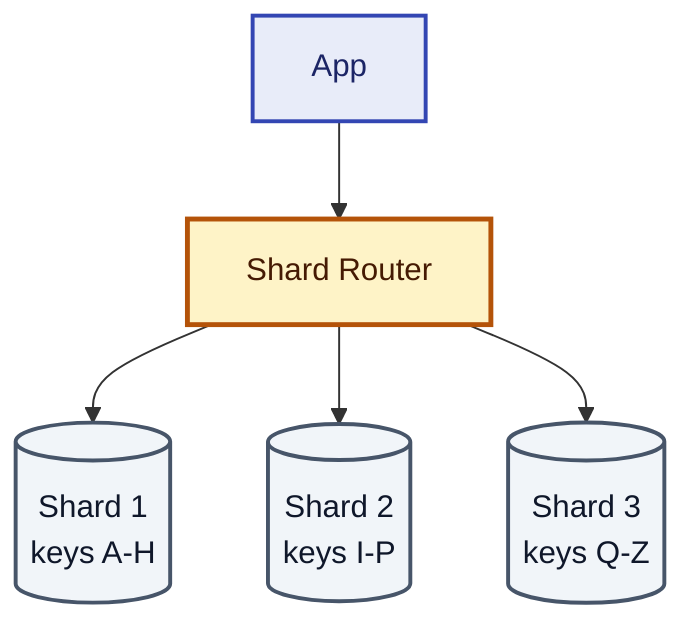

- **Range** — keys split by ranges; risk of hot range.
- **Hash** — uniform spread, but range queries fan out.
- **Consistent hashing** — minimizes rebalance churn.
- **Directory-based** — lookup table from key → shard; flexible but the directory itself becomes a bottleneck.

### Database scaling — the typical progression

Most products follow this evolution. Knowing the order is what an interviewer wants:

```text
1. Single instance (small, all-in-one)
        ↓ reads outgrow one box
2. Read replicas (master + N read replicas)
        ↓ master can't keep up with writes
3. Vertical scale the master
        ↓ hit the biggest available box
4. Horizontal partitioning (shard by key)
        ↓ rebalancing becomes painful
5. Consistent hashing / managed sharded store (Vitess, Spanner, DynamoDB)
```

Each step adds operational complexity. Don't skip to step 5 if step 2 buys you 6 more months.

### CAP — the trade-off triangle

```text
                  Consistency
                      △
                     ╱ ╲
                    ╱   ╲
                   ╱     ╲
                  ╱  CP   ╲      CA: only possible in a single-node
                 ╱    ○    ╲     system; impossible if there's a
                ╱           ╲    network you can partition.
               ╱      ○      ╲
              ╱       AP      ╲
    Availability ─────────── Partition Tolerance
```

In a real distributed system **P is not optional** — networks partition. You pick **CP** (reject requests during partition, e.g. HBase, Spanner) or **AP** (serve stale, e.g. DynamoDB default, Cassandra).

## Topic 6: Message Queues

When work is **slow or bursty**, decouple producer rate from consumer rate with a durable queue.

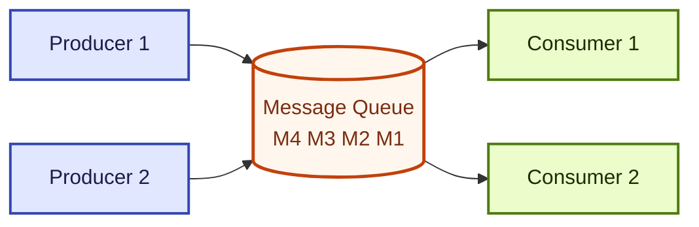

Producers fire-and-forget; consumers pull at their own pace. A slow consumer means the queue grows, not that the producer fails.

### When NOT to use a message queue

- **Synchronous, sub-100ms request/response** — the queue's persistence overhead destroys latency. Use direct RPC.
- **You actually need a database** — if you find yourself "reading from the queue" or "looking up messages," you wanted a DB, not a queue.
- **You need strict cross-partition ordering at scale** — a single global ordering bottlenecks the whole queue.

### Two core patterns

| Pattern | Topology | Example use |
| --- | --- | --- |
| **Point-to-point** | One producer, one consumer per message | Job worker queue (each job done once) |
| **Pub/Sub (fan-out)** | One producer, many subscribers per message | Audit log shipped to N analytics consumers |

### Popular systems — side-by-side

| | RabbitMQ | Kafka | SQS | Redis Streams |
| --- | --- | --- | --- | --- |
| **Model** | Broker with queues | Distributed commit log | Managed queue | In-memory log |
| **Durability** | Disk-persisted | Strong (replicated log) | Strong (managed) | Optional (AOF) |
| **Ordering** | Per-queue | Per-partition | FIFO queues offer per-message-group | Per-stream |
| **Replay** | No (consume = remove) | Yes (offsets) | No | Limited |
| **Throughput** | 10k–50k msg/s | 100k–1M+ msg/s | Effectively unlimited (managed) | 100k+ |
| **Best for** | Traditional task queues, RPC | Event streaming, audit logs, large fan-out | AWS-native async work | Lightweight pub-sub when you already have Redis |

### Anatomy of a managed queue

Three logical pieces:

1. **Frontend service** — accepts produces, validates, hands the message to the backend.
2. **Backend service** — persists, replicates, hands off to consumers.
3. **Metadata service** — tracks queues, subscriptions, offsets, ACLs.

This separation is why managed offerings (SQS, EventBridge, Pub/Sub) feel "infinite" — each layer scales independently.

| Tool | Semantics | Use for |
| --- | --- | --- |
| SQS / RabbitMQ | At-least-once | Generic async work |
| Kafka / Kinesis / MSK | Ordered, replayable | Event streams, audit logs |
| SNS / EventBridge / Pub-Sub | Fan-out pub/sub | Many subscribers, low ordering |

Make consumers **idempotent** — at-least-once means duplicates happen. Use a **dead-letter queue** for poison messages; don't retry forever.

### Message ordering guarantees

| Guarantee | What it means | How to get it |
| --- | --- | --- |
| **No ordering** | Messages may arrive in any order | Default for SNS, plain SQS, many pub/subs |
| **Per-partition ordering** | Within a partition (e.g. a Kafka topic-partition or SQS FIFO message group), order is preserved | Pick a partition key that groups related messages (e.g. `user_id`) |
| **Strict global ordering** | All consumers see *every* message in the same order | Single partition → bottlenecks throughput; rarely worth it |

Pick the *coarsest* partition key that still satisfies ordering — `customer_id` is usually enough; the whole topic almost never is.

### Consumer groups

In Kafka, multiple consumers in the **same group** split partitions among themselves — each partition is read by exactly one consumer in the group. To parallelise, raise partition count; to broadcast, use separate consumer groups.

### Dead-letter queues (DLQ)

When a message fails N times, route it to a DLQ instead of retrying forever. Alarm on DLQ depth; replay manually after fixing the bug. **Always have a DLQ in production** — without one, a single poison message can stall the queue.

## Topic 7: API Gateway

The single entry point in front of your services. Handles authn / authz, rate-limiting, request validation, routing, and metrics.

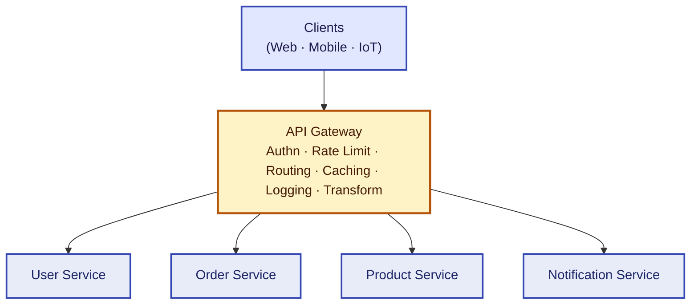

One JWT validation, one rate-limit budget, one place to log. The trade-off is that the gateway itself becomes a critical path — make it horizontally scaled and stateless.

### Eight functions an API Gateway actually performs

A complete senior answer enumerates these — most candidates only name three:

| # | Function | Detail |
| --- | --- | --- |
| 1 | **Authentication & authorisation** | Validate JWT / OAuth tokens once; propagate `user_id` and roles to downstream as headers |
| 2 | **Rate limiting & throttling** | Per API key / user / IP, token bucket or sliding window |
| 3 | **Request routing** | URL path / hostname / header / version → service |
| 4 | **Load balancing** | Pick a healthy backend instance for the chosen service |
| 5 | **Request / response transformation** | Envelope, header injection, gRPC ↔ REST, GraphQL stitch |
| 6 | **API composition / aggregation** | Fan-out to multiple services and stitch one response (BFF pattern) |
| 7 | **Caching** | Cache successful idempotent responses by route + key |
| 8 | **Observability** | Log every request; emit metrics and traces; centralise without per-service instrumentation |

### Popular API Gateways

| Tier | Choices |
| --- | --- |
| **Cloud-native managed** | AWS API Gateway, Google Cloud API Gateway, Azure API Management |
| **Open source** | Kong, NGINX (with Lua), Traefik, KrakenD |
| **Service-mesh ingress** | Istio Gateway, Envoy, Linkerd |
| **Edge platforms** | Cloudflare Workers, Fastly Compute, Vercel Edge |

For greenfield projects: managed cloud gateway for speed; Envoy / Kong when you need fine control or are running on Kubernetes.

Pick a managed gateway (API Gateway, Kong, Apigee, Envoy) over rolling your own — what looks simple ("just route the request") accumulates complexity quickly.

A senior answer also touches on:

- **JWT vs. session cookies** for authn.
- **Per-route rate limits**.
- **Request transformation** (envelope unwrapping, header injection).
- **Versioning strategy** — URL prefix vs. header.

### Circuit breaker pattern

The gateway (or a service-to-service client) wraps downstream calls in a **circuit breaker** with three states:

| State | Behaviour | Transition |
| --- | --- | --- |
| **CLOSED** | Calls flow normally; failures are counted | → OPEN when failure threshold (e.g. 50% over 20 calls) is crossed |
| **OPEN** | Calls fail fast — return error immediately, **don't even attempt** downstream | → HALF-OPEN after a cooldown (e.g. 30 s) |
| **HALF-OPEN** | Let one probe request through | Success → CLOSED; failure → OPEN |

Why it matters: without a breaker, a single slow downstream can saturate every caller's thread pool and **cascade** the failure across services. With a breaker, you shed load fast and isolate the blast radius. Standard implementations: Resilience4j (Java), Hystrix (legacy), Envoy's outlier detection.

```mermaid
stateDiagram-v2
    [*] --> CLOSED
    CLOSED --> OPEN: failure rate ≥ threshold
    OPEN --> HALF_OPEN: cooldown elapsed
    HALF_OPEN --> CLOSED: probe succeeds
    HALF_OPEN --> OPEN: probe fails
    note right of CLOSED: requests flow normally;<br/>failures counted in a sliding window
    note right of OPEN: requests fail fast;<br/>downstream not touched
    note right of HALF_OPEN: one probe request<br/>tests recovery
```
